# LaTeX Templates for Theses, Papers, CVs and Presentations

[](https://letx.app/templates) [](LICENSE) [](https://letx.app/templates)

**232 free LaTeX templates** across 19 categories — university theses, journal articles, CVs and résumés, academic posters, Beamer presentations, lab reports, grant proposals and formal letters. All compile-tested and ready to edit.

Every template is compile-tested, MIT-licensed, and free to use — no account, no signup, no paywall. Open one in the browser to edit and compile it without installing LaTeX, or clone the repo and run `latexmk` locally. The full library of 601+ templates lives at [letx.app/templates](https://letx.app/templates).

## Categories

| Category | Templates | Browse online |
|---|---:|---|
| [University & Thesis Templates](#university--thesis-templates) | 23 | [universities](https://letx.app/templates/universities) |
| [Journal Articles & Papers](#journal-articles--papers) | 16 | [journal-articles](https://letx.app/templates/journal-articles) |
| [Conference Papers & Abstracts](#conference-papers--abstracts) | 8 | [conferences](https://letx.app/templates/conferences) |
| [CVs & Résumés](#cvs--résumés) | 13 | [cvs-resumes](https://letx.app/templates/cvs-resumes) |
| [Academic Career (Statements, Applications)](#academic-career-statements-applications) | 4 | [academic-career](https://letx.app/templates/academic-career) |
| [Assignments & Course Work](#assignments--course-work) | 18 | [assignments](https://letx.app/templates/assignments) |
| [Lab Reports & Documentation](#lab-reports--documentation) | 10 | [lab-documents](https://letx.app/templates/lab-documents) |
| [Grants & Research Proposals](#grants--research-proposals) | 10 | [grants](https://letx.app/templates/grants) |
| [Academic Posters](#academic-posters) | 14 | [posters](https://letx.app/templates/posters) |
| [Presentations & Beamer Slides](#presentations--beamer-slides) | 23 | [presentations](https://letx.app/templates/presentations) |
| [Books & Long-Form Documents](#books--long-form-documents) | 14 | [books](https://letx.app/templates/books) |
| [Formal Letters & Letterheads](#formal-letters--letterheads) | 19 | [formal-letters](https://letx.app/templates/formal-letters) |
| [Technical Documentation](#technical-documentation) | 12 | [tech-docs](https://letx.app/templates/tech-docs) |
| [Medical & Clinical](#medical--clinical) | 8 | [medical](https://letx.app/templates/medical) |
| [Legal Documents](#legal-documents) | 8 | [legal](https://letx.app/templates/legal) |
| [Finance & Business](#finance--business) | 11 | [finance](https://letx.app/templates/finance) |
| [Teaching & Education](#teaching--education) | 8 | [education](https://letx.app/templates/education) |
| [Calendars & Planners](#calendars--planners) | 4 | [calendars](https://letx.app/templates/calendars) |
| [Everything Else](#everything-else) | 9 | [miscellaneous](https://letx.app/templates/miscellaneous) |

## How to use a template

**Online (no install):** click *Open in LetX* on any template below. It opens ready to edit, compiles to PDF in the browser, and supports real-time collaboration with co-authors.

**Locally:**

```bash
git clone https://github.com/shihabshahrier/Latex_Templates.git
cd Latex_Templates/<category>/<template>
latexmk -pdf main.tex     # check metadata.json for the right compiler
```

Each template directory contains `main.tex`, a compiled `main.pdf`, a `preview.png`, and a `metadata.json` naming its compiler (`pdflatex`, `xelatex` or `lualatex`).

## Templates

### University & Thesis Templates

23 templates. [Browse this category on LetX](https://letx.app/templates/universities)

<table>
<tr>
<td width="33%" valign="top" align="center"><b>BUET Thesis</b><br><a href="https://letx.app/templates/universities/buet-thesis">Open in LetX</a> · <a href="./universities/buet-thesis">Source</a></td>
<td width="33%" valign="top" align="center"><b>Cambridge Thesis</b><br><a href="https://letx.app/templates/universities/cambridge-thesis">Open in LetX</a> · <a href="./universities/cambridge-thesis">Source</a></td>
<td width="33%" valign="top" align="center"><b>ClassicThesis</b><br><a href="https://letx.app/templates/universities/classicthesis">Open in LetX</a> · <a href="./universities/classicthesis">Source</a></td>
</tr>
<tr>
<td width="33%" valign="top" align="center"><b>CUET Thesis</b><br><a href="https://letx.app/templates/universities/cuet-thesis">Open in LetX</a> · <a href="./universities/cuet-thesis">Source</a></td>
<td width="33%" valign="top" align="center"><b>DU Thesis</b><br><a href="https://letx.app/templates/universities/du-thesis">Open in LetX</a> · <a href="./universities/du-thesis">Source</a></td>
<td width="33%" valign="top" align="center"><b>ETH Zurich Thesis</b><br><a href="https://letx.app/templates/universities/eth-thesis">Open in LetX</a> · <a href="./universities/eth-thesis">Source</a></td>
</tr>
<tr>
<td width="33%" valign="top" align="center"><b>Harvard Thesis</b><br><a href="https://letx.app/templates/universities/harvard-thesis">Open in LetX</a> · <a href="./universities/harvard-thesis">Source</a></td>
<td width="33%" valign="top" align="center"><b>IISc Thesis</b><br><a href="https://letx.app/templates/universities/iisc-thesis">Open in LetX</a> · <a href="./universities/iisc-thesis">Source</a></td>
<td width="33%" valign="top" align="center"><b>IIT Bombay Thesis</b><br><a href="https://letx.app/templates/universities/iit-bombay-thesis">Open in LetX</a> · <a href="./universities/iit-bombay-thesis">Source</a></td>
</tr>
<tr>
<td width="33%" valign="top" align="center"><b>IIT Delhi Thesis</b><br><a href="https://letx.app/templates/universities/iitd-thesis">Open in LetX</a> · <a href="./universities/iitd-thesis">Source</a></td>
<td width="33%" valign="top" align="center"><b>IIT Kanpur Thesis</b><br><a href="https://letx.app/templates/universities/iitk-thesis">Open in LetX</a> · <a href="./universities/iitk-thesis">Source</a></td>
<td width="33%" valign="top" align="center"><b>IIT Madras Thesis</b><br><a href="https://letx.app/templates/universities/iitm-thesis">Open in LetX</a> · <a href="./universities/iitm-thesis">Source</a></td>
</tr>
<tr>
<td width="33%" valign="top" align="center"><b>IUT Thesis</b><br><a href="https://letx.app/templates/universities/iut-thesis">Open in LetX</a> · <a href="./universities/iut-thesis">Source</a></td>
<td width="33%" valign="top" align="center"><b>KUET Thesis</b><br><a href="https://letx.app/templates/universities/kuet-thesis">Open in LetX</a> · <a href="./universities/kuet-thesis">Source</a></td>
<td width="33%" valign="top" align="center"><b>MIT Thesis</b><br><a href="https://letx.app/templates/universities/mit-thesis">Open in LetX</a> · <a href="./universities/mit-thesis">Source</a></td>
</tr>
<tr>
<td width="33%" valign="top" align="center"><b>NTU Thesis</b><br><a href="https://letx.app/templates/universities/ntu-thesis">Open in LetX</a> · <a href="./universities/ntu-thesis">Source</a></td>
<td width="33%" valign="top" align="center"><b>NUS Thesis</b><br><a href="https://letx.app/templates/universities/nus-thesis">Open in LetX</a> · <a href="./universities/nus-thesis">Source</a></td>
<td width="33%" valign="top" align="center"><b>Oxford Thesis</b><br><a href="https://letx.app/templates/universities/oxford-thesis">Open in LetX</a> · <a href="./universities/oxford-thesis">Source</a></td>
</tr>
<tr>
<td width="33%" valign="top" align="center"><b>RUET Thesis</b><br><a href="https://letx.app/templates/universities/ruet-thesis">Open in LetX</a> · <a href="./universities/ruet-thesis">Source</a></td>
<td width="33%" valign="top" align="center"><b>Stanford Thesis</b><br><a href="https://letx.app/templates/universities/stanford-thesis">Open in LetX</a> · <a href="./universities/stanford-thesis">Source</a></td>
<td width="33%" valign="top" align="center"><b>SUST Thesis</b><br><a href="https://letx.app/templates/universities/sust-thesis">Open in LetX</a> · <a href="./universities/sust-thesis">Source</a></td>
</tr>
<tr>
<td width="33%" valign="top" align="center"><b>UC Berkeley Thesis</b><br><a href="https://letx.app/templates/universities/ucb-thesis">Open in LetX</a> · <a href="./universities/ucb-thesis">Source</a></td>
<td width="33%" valign="top" align="center"><b>UT Austin Thesis</b><br><a href="https://letx.app/templates/universities/ut-thesis">Open in LetX</a> · <a href="./universities/ut-thesis">Source</a></td>
</tr>
</table>

### Journal Articles & Papers

16 templates. [Browse this category on LetX](https://letx.app/templates/journal-articles)

<table>
<tr>
<td width="33%" valign="top" align="center"><a href="https://letx.app/templates/journal-articles/aastex-apj-letter">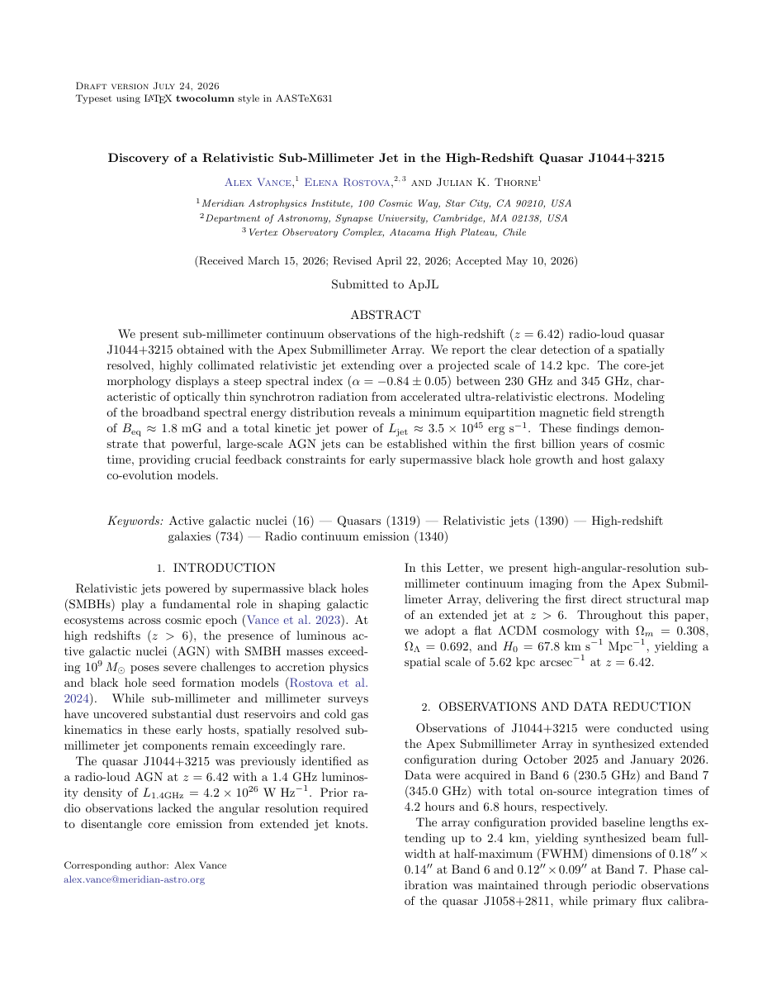</a><br><b>AAS Astrophysical Journal Letter</b><br><a href="https://letx.app/templates/journal-articles/aastex-apj-letter">Open in LetX</a> · <a href="./journal-articles/aastex-apj-letter">Source</a></td>
<td width="33%" valign="top" align="center"><b>ACM Article Template</b><br><a href="https://letx.app/templates/journal-articles/acmart">Open in LetX</a> · <a href="./journal-articles/acmart">Source</a></td>
<td width="33%" valign="top" align="center"><a href="https://letx.app/templates/journal-articles/acs-physical-chemistry-article">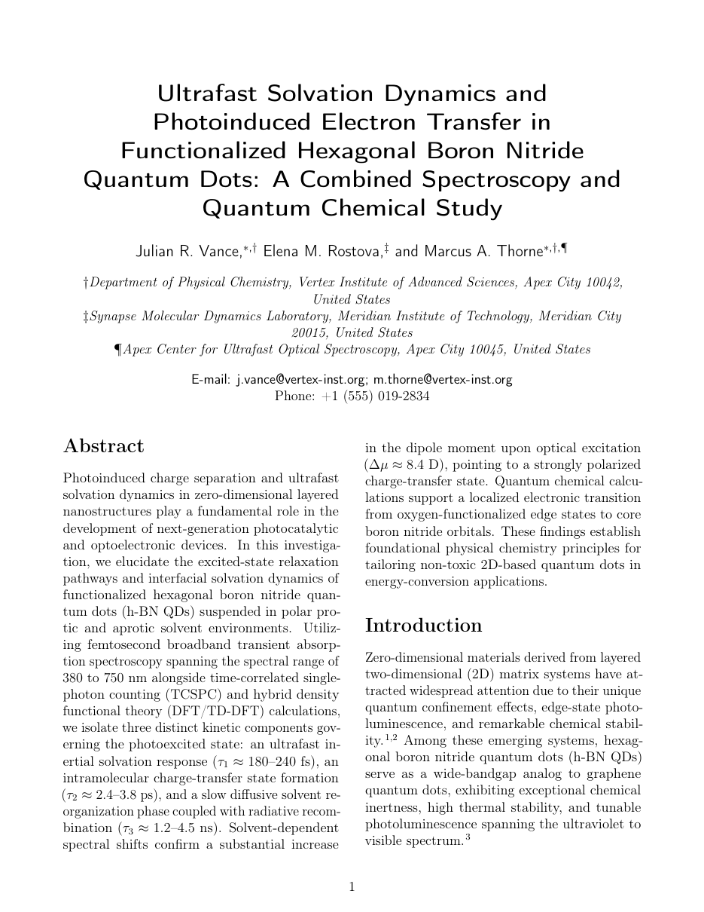</a><br><b>ACS Physical Chemistry Research Paper</b><br><a href="https://letx.app/templates/journal-articles/acs-physical-chemistry-article">Open in LetX</a> · <a href="./journal-articles/acs-physical-chemistry-article">Source</a></td>
</tr>
<tr>
<td width="33%" valign="top" align="center"><a href="https://letx.app/templates/journal-articles/ams-pure-math-article">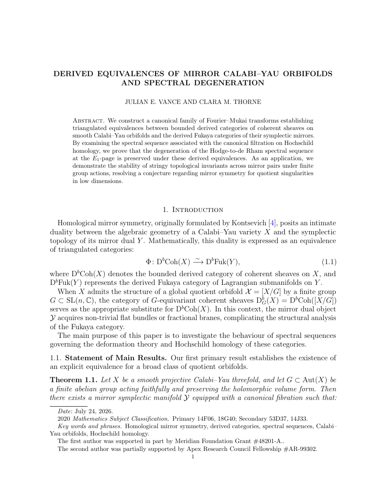</a><br><b>AMS Pure Mathematics Research Article</b><br><a href="https://letx.app/templates/journal-articles/ams-pure-math-article">Open in LetX</a> · <a href="./journal-articles/ams-pure-math-article">Source</a></td>
<td width="33%" valign="top" align="center"><a href="https://letx.app/templates/journal-articles/revtex-aps-prb-paper">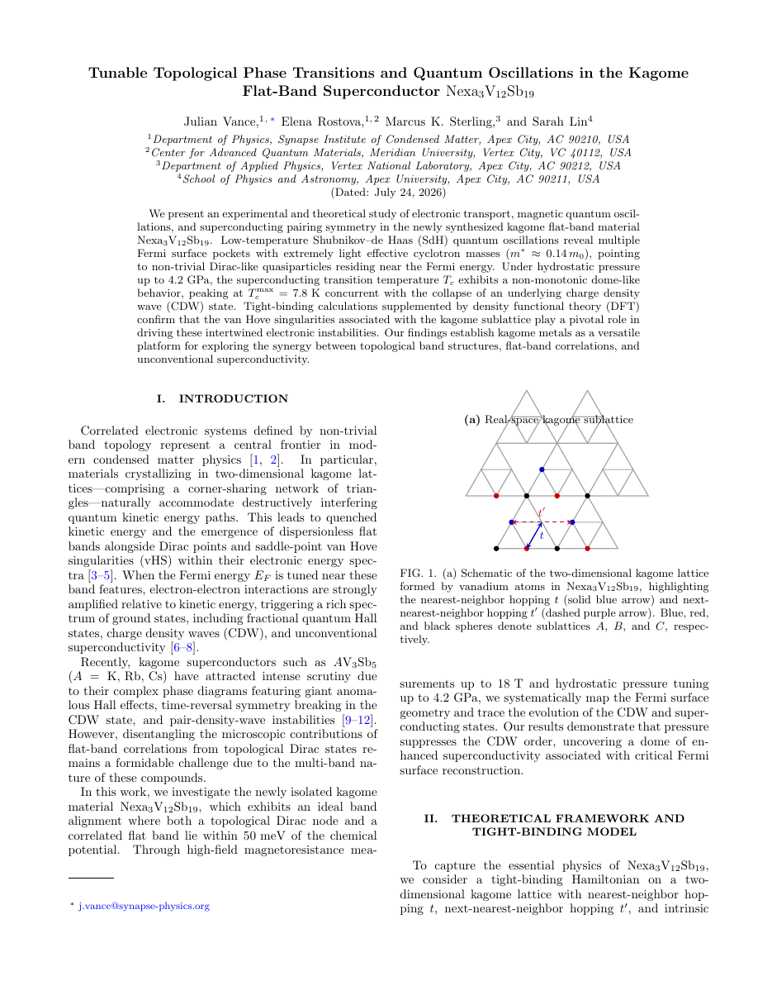</a><br><b>APS Physical Review B Two-Column Paper</b><br><a href="https://letx.app/templates/journal-articles/revtex-aps-prb-paper">Open in LetX</a> · <a href="./journal-articles/revtex-aps-prb-paper">Source</a></td>
<td width="33%" valign="top" align="center"><b>arXiv Preprint Template</b><br><a href="https://letx.app/templates/journal-articles/arxiv-preprint">Open in LetX</a> · <a href="./journal-articles/arxiv-preprint">Source</a></td>
</tr>
<tr>
<td width="33%" valign="top" align="center"><b>Elsevier Article (elsarticle)</b><br><a href="https://letx.app/templates/journal-articles/elsarticle">Open in LetX</a> · <a href="./journal-articles/elsarticle">Source</a></td>
<td width="33%" valign="top" align="center"><a href="https://letx.app/templates/journal-articles/elsevier-single-column-review">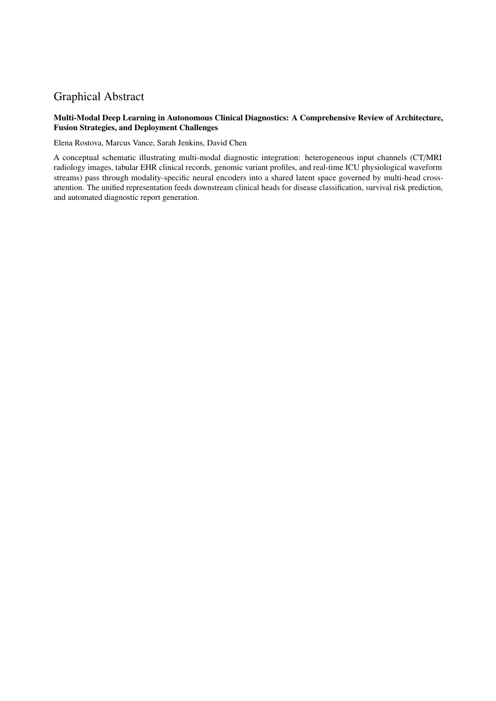</a><br><b>Elsevier Single-Column Review Article</b><br><a href="https://letx.app/templates/journal-articles/elsevier-single-column-review">Open in LetX</a> · <a href="./journal-articles/elsevier-single-column-review">Source</a></td>
<td width="33%" valign="top" align="center"><b>IEEE Conference Paper</b><br><a href="./journal-articles/ieee-conference">Source</a></td>
</tr>
<tr>
<td width="33%" valign="top" align="center"><a href="https://letx.app/templates/journal-articles/ieee-transactions-multicolumn">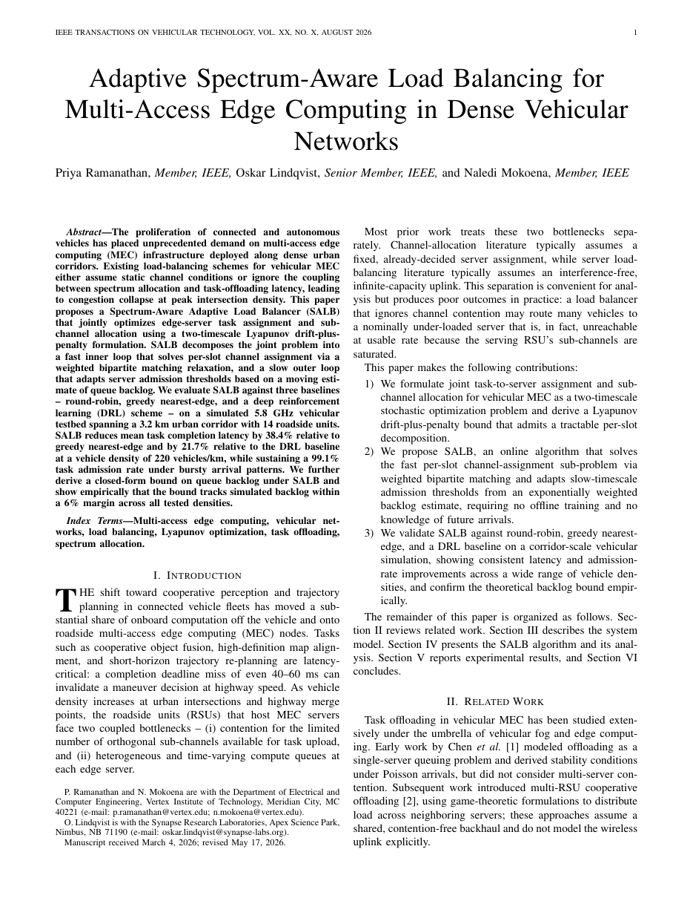</a><br><b>IEEE Transactions Multi-Column Technical Paper</b><br><a href="https://letx.app/templates/journal-articles/ieee-transactions-multicolumn">Open in LetX</a> · <a href="./journal-articles/ieee-transactions-multicolumn">Source</a></td>
<td width="33%" valign="top" align="center"><a href="https://letx.app/templates/journal-articles/minimalist-two-column-journal">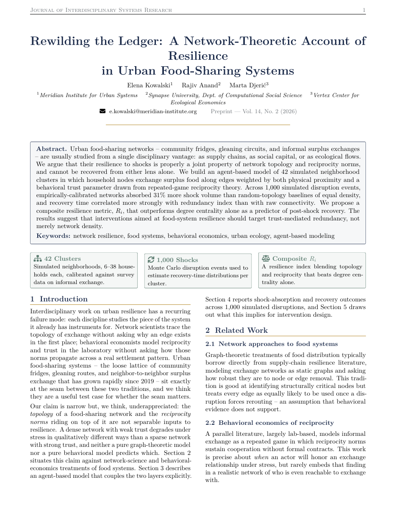</a><br><b>Minimalist Two-Column Interdisciplinary Paper</b><br><a href="https://letx.app/templates/journal-articles/minimalist-two-column-journal">Open in LetX</a> · <a href="./journal-articles/minimalist-two-column-journal">Source</a></td>
<td width="33%" valign="top" align="center"><a href="https://letx.app/templates/journal-articles/mnras-astronomy-paper">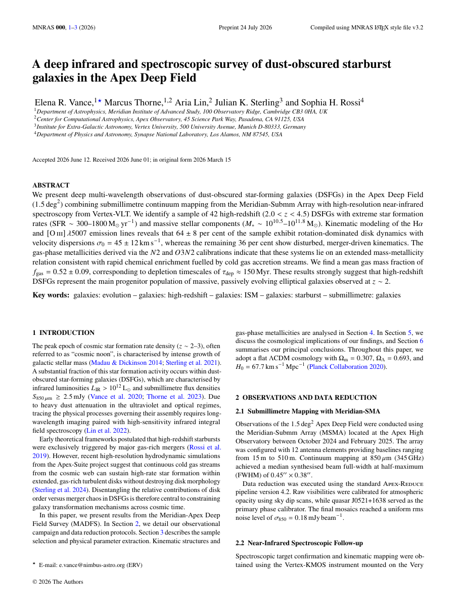</a><br><b>MNRAS Astronomy Research Paper</b><br><a href="https://letx.app/templates/journal-articles/mnras-astronomy-paper">Open in LetX</a> · <a href="./journal-articles/mnras-astronomy-paper">Source</a></td>
</tr>
<tr>
<td width="33%" valign="top" align="center"><a href="https://letx.app/templates/journal-articles/modern-open-access-article">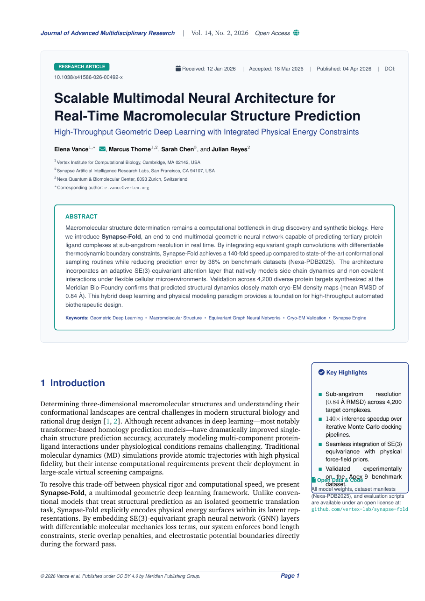</a><br><b>Modern Multidisciplinary Open-Access Article</b><br><a href="https://letx.app/templates/journal-articles/modern-open-access-article">Open in LetX</a> · <a href="./journal-articles/modern-open-access-article">Source</a></td>
<td width="33%" valign="top" align="center"><b>Springer LNCS</b><br><a href="https://letx.app/templates/journal-articles/springer-lncs">Open in LetX</a> · <a href="./journal-articles/springer-lncs">Source</a></td>
<td width="33%" valign="top" align="center"><a href="https://letx.app/templates/journal-articles/springer-lncs-cs-paper">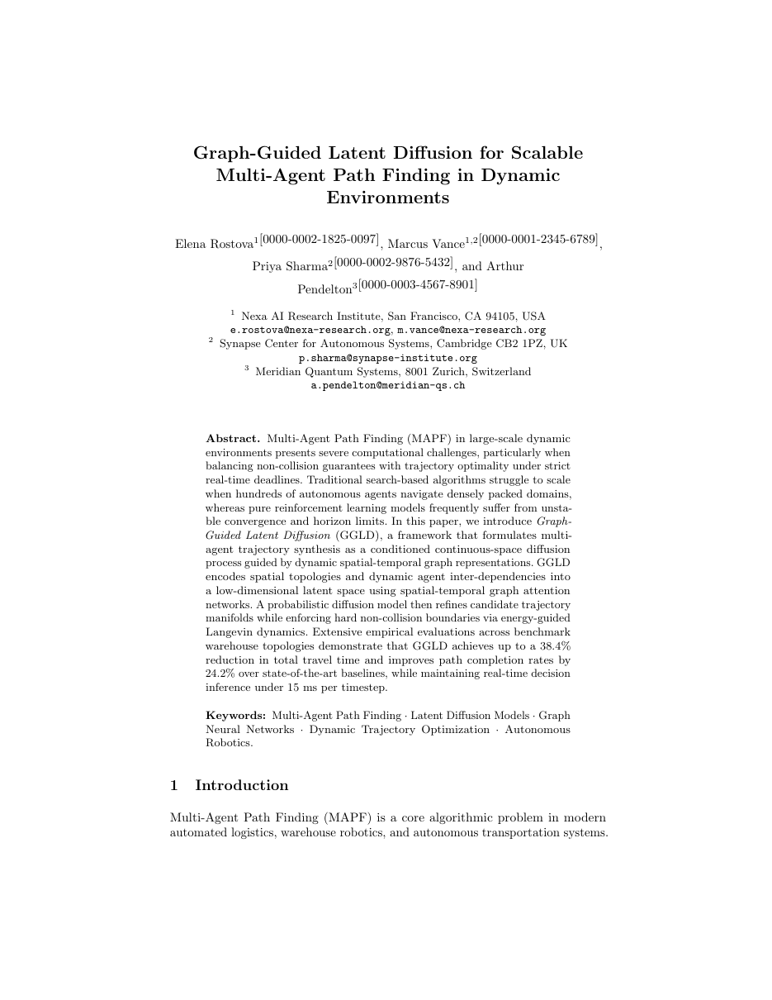</a><br><b>Springer LNCS Computer Science Article</b><br><a href="https://letx.app/templates/journal-articles/springer-lncs-cs-paper">Open in LetX</a> · <a href="./journal-articles/springer-lncs-cs-paper">Source</a></td>
</tr>
<tr>
<td width="33%" valign="top" align="center"><a href="https://letx.app/templates/journal-articles/tugboat-journal-article">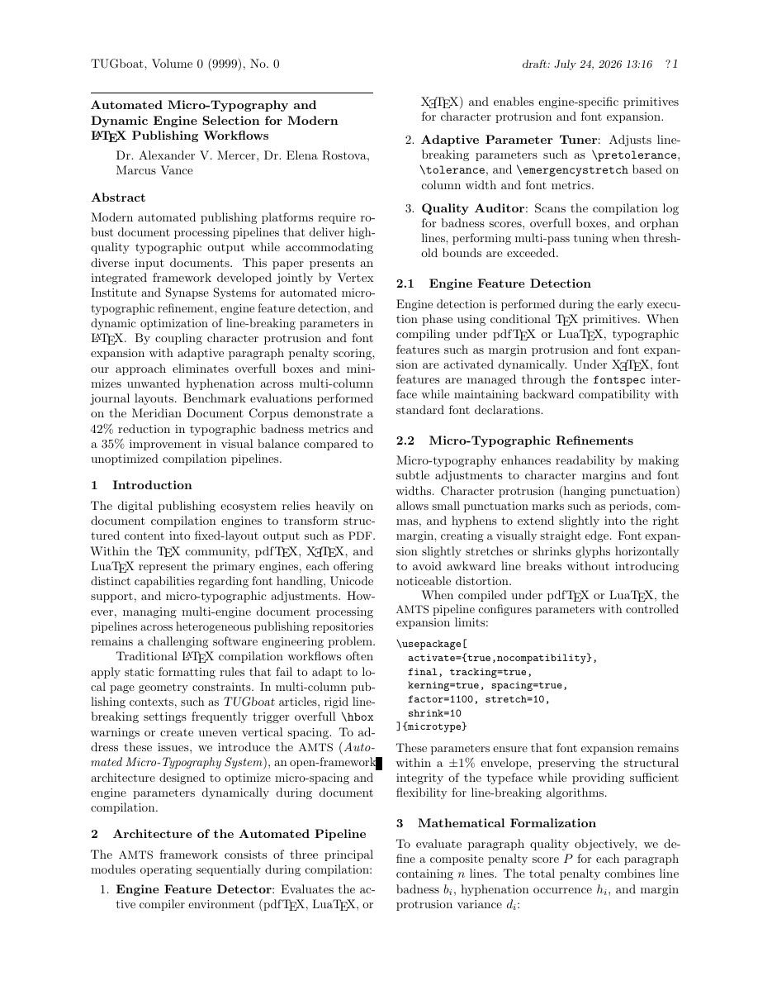</a><br><b>TUGboat TeX & Typography Article</b><br><a href="https://letx.app/templates/journal-articles/tugboat-journal-article">Open in LetX</a> · <a href="./journal-articles/tugboat-journal-article">Source</a></td>
</tr>
</table>

### Conference Papers & Abstracts

8 templates. [Browse this category on LetX](https://letx.app/templates/conferences)

<table>
<tr>
<td width="33%" valign="top" align="center"><a href="https://letx.app/templates/conferences/acm-single-column-conference">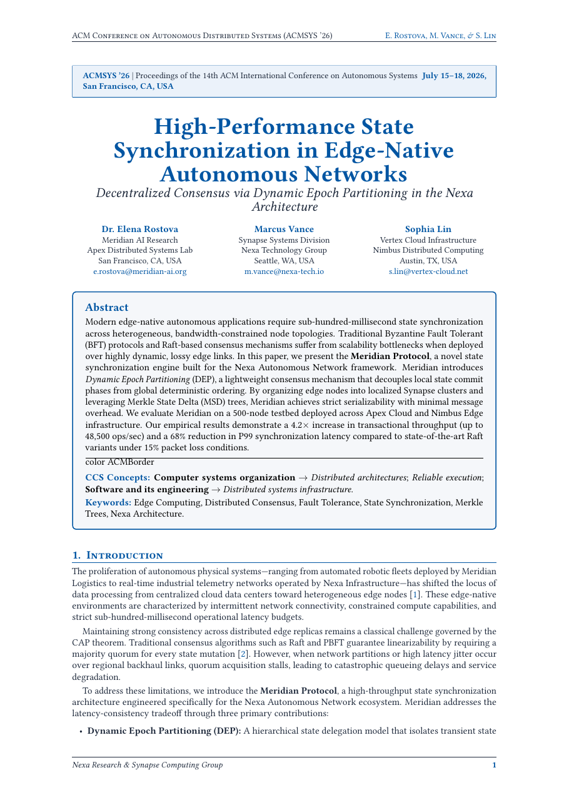</a><br><b>ACM Style Single-Column Conference Article</b><br><a href="https://letx.app/templates/conferences/acm-single-column-conference">Open in LetX</a> · <a href="./conferences/acm-single-column-conference">Source</a></td>
<td width="33%" valign="top" align="center"><a href="https://letx.app/templates/conferences/doctoral-consortium-abstract">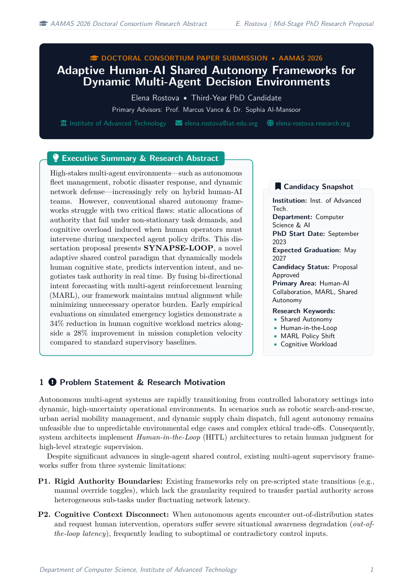</a><br><b>Doctoral Consortium Research Abstract</b><br><a href="https://letx.app/templates/conferences/doctoral-consortium-abstract">Open in LetX</a> · <a href="./conferences/doctoral-consortium-abstract">Source</a></td>
<td width="33%" valign="top" align="center"><a href="https://letx.app/templates/conferences/extended-abstract-poster-companion">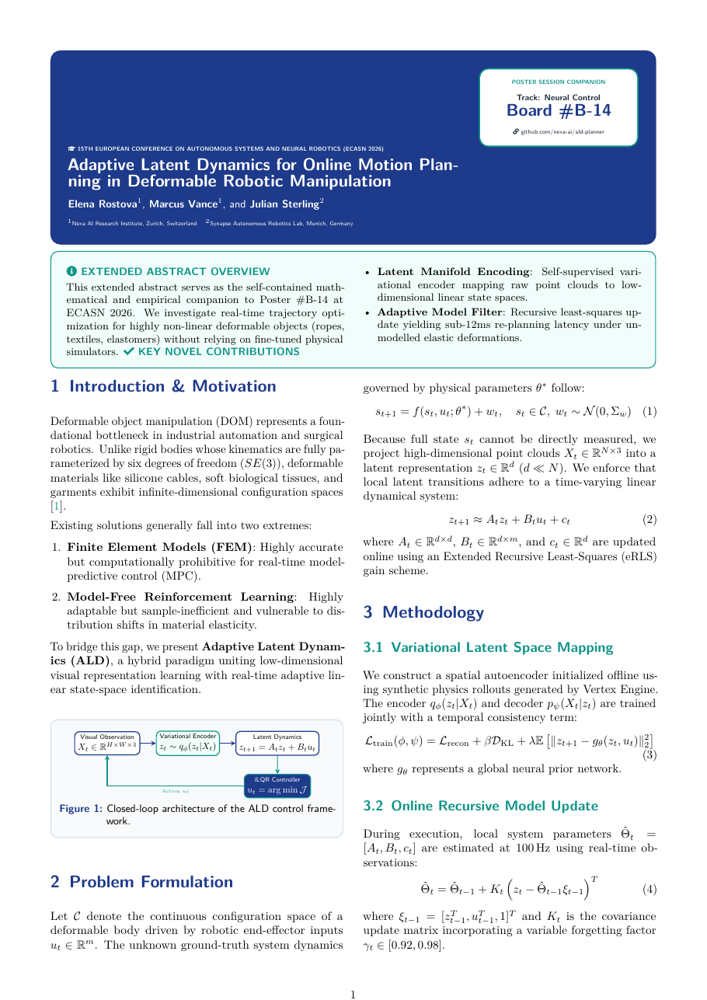</a><br><b>European Conference Poster Extended Abstract</b><br><a href="https://letx.app/templates/conferences/extended-abstract-poster-companion">Open in LetX</a> · <a href="./conferences/extended-abstract-poster-companion">Source</a></td>
</tr>
<tr>
<td width="33%" valign="top" align="center"><a href="https://letx.app/templates/conferences/ieee-conference-workshop">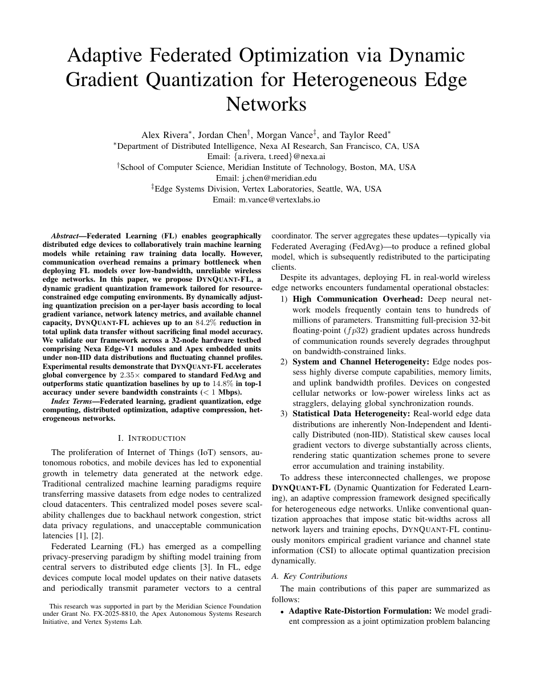</a><br><b>IEEE Conference Workshop Paper</b><br><a href="https://letx.app/templates/conferences/ieee-conference-workshop">Open in LetX</a> · <a href="./conferences/ieee-conference-workshop">Source</a></td>
<td width="33%" valign="top" align="center"><a href="https://letx.app/templates/conferences/industry-tech-summit-paper">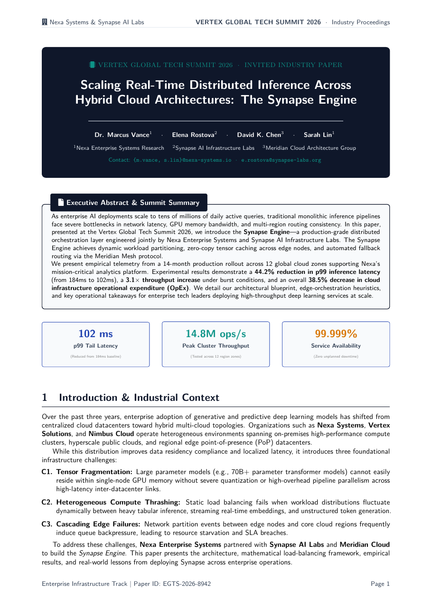</a><br><b>Industry Tech Summit Presentation Paper</b><br><a href="https://letx.app/templates/conferences/industry-tech-summit-paper">Open in LetX</a> · <a href="./conferences/industry-tech-summit-paper">Source</a></td>
<td width="33%" valign="top" align="center"><a href="https://letx.app/templates/conferences/symposium-short-paper">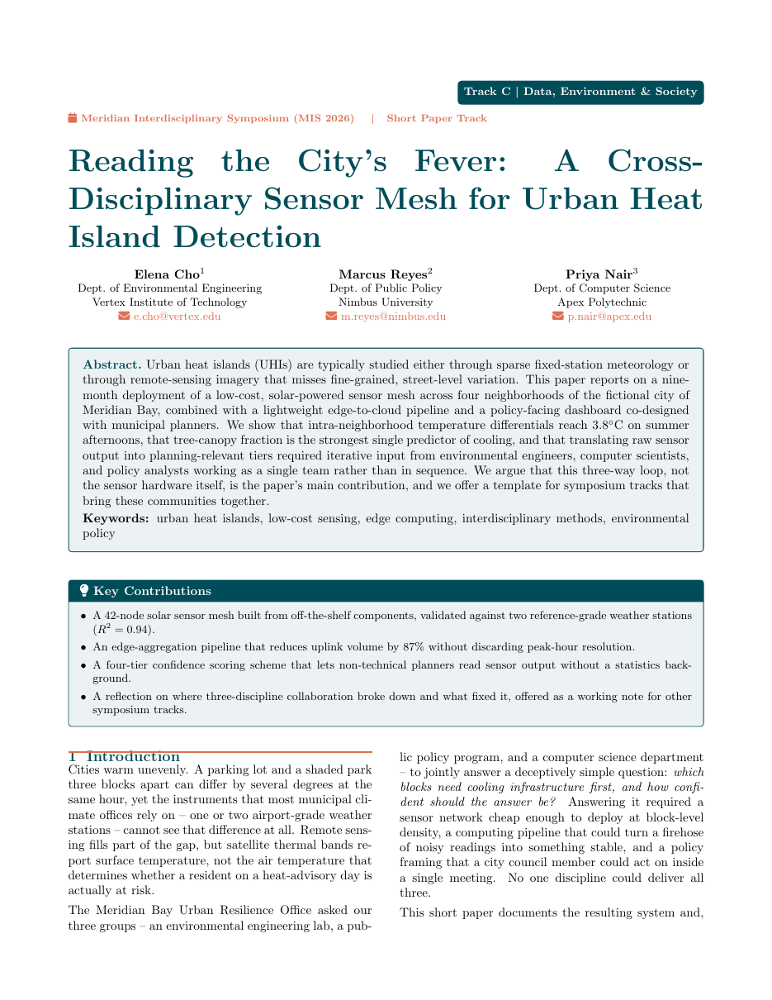</a><br><b>Interdisciplinary Symposium Short Paper</b><br><a href="https://letx.app/templates/conferences/symposium-short-paper">Open in LetX</a> · <a href="./conferences/symposium-short-paper">Source</a></td>
</tr>
<tr>
<td width="33%" valign="top" align="center"><a href="https://letx.app/templates/conferences/proceedings-science-report">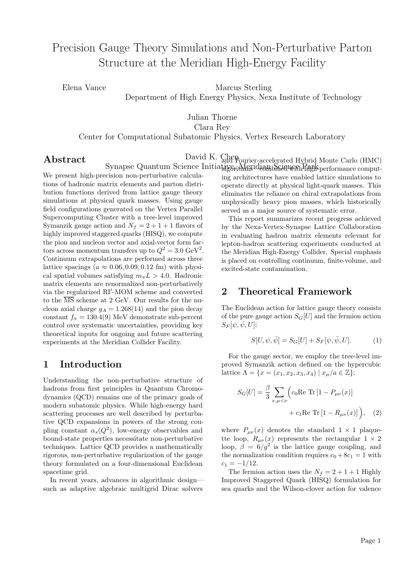</a><br><b>Proceedings of Science Conference Report</b><br><a href="https://letx.app/templates/conferences/proceedings-science-report">Open in LetX</a> · <a href="./conferences/proceedings-science-report">Source</a></td>
<td width="33%" valign="top" align="center"><a href="https://letx.app/templates/conferences/springer-lncs-short-paper">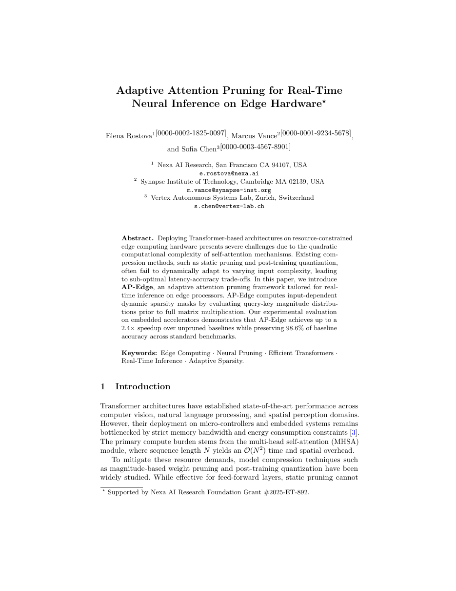</a><br><b>Springer LNCS Short Conference Paper</b><br><a href="https://letx.app/templates/conferences/springer-lncs-short-paper">Open in LetX</a> · <a href="./conferences/springer-lncs-short-paper">Source</a></td>
</tr>
</table>

### CVs & Résumés

13 templates. [Browse this category on LetX](https://letx.app/templates/cvs-resumes)

<table>
<tr>
<td width="33%" valign="top" align="center"><b>Academic CV</b><br><a href="https://letx.app/templates/cvs-resumes/academic-cv">Open in LetX</a> · <a href="./cvs-resumes/academic-cv">Source</a></td>
<td width="33%" valign="top" align="center"><b>AltaCV Resume</b><br><a href="https://letx.app/templates/cvs-resumes/altacv">Open in LetX</a> · <a href="./cvs-resumes/altacv">Source</a></td>
<td width="33%" valign="top" align="center"><b>Awesome CV</b><br><a href="https://letx.app/templates/cvs-resumes/awesome-cv">Open in LetX</a> · <a href="./cvs-resumes/awesome-cv">Source</a></td>
</tr>
<tr>
<td width="33%" valign="top" align="center"><b>Banking & Finance CV</b><br><a href="https://letx.app/templates/cvs-resumes/banking-cv">Open in LetX</a> · <a href="./cvs-resumes/banking-cv">Source</a></td>
<td width="33%" valign="top" align="center"><b>Classic CV Template</b><br><a href="https://letx.app/templates/cvs-resumes/classic-cv">Open in LetX</a> · <a href="./cvs-resumes/classic-cv">Source</a></td>
<td width="33%" valign="top" align="center"><b>Data Scientist Resume</b><br><a href="https://letx.app/templates/cvs-resumes/data-scientist-resume">Open in LetX</a> · <a href="./cvs-resumes/data-scientist-resume">Source</a></td>
</tr>
<tr>
<td width="33%" valign="top" align="center"><b>Deedy Resume</b><br><a href="https://letx.app/templates/cvs-resumes/deedy-resume">Open in LetX</a> · <a href="./cvs-resumes/deedy-resume">Source</a></td>
<td width="33%" valign="top" align="center"><b>Jake's Resume</b><br><a href="https://letx.app/templates/cvs-resumes/jakes-resume">Open in LetX</a> · <a href="./cvs-resumes/jakes-resume">Source</a></td>
<td width="33%" valign="top" align="center"><b>ML / AI Engineer Resume</b><br><a href="https://letx.app/templates/cvs-resumes/ml-engineer-resume">Open in LetX</a> · <a href="./cvs-resumes/ml-engineer-resume">Source</a></td>
</tr>
<tr>
<td width="33%" valign="top" align="center"><b>ModernCV</b><br><a href="https://letx.app/templates/cvs-resumes/moderncv">Open in LetX</a> · <a href="./cvs-resumes/moderncv">Source</a></td>
<td width="33%" valign="top" align="center"><b>sb2nov Resume</b><br><a href="./cvs-resumes/sb2nov-cv">Source</a></td>
<td width="33%" valign="top" align="center"><b>Software Engineer Resume</b><br><a href="https://letx.app/templates/cvs-resumes/software-engineer-resume">Open in LetX</a> · <a href="./cvs-resumes/software-engineer-resume">Source</a></td>
</tr>
<tr>
<td width="33%" valign="top" align="center"><b>Student / Fresher Resume</b><br><a href="https://letx.app/templates/cvs-resumes/student-resume">Open in LetX</a> · <a href="./cvs-resumes/student-resume">Source</a></td>
</tr>
</table>

### Academic Career (Statements, Applications)

4 templates. [Browse this category on LetX](https://letx.app/templates/academic-career)

<table>
<tr>
<td width="33%" valign="top" align="center"><a href="https://letx.app/templates/academic-career/europecv-academic-standard">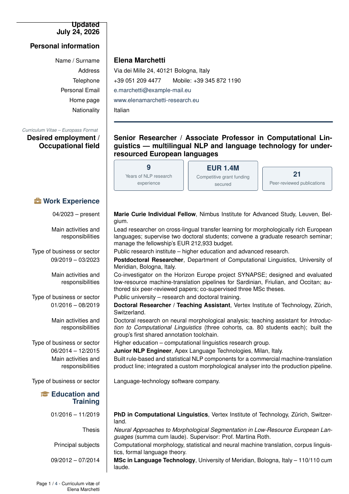</a><br><b>Europass Standard European Academic CV</b><br><a href="https://letx.app/templates/academic-career/europecv-academic-standard">Open in LetX</a> · <a href="./academic-career/europecv-academic-standard">Source</a></td>
<td width="33%" valign="top" align="center"><a href="https://letx.app/templates/academic-career/moderncv-faculty-academic-cv">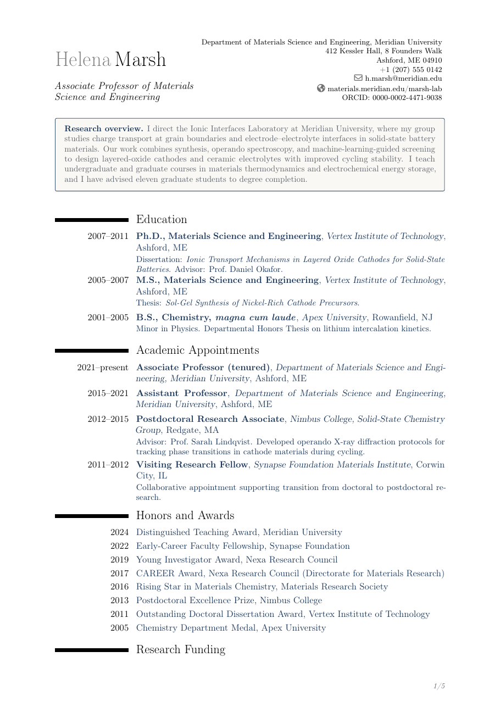</a><br><b>ModernCV Classic Faculty Academic CV</b><br><a href="https://letx.app/templates/academic-career/moderncv-faculty-academic-cv">Open in LetX</a> · <a href="./academic-career/moderncv-faculty-academic-cv">Source</a></td>
<td width="33%" valign="top" align="center"><a href="https://letx.app/templates/academic-career/teaching-philosophy-portfolio">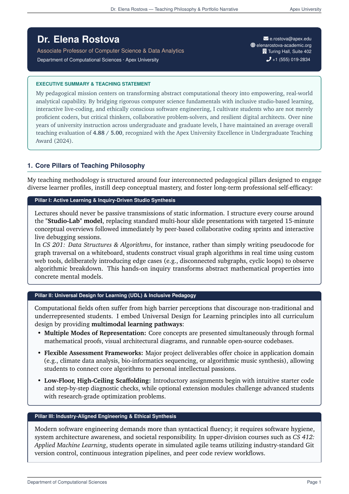</a><br><b>Teaching Philosophy & Portfolio Narrative</b><br><a href="https://letx.app/templates/academic-career/teaching-philosophy-portfolio">Open in LetX</a> · <a href="./academic-career/teaching-philosophy-portfolio">Source</a></td>
</tr>
<tr>
<td width="33%" valign="top" align="center"><a href="https://letx.app/templates/academic-career/tenure-dossier-research-statement">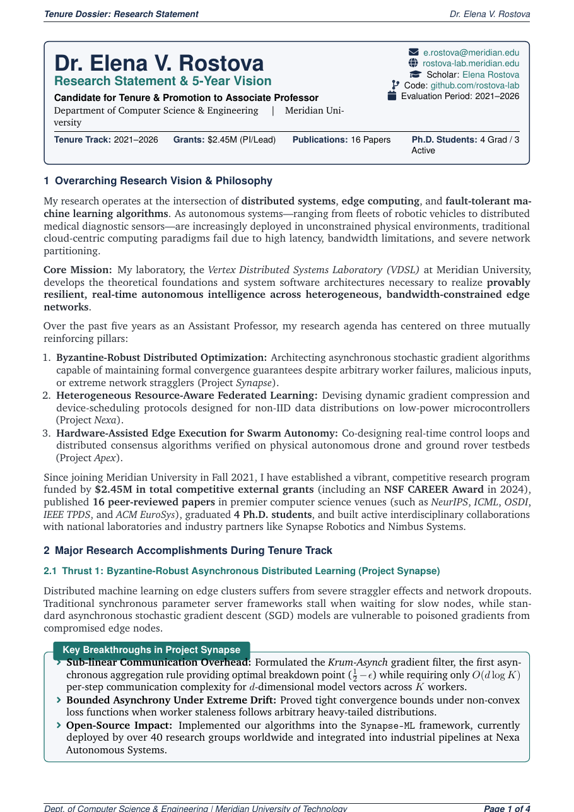</a><br><b>Tenure Track Dossier Research Statement</b><br><a href="https://letx.app/templates/academic-career/tenure-dossier-research-statement">Open in LetX</a> · <a href="./academic-career/tenure-dossier-research-statement">Source</a></td>
</tr>
</table>

### Assignments & Course Work

18 templates. [Browse this category on LetX](https://letx.app/templates/assignments)

<table>
<tr>
<td width="33%" valign="top" align="center"><a href="https://letx.app/templates/assignments/biology-genetics-worksheet">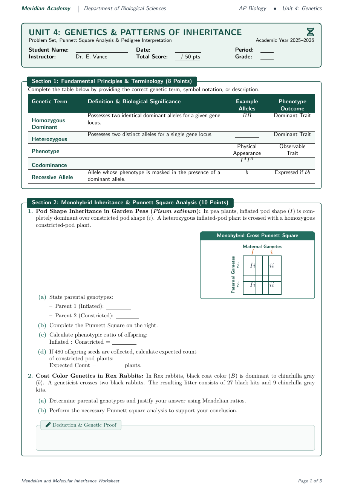</a><br><b>Biology & Genetics Worksheet</b><br><a href="https://letx.app/templates/assignments/biology-genetics-worksheet">Open in LetX</a> · <a href="./assignments/biology-genetics-worksheet">Source</a></td>
<td width="33%" valign="top" align="center"><a href="https://letx.app/templates/assignments/calculus-linear-algebra-worksheet">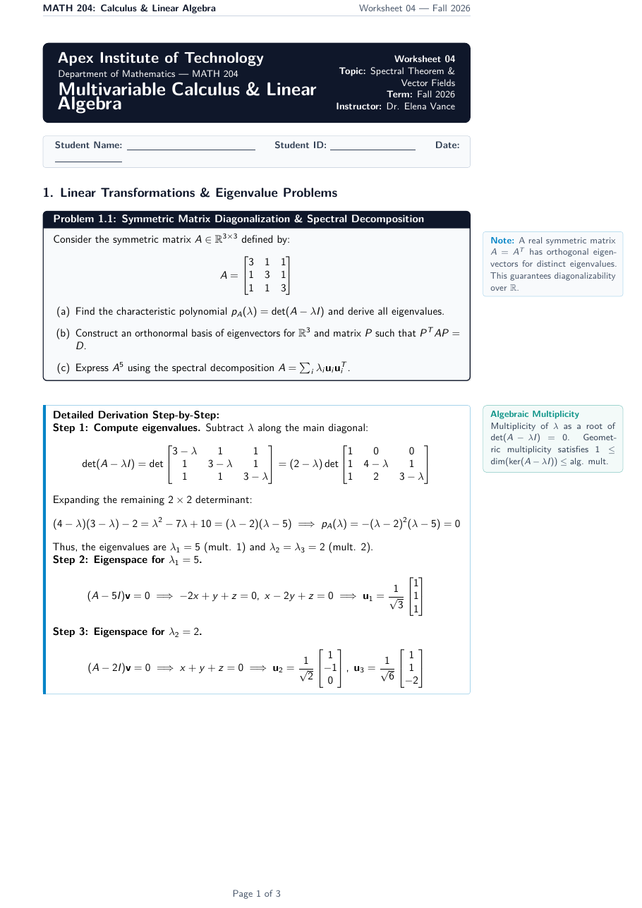</a><br><b>Calculus & Linear Algebra Worksheet</b><br><a href="https://letx.app/templates/assignments/calculus-linear-algebra-worksheet">Open in LetX</a> · <a href="./assignments/calculus-linear-algebra-worksheet">Source</a></td>
<td width="33%" valign="top" align="center"><a href="https://letx.app/templates/assignments/chemistry-lab-assignment-brief">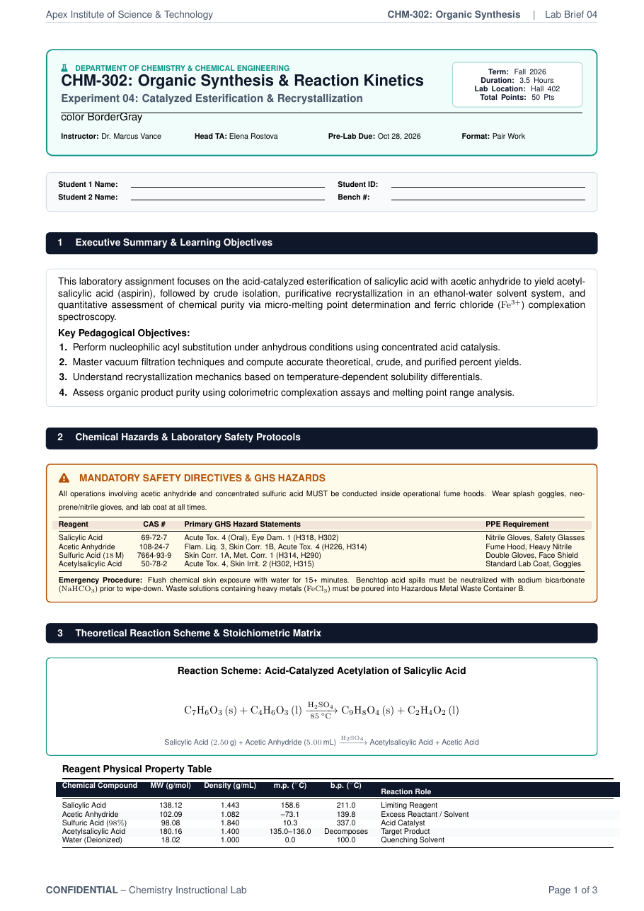</a><br><b>Chemistry Lab Assignment Brief</b><br><a href="https://letx.app/templates/assignments/chemistry-lab-assignment-brief">Open in LetX</a> · <a href="./assignments/chemistry-lab-assignment-brief">Source</a></td>
</tr>
<tr>
<td width="33%" valign="top" align="center"><a href="https://letx.app/templates/assignments/cs-algorithm-homework">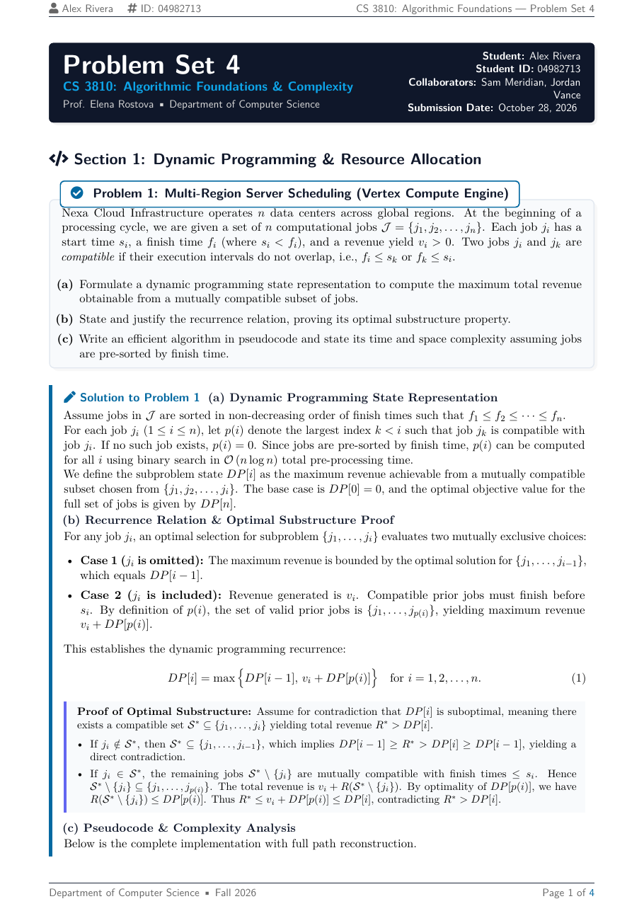</a><br><b>Computer Science Algorithm Homework</b><br><a href="https://letx.app/templates/assignments/cs-algorithm-homework">Open in LetX</a> · <a href="./assignments/cs-algorithm-homework">Source</a></td>
<td width="33%" valign="top" align="center"><b>Course Syllabus Template</b><br><a href="./assignments/syllabus-template">Source</a></td>
<td width="33%" valign="top" align="center"><a href="https://letx.app/templates/assignments/economics-econometrics-problem-set">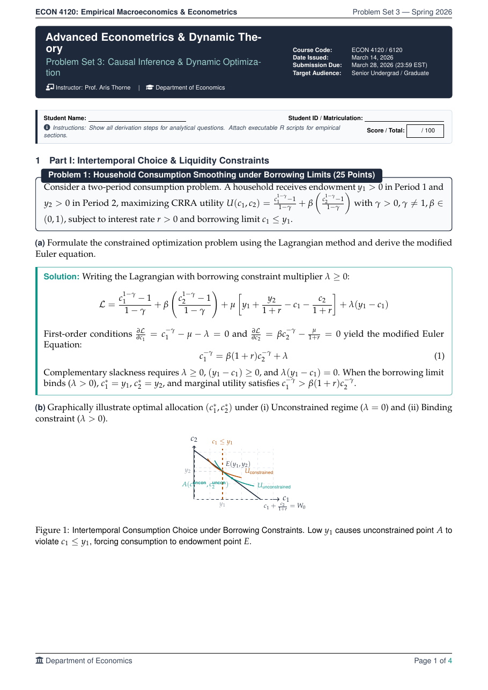</a><br><b>Economics & Econometrics Problem Set</b><br><a href="https://letx.app/templates/assignments/economics-econometrics-problem-set">Open in LetX</a> · <a href="./assignments/economics-econometrics-problem-set">Source</a></td>
</tr>
<tr>
<td width="33%" valign="top" align="center"><a href="https://letx.app/templates/assignments/engineering-statics-problem-set">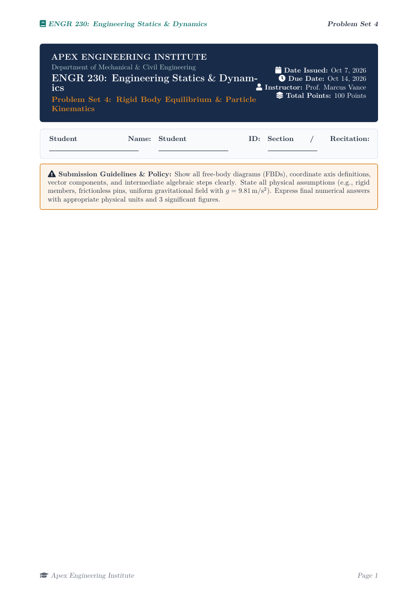</a><br><b>Engineering Statics & Dynamics Problem Set</b><br><a href="https://letx.app/templates/assignments/engineering-statics-problem-set">Open in LetX</a> · <a href="./assignments/engineering-statics-problem-set">Source</a></td>
<td width="33%" valign="top" align="center"><b>Exam Paper Template</b><br><a href="https://letx.app/templates/assignments/exam-paper">Open in LetX</a> · <a href="./assignments/exam-paper">Source</a></td>
<td width="33%" valign="top" align="center"><a href="https://letx.app/templates/assignments/graduate-seminar-reading-response">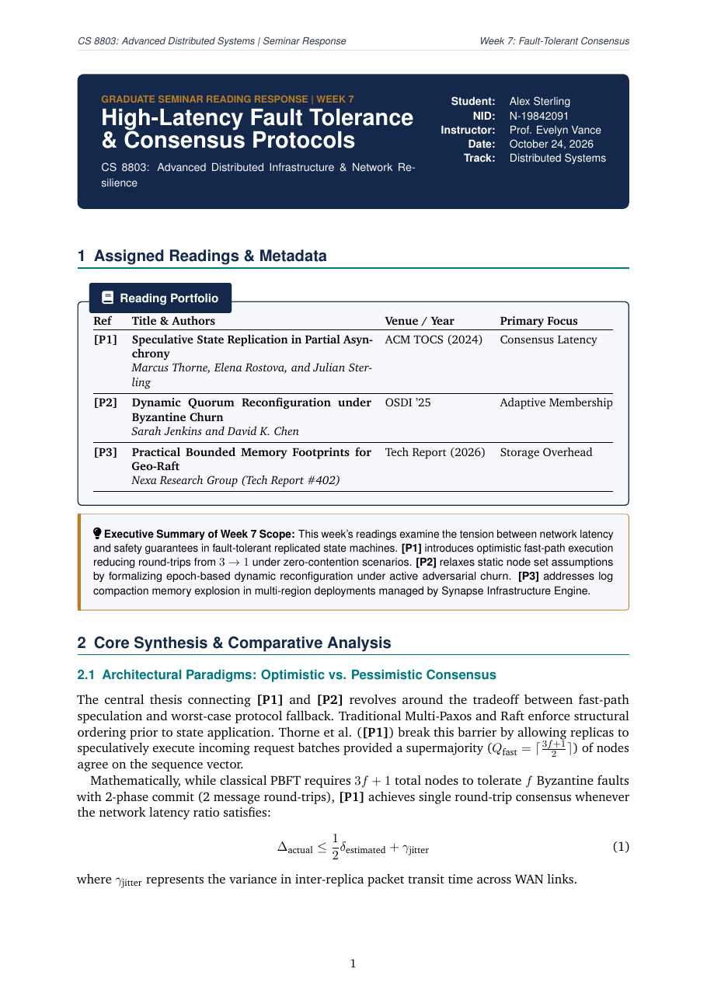</a><br><b>Graduate Seminar Reading Response</b><br><a href="https://letx.app/templates/assignments/graduate-seminar-reading-response">Open in LetX</a> · <a href="./assignments/graduate-seminar-reading-response">Source</a></td>
</tr>
<tr>
<td width="33%" valign="top" align="center"><a href="https://letx.app/templates/assignments/high-school-science-problem-set">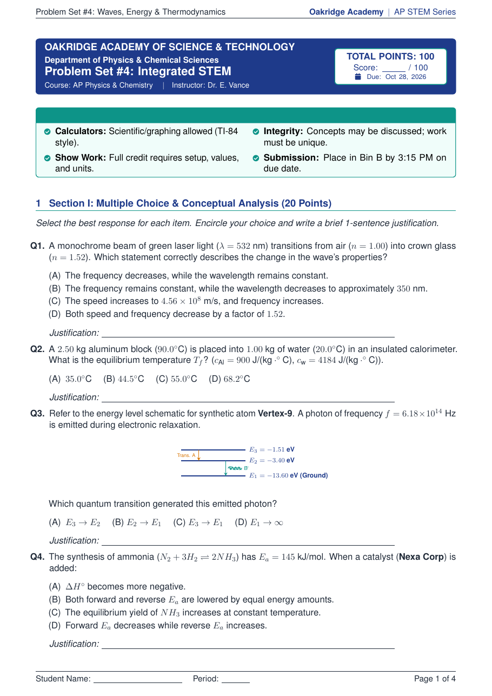</a><br><b>High School Science Problem Set</b><br><a href="https://letx.app/templates/assignments/high-school-science-problem-set">Open in LetX</a> · <a href="./assignments/high-school-science-problem-set">Source</a></td>
<td width="33%" valign="top" align="center"><b>Homework Template</b><br><a href="https://letx.app/templates/assignments/jdavis-homework">Open in LetX</a> · <a href="./assignments/jdavis-homework">Source</a></td>
<td width="33%" valign="top" align="center"><b>Lab Report Template</b><br><a href="https://letx.app/templates/assignments/lab-report">Open in LetX</a> · <a href="./assignments/lab-report">Source</a></td>
</tr>
<tr>
<td width="33%" valign="top" align="center"><b>Math Homework Template</b><br><a href="https://letx.app/templates/assignments/math-homework">Open in LetX</a> · <a href="./assignments/math-homework">Source</a></td>
<td width="33%" valign="top" align="center"><a href="https://letx.app/templates/assignments/modern-minimalist-homework-solutions">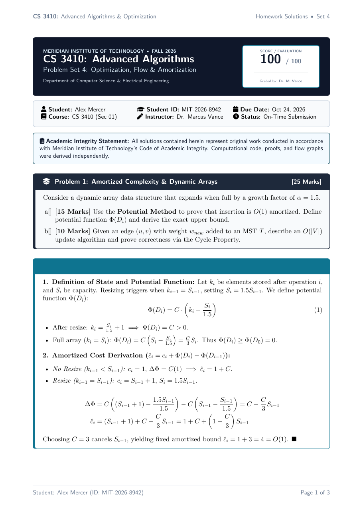</a><br><b>Modern Minimalist Homework Cover & Solutions</b><br><a href="https://letx.app/templates/assignments/modern-minimalist-homework-solutions">Open in LetX</a> · <a href="./assignments/modern-minimalist-homework-solutions">Source</a></td>
<td width="33%" valign="top" align="center"><a href="https://letx.app/templates/assignments/philosophy-ethics-assignment">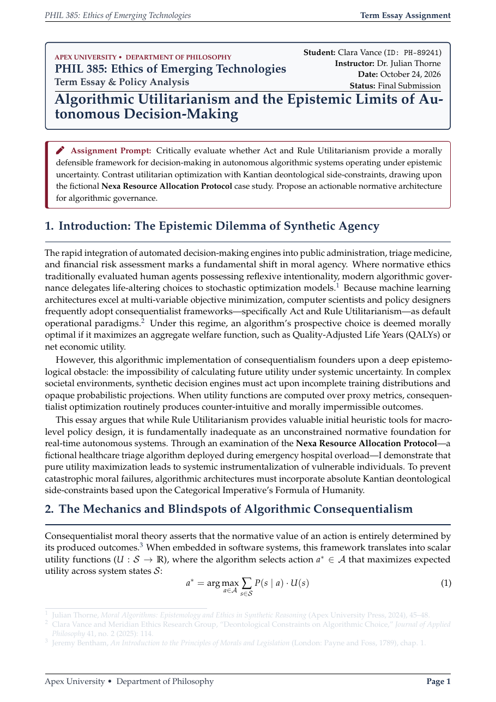</a><br><b>Philosophy & Ethics Essay Assignment</b><br><a href="https://letx.app/templates/assignments/philosophy-ethics-assignment">Open in LetX</a> · <a href="./assignments/philosophy-ethics-assignment">Source</a></td>
</tr>
<tr>
<td width="33%" valign="top" align="center"><a href="https://letx.app/templates/assignments/physics-quantum-mechanics-pset">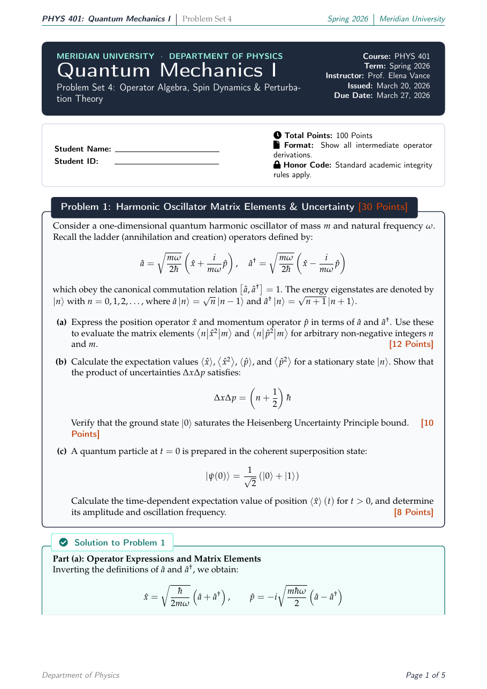</a><br><b>Physics Quantum Mechanics Problem Set</b><br><a href="https://letx.app/templates/assignments/physics-quantum-mechanics-pset">Open in LetX</a> · <a href="./assignments/physics-quantum-mechanics-pset">Source</a></td>
<td width="33%" valign="top" align="center"><b>Problem Set Template</b><br><a href="https://letx.app/templates/assignments/problem-set">Open in LetX</a> · <a href="./assignments/problem-set">Source</a></td>
<td width="33%" valign="top" align="center"><a href="https://letx.app/templates/assignments/statistics-data-analysis-homework">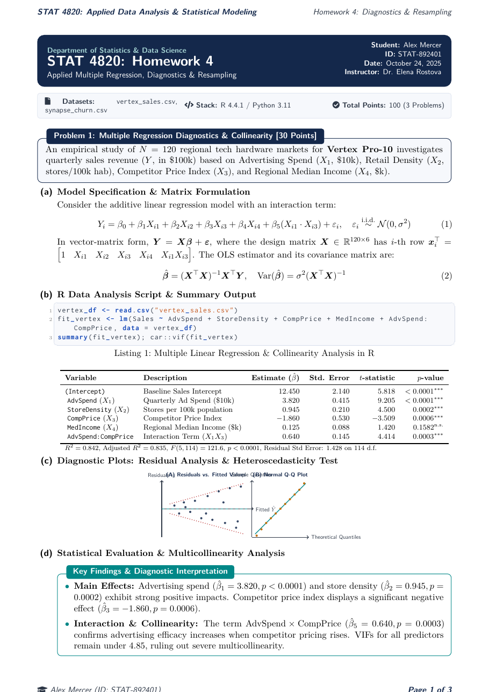</a><br><b>Statistics Data Analysis Homework</b><br><a href="https://letx.app/templates/assignments/statistics-data-analysis-homework">Open in LetX</a> · <a href="./assignments/statistics-data-analysis-homework">Source</a></td>
</tr>
</table>

### Lab Reports & Documentation

10 templates. [Browse this category on LetX](https://letx.app/templates/lab-documents)

<table>
<tr>
<td width="33%" valign="top" align="center"><a href="https://letx.app/templates/lab-documents/animal-research-activity-log">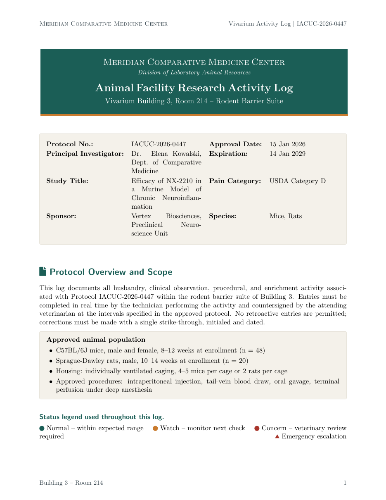</a><br><b>Animal Facility Research Activity Log</b><br><a href="https://letx.app/templates/lab-documents/animal-research-activity-log">Open in LetX</a> · <a href="./lab-documents/animal-research-activity-log">Source</a></td>
<td width="33%" valign="top" align="center"><a href="https://letx.app/templates/lab-documents/biochemistry-experimental-protocol">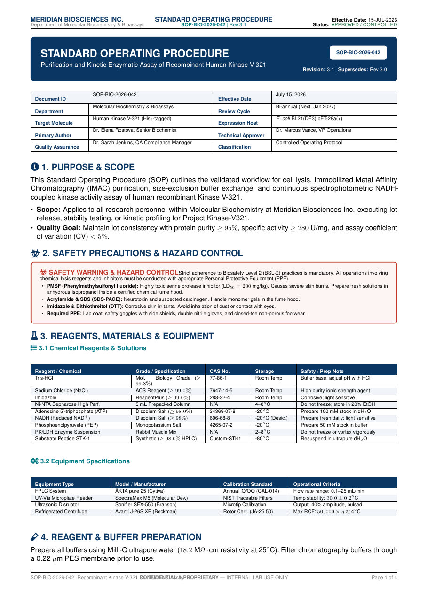</a><br><b>Biochemistry Experimental Protocol SOP</b><br><a href="https://letx.app/templates/lab-documents/biochemistry-experimental-protocol">Open in LetX</a> · <a href="./lab-documents/biochemistry-experimental-protocol">Source</a></td>
<td width="33%" valign="top" align="center"><a href="https://letx.app/templates/lab-documents/chemical-waste-disposal-register">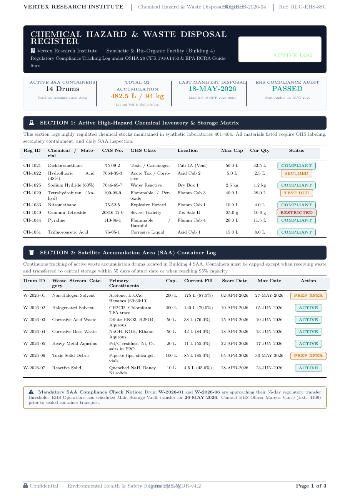</a><br><b>Chemical Hazard & Waste Disposal Register</b><br><a href="https://letx.app/templates/lab-documents/chemical-waste-disposal-register">Open in LetX</a> · <a href="./lab-documents/chemical-waste-disposal-register">Source</a></td>
</tr>
<tr>
<td width="33%" valign="top" align="center"><a href="https://letx.app/templates/lab-documents/cleanroom-calibration-sheet">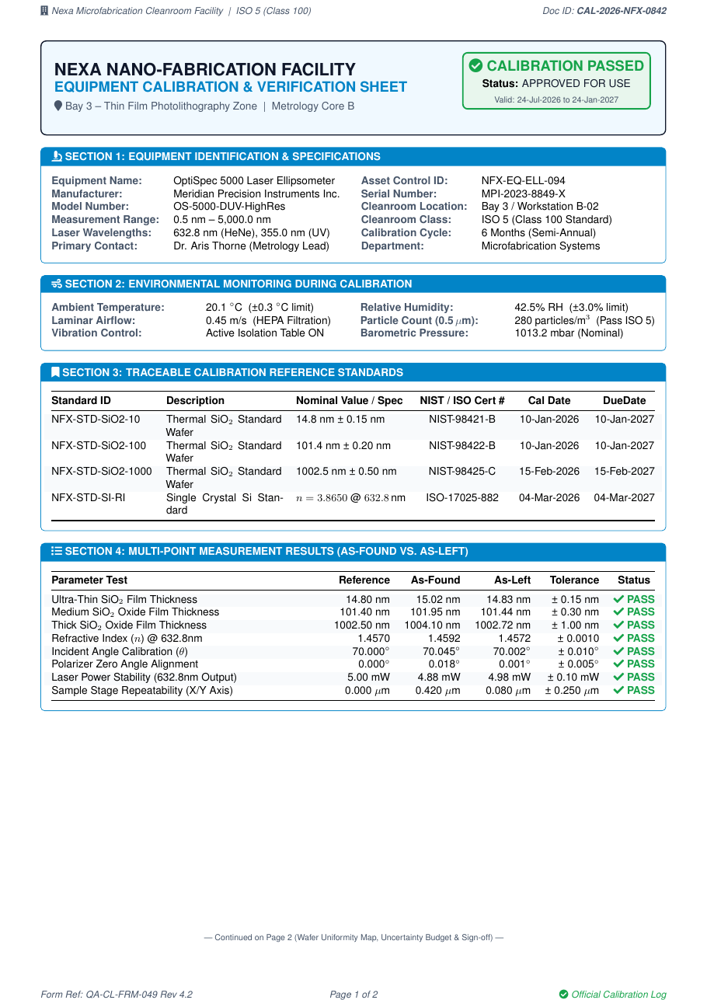</a><br><b>Cleanroom Equipment Calibration Sheet</b><br><a href="https://letx.app/templates/lab-documents/cleanroom-calibration-sheet">Open in LetX</a> · <a href="./lab-documents/cleanroom-calibration-sheet">Source</a></td>
<td width="33%" valign="top" align="center"><a href="https://letx.app/templates/lab-documents/bioinformatics-pipeline-log">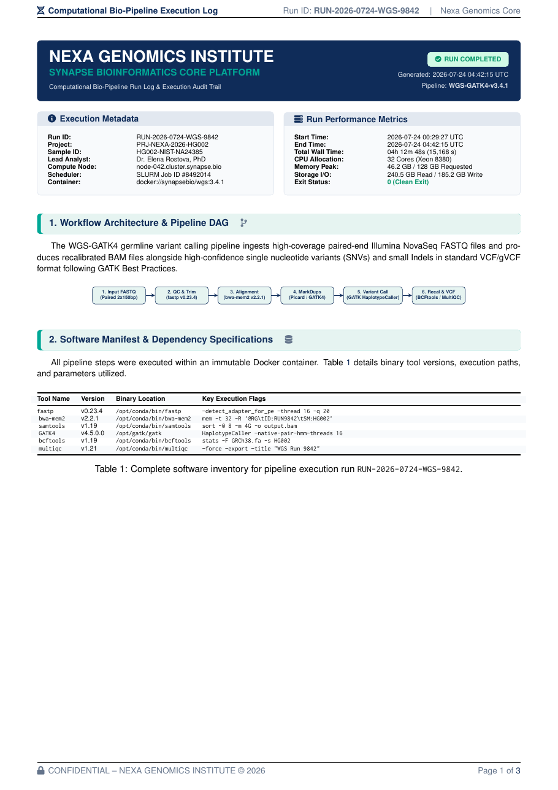</a><br><b>Computational Bio-Pipeline Execution Log</b><br><a href="https://letx.app/templates/lab-documents/bioinformatics-pipeline-log">Open in LetX</a> · <a href="./lab-documents/bioinformatics-pipeline-log">Source</a></td>
<td width="33%" valign="top" align="center"><a href="https://letx.app/templates/lab-documents/genomics-sample-processing-sheet">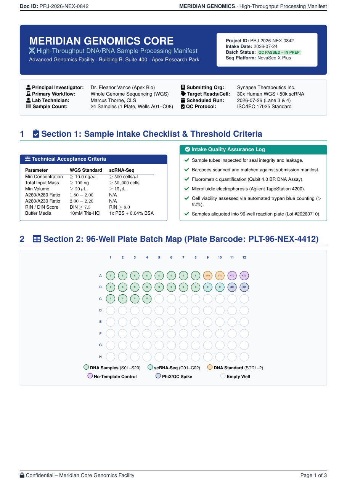</a><br><b>Genomics Sample Processing Sheet</b><br><a href="https://letx.app/templates/lab-documents/genomics-sample-processing-sheet">Open in LetX</a> · <a href="./lab-documents/genomics-sample-processing-sheet">Source</a></td>
</tr>
<tr>
<td width="33%" valign="top" align="center"><a href="https://letx.app/templates/lab-documents/materials-characterization-report">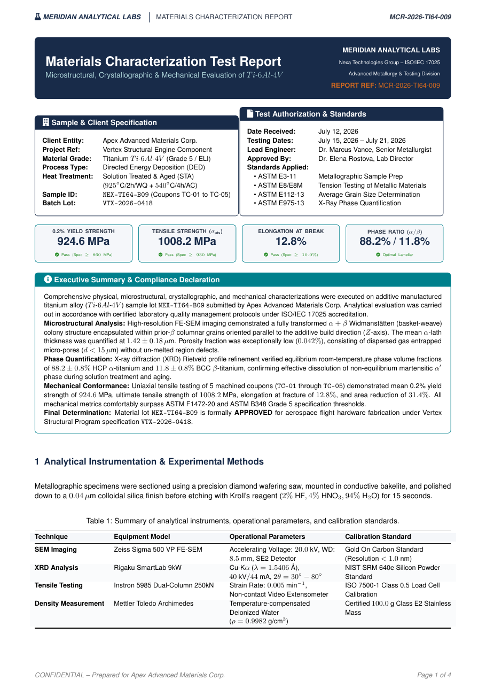</a><br><b>Materials Characterization Test Report</b><br><a href="https://letx.app/templates/lab-documents/materials-characterization-report">Open in LetX</a> · <a href="./lab-documents/materials-characterization-report">Source</a></td>
<td width="33%" valign="top" align="center"><a href="https://letx.app/templates/lab-documents/microbiology-safety-audit">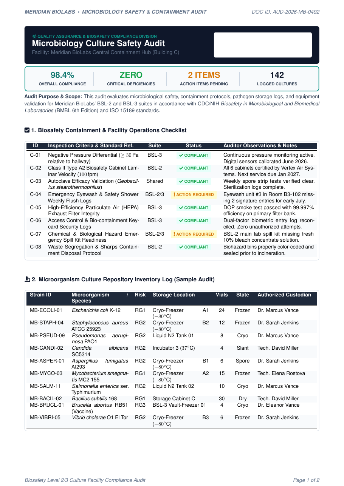</a><br><b>Microbiology Culture Safety Audit</b><br><a href="https://letx.app/templates/lab-documents/microbiology-safety-audit">Open in LetX</a> · <a href="./lab-documents/microbiology-safety-audit">Source</a></td>
<td width="33%" valign="top" align="center"><a href="https://letx.app/templates/lab-documents/physics-optics-experiment-record">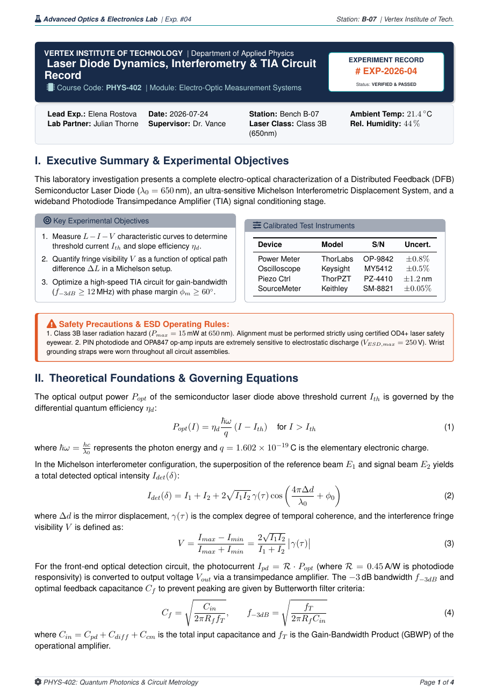</a><br><b>Physics Optics & Electronics Experiment Record</b><br><a href="https://letx.app/templates/lab-documents/physics-optics-experiment-record">Open in LetX</a> · <a href="./lab-documents/physics-optics-experiment-record">Source</a></td>
</tr>
<tr>
<td width="33%" valign="top" align="center"><a href="https://letx.app/templates/lab-documents/wet-lab-reagent-logbook">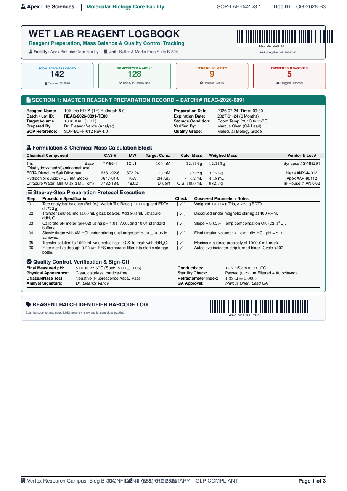</a><br><b>Wet Lab Reagent Preparation Logbook</b><br><a href="https://letx.app/templates/lab-documents/wet-lab-reagent-logbook">Open in LetX</a> · <a href="./lab-documents/wet-lab-reagent-logbook">Source</a></td>
</tr>
</table>

### Grants & Research Proposals

10 templates. [Browse this category on LetX](https://letx.app/templates/grants)

<table>
<tr>
<td width="33%" valign="top" align="center"><a href="https://letx.app/templates/grants/clinical-research-grant-application">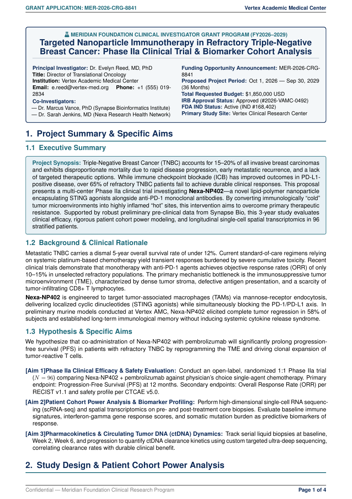</a><br><b>Clinical Research Grant Application</b><br><a href="https://letx.app/templates/grants/clinical-research-grant-application">Open in LetX</a> · <a href="./grants/clinical-research-grant-application">Source</a></td>
<td width="33%" valign="top" align="center"><a href="https://letx.app/templates/grants/darpa-technical-cost-proposal">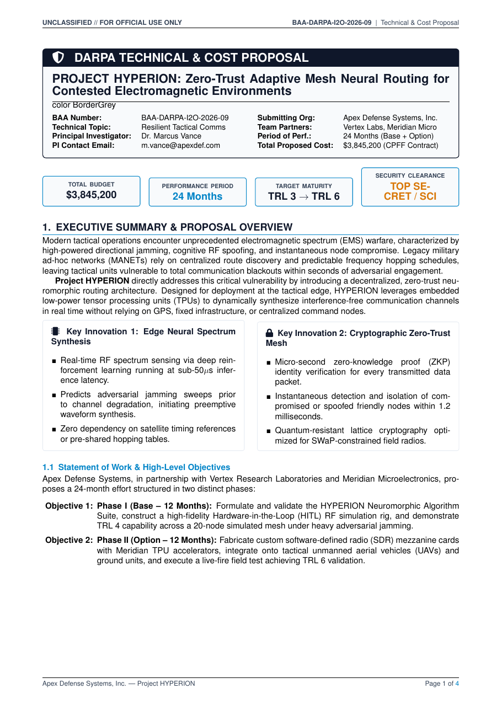</a><br><b>DARPA Technical & Cost Proposal</b><br><a href="https://letx.app/templates/grants/darpa-technical-cost-proposal">Open in LetX</a> · <a href="./grants/darpa-technical-cost-proposal">Source</a></td>
<td width="33%" valign="top" align="center"><a href="https://letx.app/templates/grants/erc-starting-grant-proposal">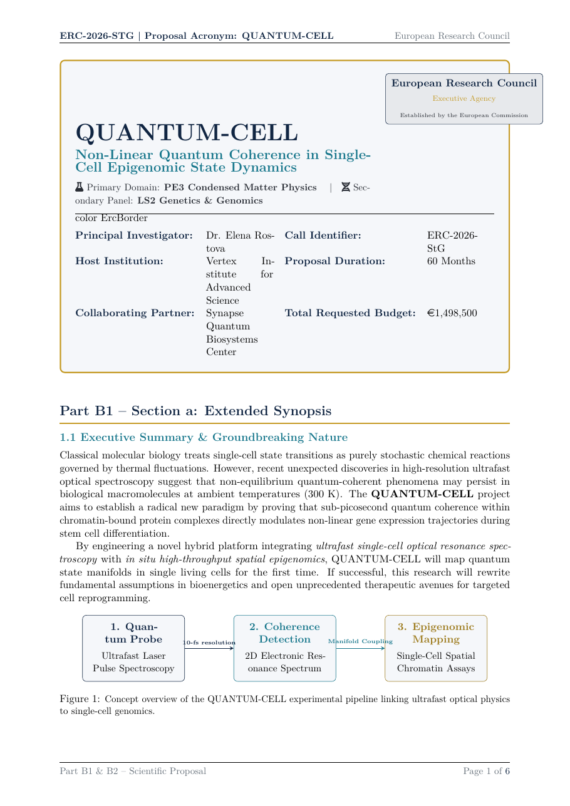</a><br><b>ERC Starting Grant Project Proposal</b><br><a href="https://letx.app/templates/grants/erc-starting-grant-proposal">Open in LetX</a> · <a href="./grants/erc-starting-grant-proposal">Source</a></td>
</tr>
<tr>
<td width="33%" valign="top" align="center"><a href="https://letx.app/templates/grants/horizon-europe-innovation-action">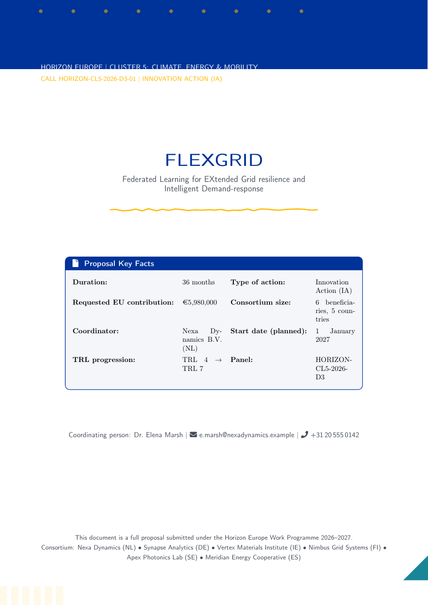</a><br><b>Horizon Europe Innovation Action Proposal</b><br><a href="https://letx.app/templates/grants/horizon-europe-innovation-action">Open in LetX</a> · <a href="./grants/horizon-europe-innovation-action">Source</a></td>
<td width="33%" valign="top" align="center"><a href="https://letx.app/templates/grants/nih-r01-research-strategy">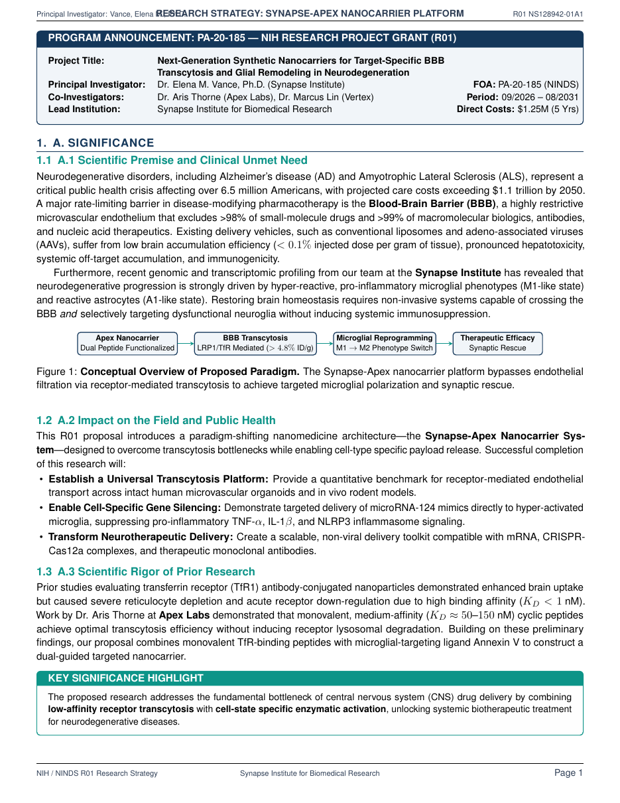</a><br><b>NIH R01 Research Strategy Proposal</b><br><a href="https://letx.app/templates/grants/nih-r01-research-strategy">Open in LetX</a> · <a href="./grants/nih-r01-research-strategy">Source</a></td>
<td width="33%" valign="top" align="center"><a href="https://letx.app/templates/grants/nsf-project-description-template">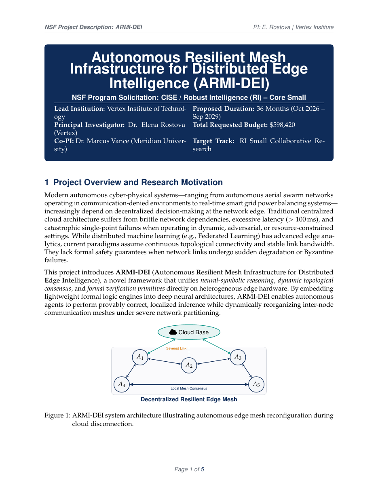</a><br><b>NSF Project Description Template</b><br><a href="https://letx.app/templates/grants/nsf-project-description-template">Open in LetX</a> · <a href="./grants/nsf-project-description-template">Source</a></td>
</tr>
<tr>
<td width="33%" valign="top" align="center"><a href="https://letx.app/templates/grants/philanthropic-foundation-fellowship">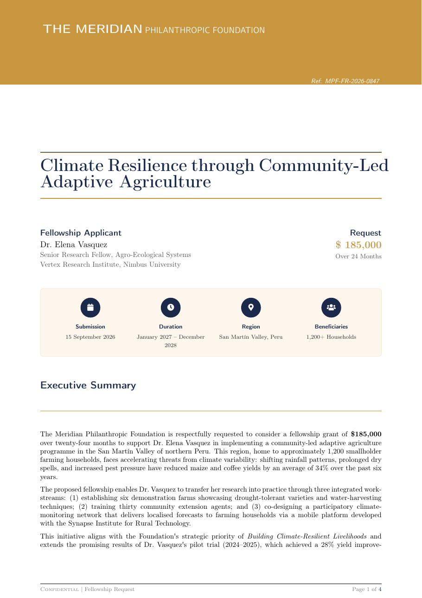</a><br><b>Philanthropic Foundation Fellowship Request</b><br><a href="https://letx.app/templates/grants/philanthropic-foundation-fellowship">Open in LetX</a> · <a href="./grants/philanthropic-foundation-fellowship">Source</a></td>
<td width="33%" valign="top" align="center"><a href="https://letx.app/templates/grants/sbir-phase-1-grant-proposal">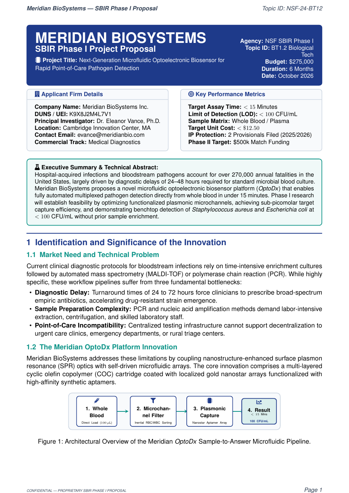</a><br><b>SBIR/STTR Phase I Startup Grant Proposal</b><br><a href="https://letx.app/templates/grants/sbir-phase-1-grant-proposal">Open in LetX</a> · <a href="./grants/sbir-phase-1-grant-proposal">Source</a></td>
<td width="33%" valign="top" align="center"><a href="https://letx.app/templates/grants/supercomputing-allocation-request">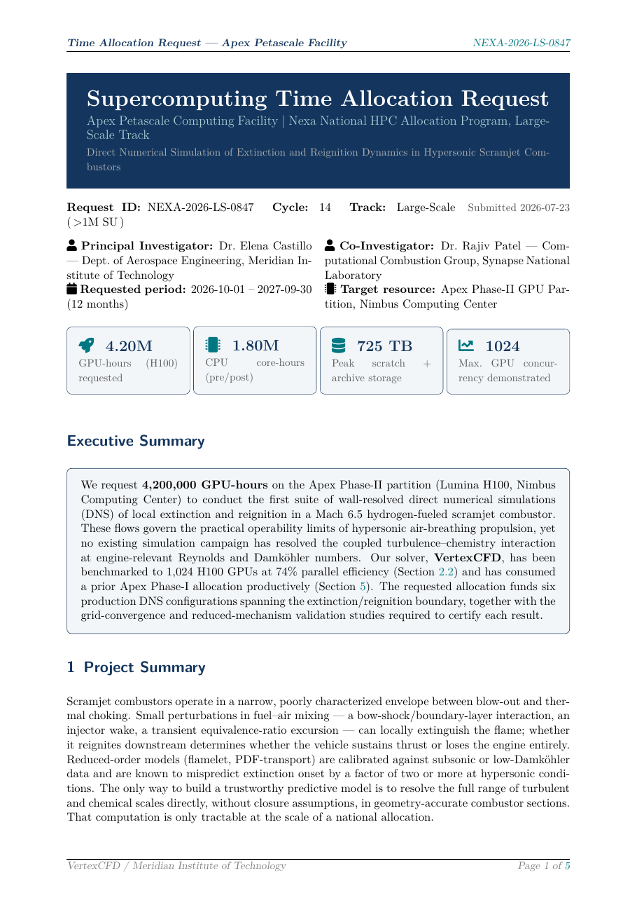</a><br><b>Supercomputing Time Allocation Request</b><br><a href="https://letx.app/templates/grants/supercomputing-allocation-request">Open in LetX</a> · <a href="./grants/supercomputing-allocation-request">Source</a></td>
</tr>
<tr>
<td width="33%" valign="top" align="center"><a href="https://letx.app/templates/grants/institutional-seed-grant-proposal">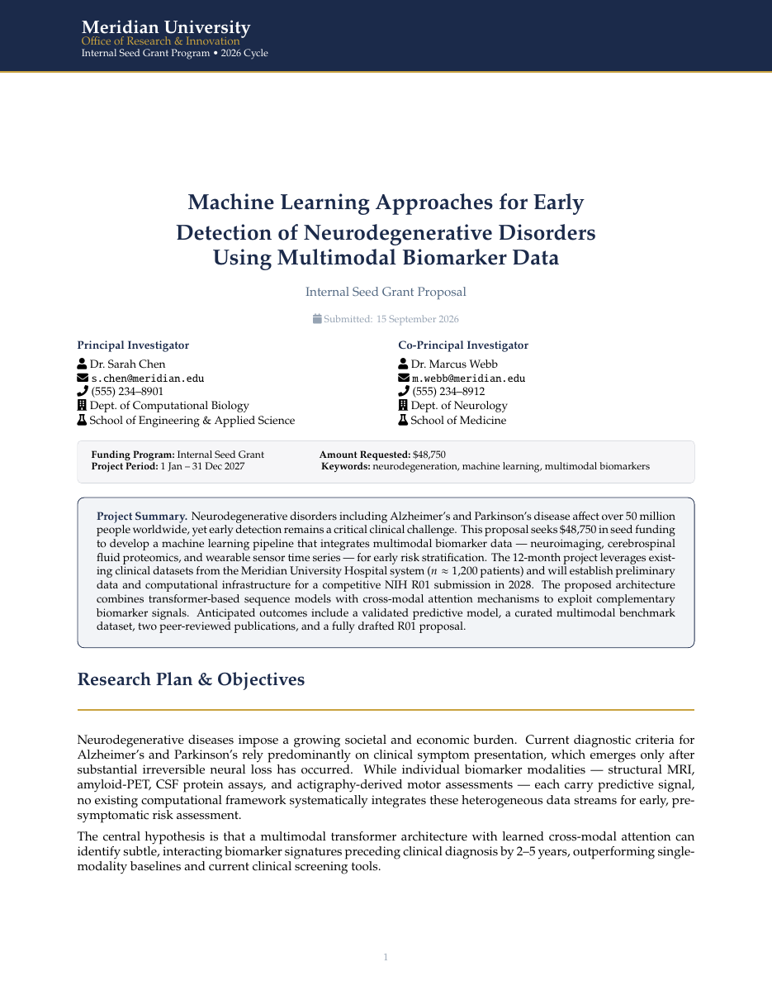</a><br><b>University Seed Grant Internal Proposal</b><br><a href="https://letx.app/templates/grants/institutional-seed-grant-proposal">Open in LetX</a> · <a href="./grants/institutional-seed-grant-proposal">Source</a></td>
</tr>
</table>

### Academic Posters

14 templates. [Browse this category on LetX](https://letx.app/templates/posters)

<table>
<tr>
<td width="33%" valign="top" align="center"><b>A0 Research Poster</b><br><a href="https://letx.app/templates/posters/a0poster">Open in LetX</a> · <a href="./posters/a0poster">Source</a></td>
<td width="33%" valign="top" align="center"><a href="https://letx.app/templates/posters/a0poster-classic-research">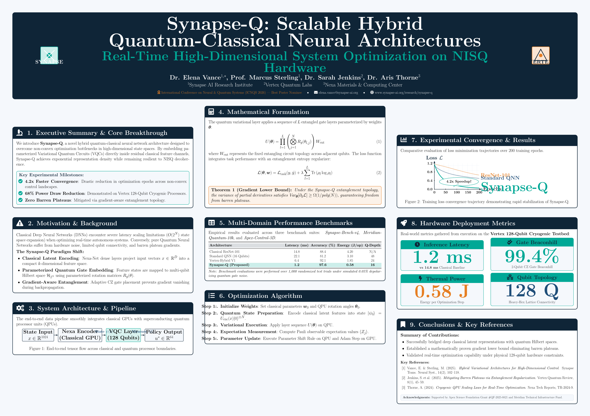</a><br><b>A0poster Classic Academic Research Poster</b><br><a href="https://letx.app/templates/posters/a0poster-classic-research">Open in LetX</a> · <a href="./posters/a0poster-classic-research">Source</a></td>
<td width="33%" valign="top" align="center"><a href="https://letx.app/templates/posters/a0poster-high-density-data">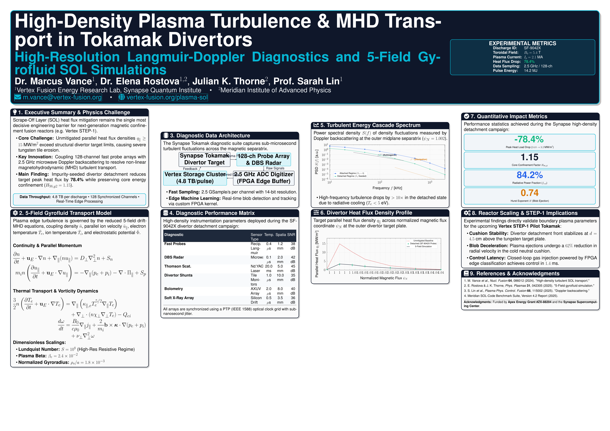</a><br><b>A0poster High-Density Data Analysis Poster</b><br><a href="https://letx.app/templates/posters/a0poster-high-density-data">Open in LetX</a> · <a href="./posters/a0poster-high-density-data">Source</a></td>
</tr>
<tr>
<td width="33%" valign="top" align="center"><a href="https://letx.app/templates/posters/a0poster-vertical-banner">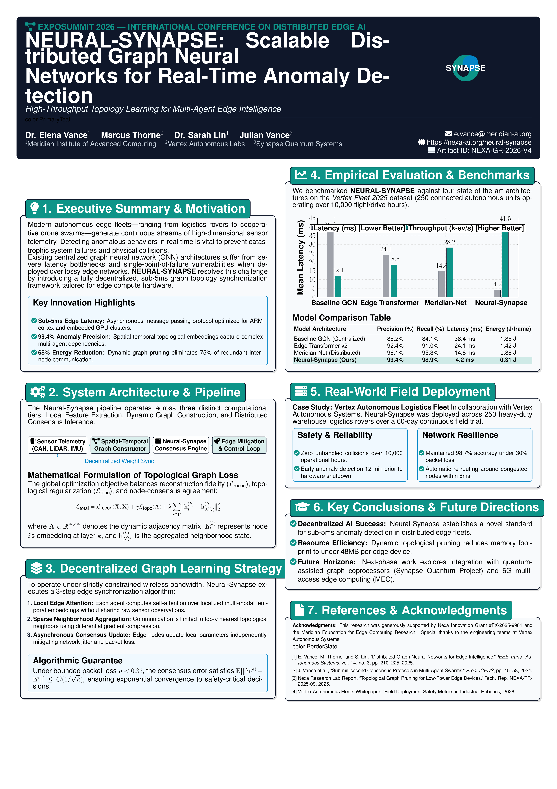</a><br><b>A0poster Two-Column Vertical Exhibition Banner</b><br><a href="https://letx.app/templates/posters/a0poster-vertical-banner">Open in LetX</a> · <a href="./posters/a0poster-vertical-banner">Source</a></td>
<td width="33%" valign="top" align="center"><b>baposter Clean Template</b><br><a href="https://letx.app/templates/posters/baposter-clean">Open in LetX</a> · <a href="./posters/baposter-clean">Source</a></td>
<td width="33%" valign="top" align="center"><a href="https://letx.app/templates/posters/beamerposter-dark-tech-expo">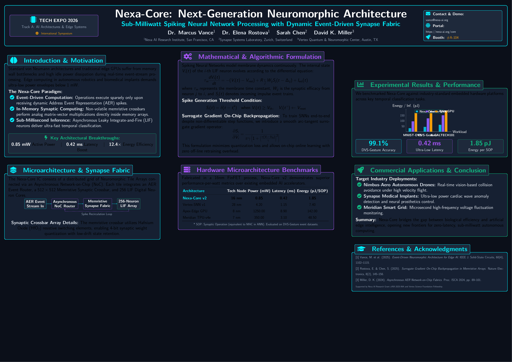</a><br><b>Beamerposter Dark Mode Tech Expo Poster</b><br><a href="https://letx.app/templates/posters/beamerposter-dark-tech-expo">Open in LetX</a> · <a href="./posters/beamerposter-dark-tech-expo">Source</a></td>
</tr>
<tr>
<td width="33%" valign="top" align="center"><a href="https://letx.app/templates/posters/beamerposter-grid-layout">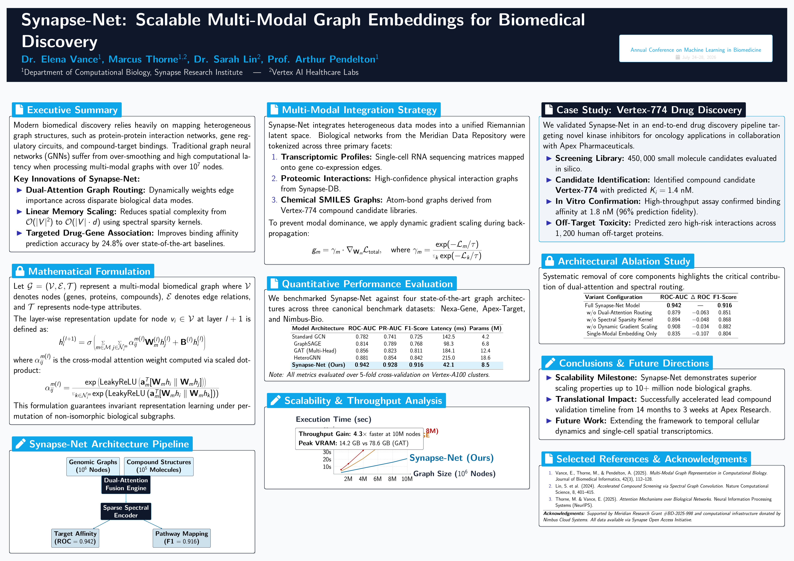</a><br><b>Beamerposter Grid Layout Conference Poster</b><br><a href="https://letx.app/templates/posters/beamerposter-grid-layout">Open in LetX</a> · <a href="./posters/beamerposter-grid-layout">Source</a></td>
<td width="33%" valign="top" align="center"><a href="https://letx.app/templates/posters/beamerposter-landscape-3column">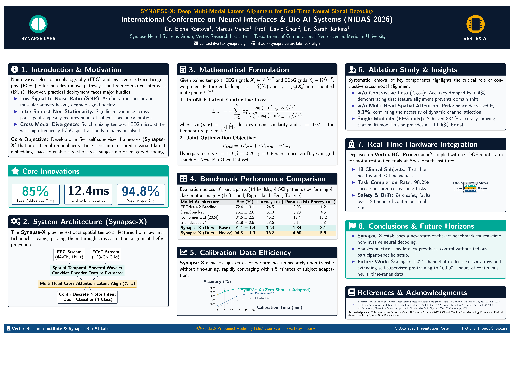</a><br><b>Beamerposter Landscape 3-Column Conference Poster</b><br><a href="https://letx.app/templates/posters/beamerposter-landscape-3column">Open in LetX</a> · <a href="./posters/beamerposter-landscape-3column">Source</a></td>
<td width="33%" valign="top" align="center"><b>Gemini Beamer Poster</b><br><a href="https://letx.app/templates/posters/gemini-beamerposter">Open in LetX</a> · <a href="./posters/gemini-beamerposter">Source</a></td>
</tr>
<tr>
<td width="33%" valign="top" align="center"><b>TikZ Poster Template</b><br><a href="https://letx.app/templates/posters/tikzposter-clean">Open in LetX</a> · <a href="./posters/tikzposter-clean">Source</a></td>
<td width="33%" valign="top" align="center"><a href="https://letx.app/templates/posters/tikzposter-student-symposium">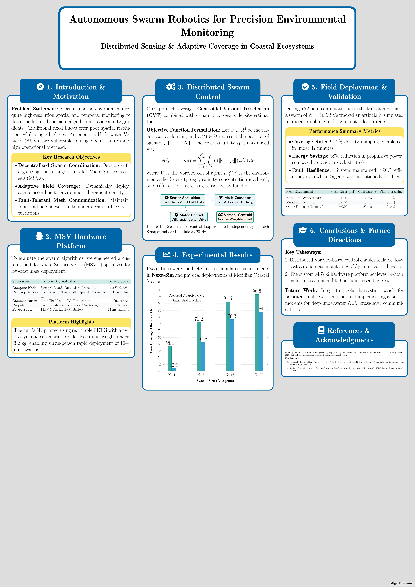</a><br><b>TikZposter Colorful Student Symposium Poster</b><br><a href="https://letx.app/templates/posters/tikzposter-student-symposium">Open in LetX</a> · <a href="./posters/tikzposter-student-symposium">Source</a></td>
<td width="33%" valign="top" align="center"><a href="https://letx.app/templates/posters/tikzposter-medical-clinical">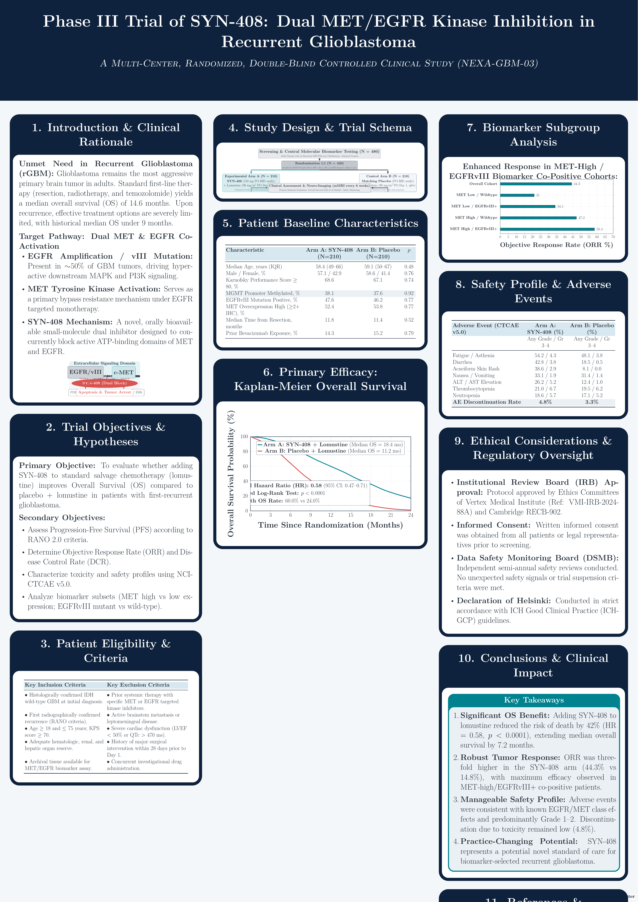</a><br><b>TikZposter Medical Research & Clinical Trial</b><br><a href="https://letx.app/templates/posters/tikzposter-medical-clinical">Open in LetX</a> · <a href="./posters/tikzposter-medical-clinical">Source</a></td>
</tr>
<tr>
<td width="33%" valign="top" align="center"><a href="https://letx.app/templates/posters/tikzposter-minimalist-clean">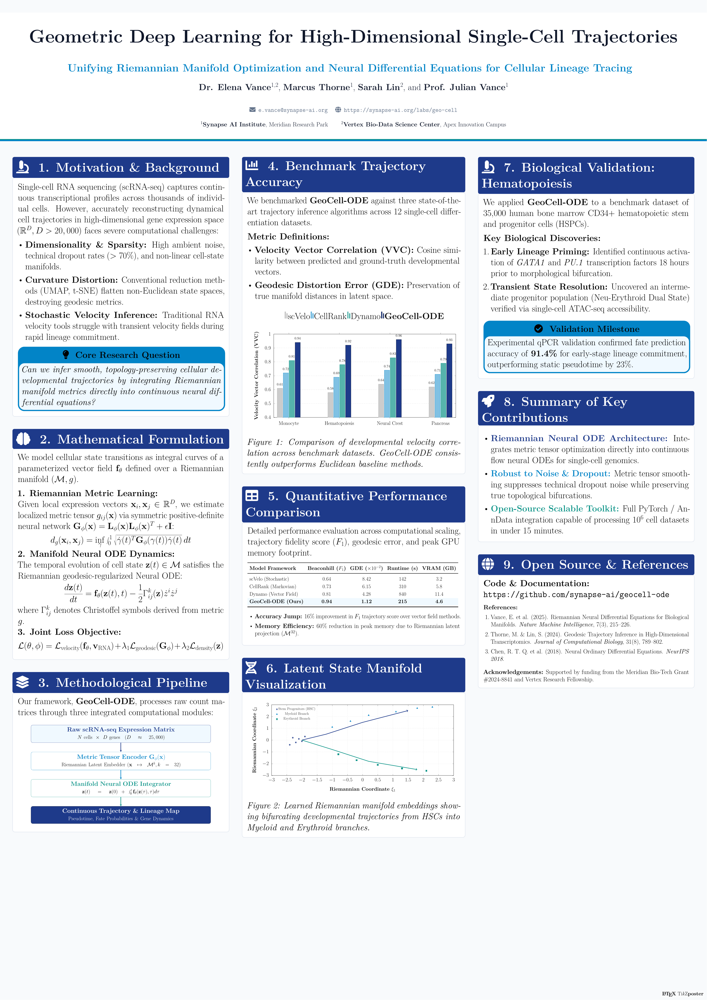</a><br><b>TikZposter Minimalist Clean Scientific Poster</b><br><a href="https://letx.app/templates/posters/tikzposter-minimalist-clean">Open in LetX</a> · <a href="./posters/tikzposter-minimalist-clean">Source</a></td>
<td width="33%" valign="top" align="center"><a href="https://letx.app/templates/posters/tikzposter-modern-infographic">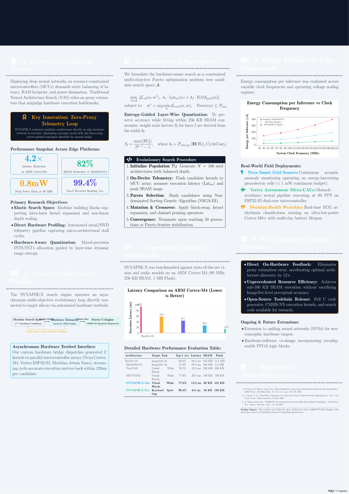</a><br><b>TikZposter Modern Infographic Poster</b><br><a href="https://letx.app/templates/posters/tikzposter-modern-infographic">Open in LetX</a> · <a href="./posters/tikzposter-modern-infographic">Source</a></td>
</tr>
</table>

### Presentations & Beamer Slides

23 templates. [Browse this category on LetX](https://letx.app/templates/presentations)

<table>
<tr>
<td width="33%" valign="top" align="center"><b>Academic Defense Presentation</b><br><a href="https://letx.app/templates/presentations/academic-defense">Open in LetX</a> · <a href="./presentations/academic-defense">Source</a></td>
<td width="33%" valign="top" align="center"><a href="https://letx.app/templates/presentations/beamer-corporate-quarterly">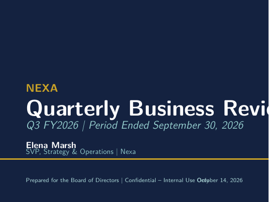</a><br><b>Beamer Clean Corporate Quarterly Review</b><br><a href="https://letx.app/templates/presentations/beamer-corporate-quarterly">Open in LetX</a> · <a href="./presentations/beamer-corporate-quarterly">Source</a></td>
<td width="33%" valign="top" align="center"><a href="https://letx.app/templates/presentations/beamer-pastel-humanities">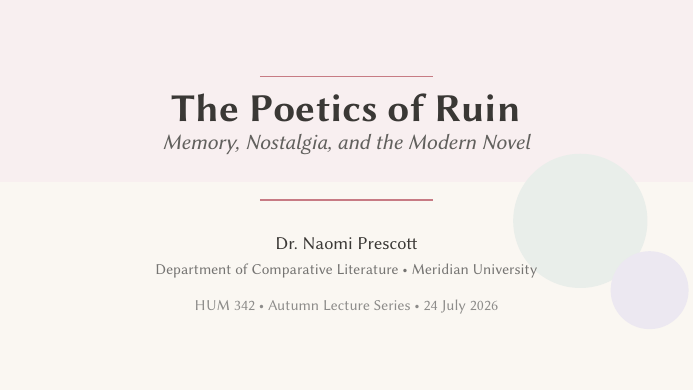</a><br><b>Beamer Elegant Pastel Humanities Talk</b><br><a href="https://letx.app/templates/presentations/beamer-pastel-humanities">Open in LetX</a> · <a href="./presentations/beamer-pastel-humanities">Source</a></td>
</tr>
<tr>
<td width="33%" valign="top" align="center"><a href="https://letx.app/templates/presentations/beamer-scientific-defense-deck">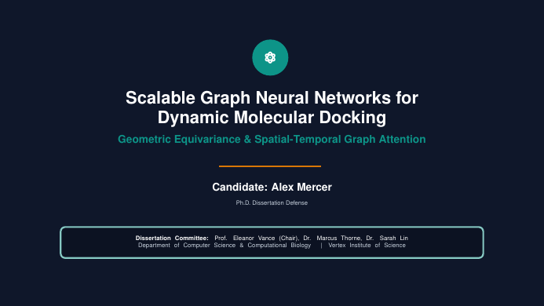</a><br><b>Beamer High-Contrast Scientific Defense</b><br><a href="https://letx.app/templates/presentations/beamer-scientific-defense-deck">Open in LetX</a> · <a href="./presentations/beamer-scientific-defense-deck">Source</a></td>
<td width="33%" valign="top" align="center"><a href="https://letx.app/templates/presentations/beamer-interactive-nav-deck"></a><br><b>Beamer Interactive Navigation Presentation</b><br><a href="https://letx.app/templates/presentations/beamer-interactive-nav-deck">Open in LetX</a> · <a href="./presentations/beamer-interactive-nav-deck">Source</a></td>
<td width="33%" valign="top" align="center"><a href="https://letx.app/templates/presentations/beamer-keynote-media-style"></a><br><b>Beamer Keynote-Style Media Presentation</b><br><a href="https://letx.app/templates/presentations/beamer-keynote-media-style">Open in LetX</a> · <a href="./presentations/beamer-keynote-media-style">Source</a></td>
</tr>
<tr>
<td width="33%" valign="top" align="center"><a href="https://letx.app/templates/presentations/beamer-minimal-math-lecture">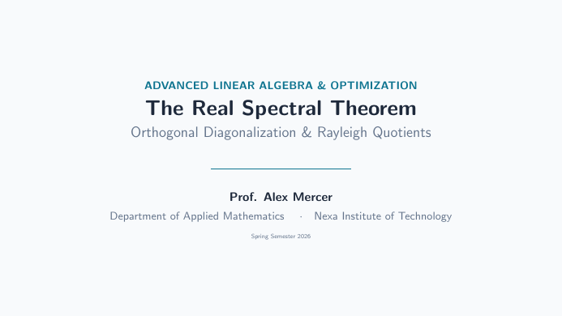</a><br><b>Beamer Minimalist Math Lecture Slides</b><br><a href="https://letx.app/templates/presentations/beamer-minimal-math-lecture">Open in LetX</a> · <a href="./presentations/beamer-minimal-math-lecture">Source</a></td>
<td width="33%" valign="top" align="center"><a href="https://letx.app/templates/presentations/beamer-cybersecurity-deck">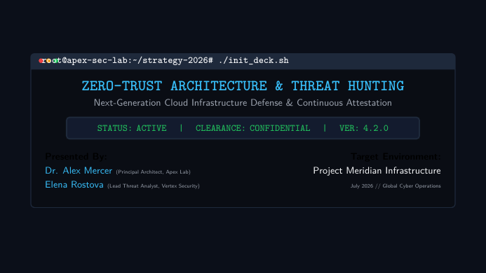</a><br><b>Beamer Modern Cyber & Security Deck</b><br><a href="https://letx.app/templates/presentations/beamer-cybersecurity-deck">Open in LetX</a> · <a href="./presentations/beamer-cybersecurity-deck">Source</a></td>
<td width="33%" valign="top" align="center"><a href="https://letx.app/templates/presentations/beamer-two-column-technical">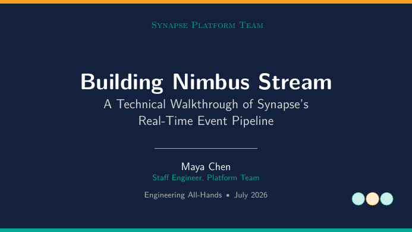</a><br><b>Beamer Two-Column Technical Walkthrough</b><br><a href="https://letx.app/templates/presentations/beamer-two-column-technical">Open in LetX</a> · <a href="./presentations/beamer-two-column-technical">Source</a></td>
</tr>
<tr>
<td width="33%" valign="top" align="center"><b>Conference Talk (15 min)</b><br><a href="https://letx.app/templates/presentations/conference-15min">Open in LetX</a> · <a href="./presentations/conference-15min">Source</a></td>
<td width="33%" valign="top" align="center"><a href="https://letx.app/templates/presentations/foiltex-high-readability">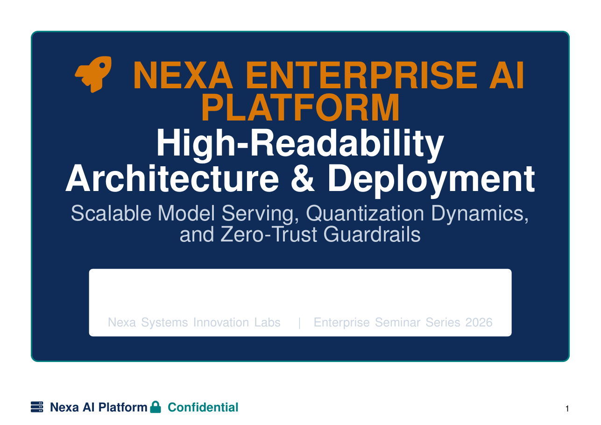</a><br><b>FoilTeX High-Readability Workshop Deck</b><br><a href="https://letx.app/templates/presentations/foiltex-high-readability">Open in LetX</a> · <a href="./presentations/foiltex-high-readability">Source</a></td>
<td width="33%" valign="top" align="center"><a href="https://letx.app/templates/presentations/foiltex-large-print-slides">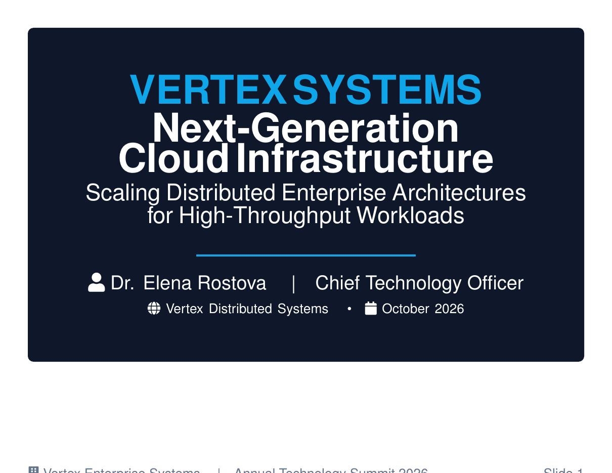</a><br><b>FoilTeX Large Print Conference Slides</b><br><a href="https://letx.app/templates/presentations/foiltex-large-print-slides">Open in LetX</a> · <a href="./presentations/foiltex-large-print-slides">Source</a></td>
</tr>
<tr>
<td width="33%" valign="top" align="center"><a href="https://letx.app/templates/presentations/standard-latex-slides-deck">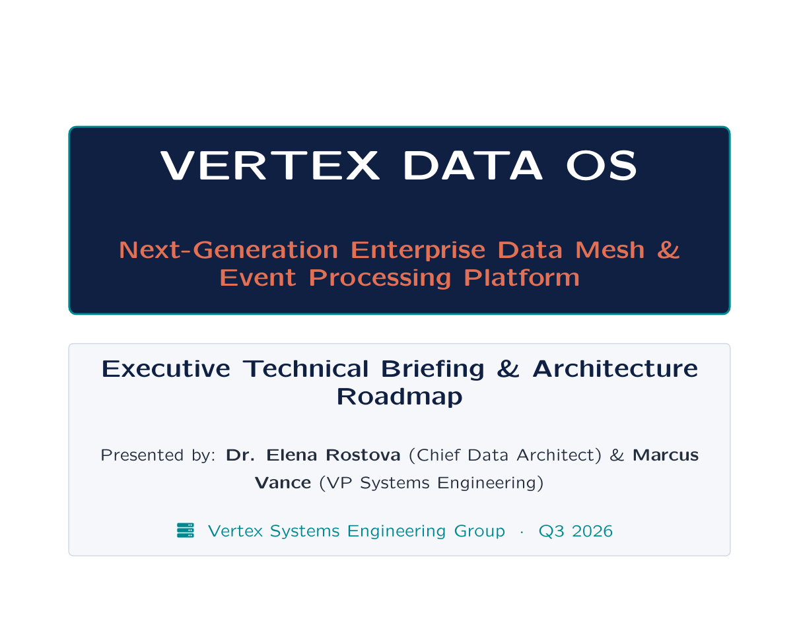</a><br><b>LaTeX Standard Transparencies Deck</b><br><a href="https://letx.app/templates/presentations/standard-latex-slides-deck">Open in LetX</a> · <a href="./presentations/standard-latex-slides-deck">Source</a></td>
<td width="33%" valign="top" align="center"><b>Madrid Beamer Theme</b><br><a href="https://letx.app/templates/presentations/madrid-beamer">Open in LetX</a> · <a href="./presentations/madrid-beamer">Source</a></td>
<td width="33%" valign="top" align="center"><b>Metropolis Beamer Theme</b><br><a href="https://letx.app/templates/presentations/metropolis-beamer">Open in LetX</a> · <a href="./presentations/metropolis-beamer">Source</a></td>
</tr>
<tr>
<td width="33%" valign="top" align="center"><b>Minimalist Beamer Slides</b><br><a href="https://letx.app/templates/presentations/minimalist-beamer">Open in LetX</a> · <a href="./presentations/minimalist-beamer">Source</a></td>
<td width="33%" valign="top" align="center"><a href="https://letx.app/templates/presentations/minimalist-nordic-beamer">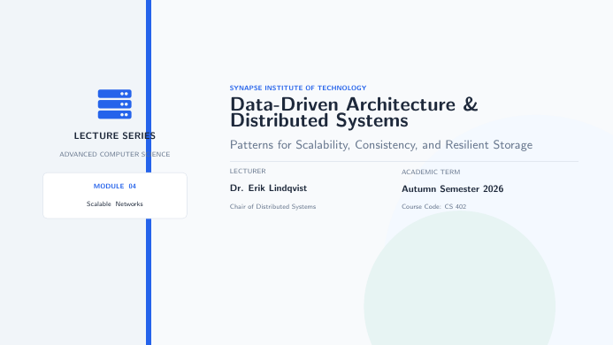</a><br><b>Minimalist Nordic Beamer Lecture</b><br><a href="https://letx.app/templates/presentations/minimalist-nordic-beamer">Open in LetX</a> · <a href="./presentations/minimalist-nordic-beamer">Source</a></td>
<td width="33%" valign="top" align="center"><b>Modern Dark Beamer</b><br><a href="https://letx.app/templates/presentations/modern-dark-beamer">Open in LetX</a> · <a href="./presentations/modern-dark-beamer">Source</a></td>
</tr>
<tr>
<td width="33%" valign="top" align="center"><a href="https://letx.app/templates/presentations/modern-dark-beamer-deck">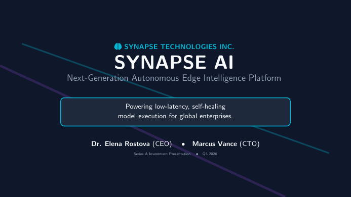</a><br><b>Modern Dark Theme Beamer Pitch Deck</b><br><a href="https://letx.app/templates/presentations/modern-dark-beamer-deck">Open in LetX</a> · <a href="./presentations/modern-dark-beamer-deck">Source</a></td>
<td width="33%" valign="top" align="center"><a href="https://letx.app/templates/presentations/powerdot-executive-corporate">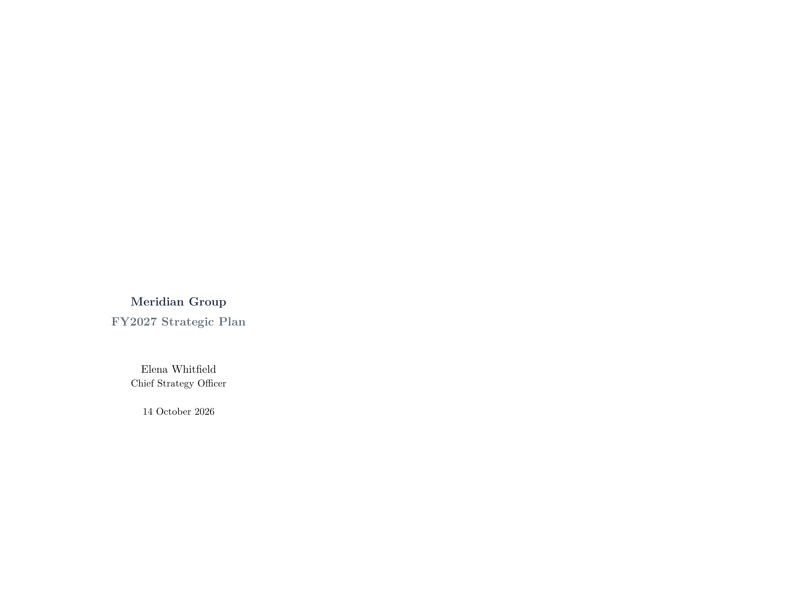</a><br><b>Powerdot Executive Corporate Presentation</b><br><a href="https://letx.app/templates/presentations/powerdot-executive-corporate">Open in LetX</a> · <a href="./presentations/powerdot-executive-corporate">Source</a></td>
<td width="33%" valign="top" align="center"><a href="https://letx.app/templates/presentations/powerdot-minimal-monochrome">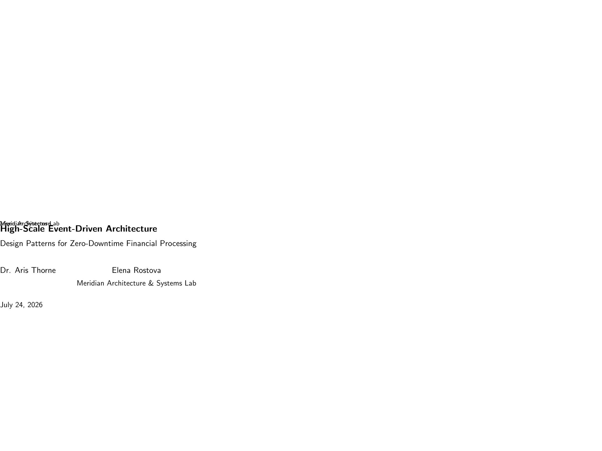</a><br><b>Powerdot Minimal Monochrome Deck</b><br><a href="https://letx.app/templates/presentations/powerdot-minimal-monochrome">Open in LetX</a> · <a href="./presentations/powerdot-minimal-monochrome">Source</a></td>
</tr>
<tr>
<td width="33%" valign="top" align="center"><a href="https://letx.app/templates/presentations/powerdot-modern-gradient">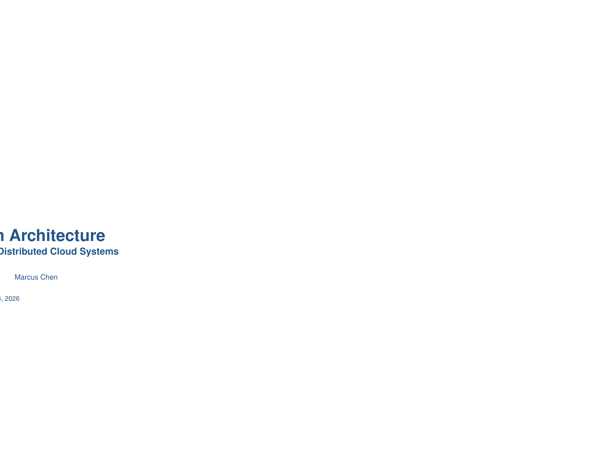</a><br><b>Powerdot Modern Gradient Deck</b><br><a href="https://letx.app/templates/presentations/powerdot-modern-gradient">Open in LetX</a> · <a href="./presentations/powerdot-modern-gradient">Source</a></td>
<td width="33%" valign="top" align="center"><a href="https://letx.app/templates/presentations/prosper-classic-academic-deck">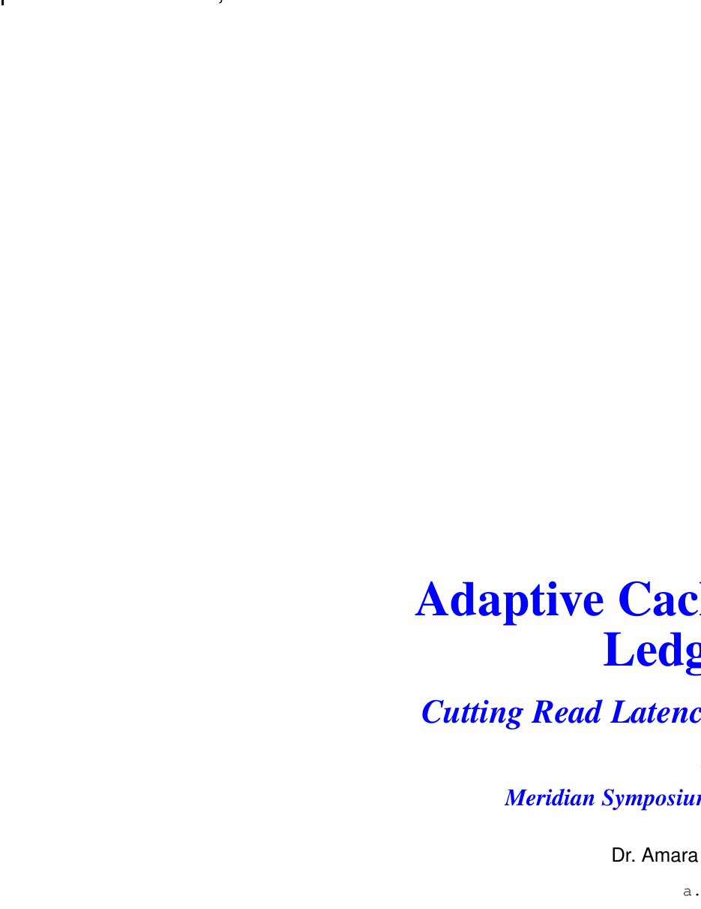</a><br><b>Prosper Classic Academic Presentation</b><br><a href="https://letx.app/templates/presentations/prosper-classic-academic-deck">Open in LetX</a> · <a href="./presentations/prosper-classic-academic-deck">Source</a></td>
</tr>
</table>

### Books & Long-Form Documents

14 templates. [Browse this category on LetX](https://letx.app/templates/books)

<table>
<tr>
<td width="33%" valign="top" align="center"><a href="https://letx.app/templates/books/ams-advanced-math-monograph">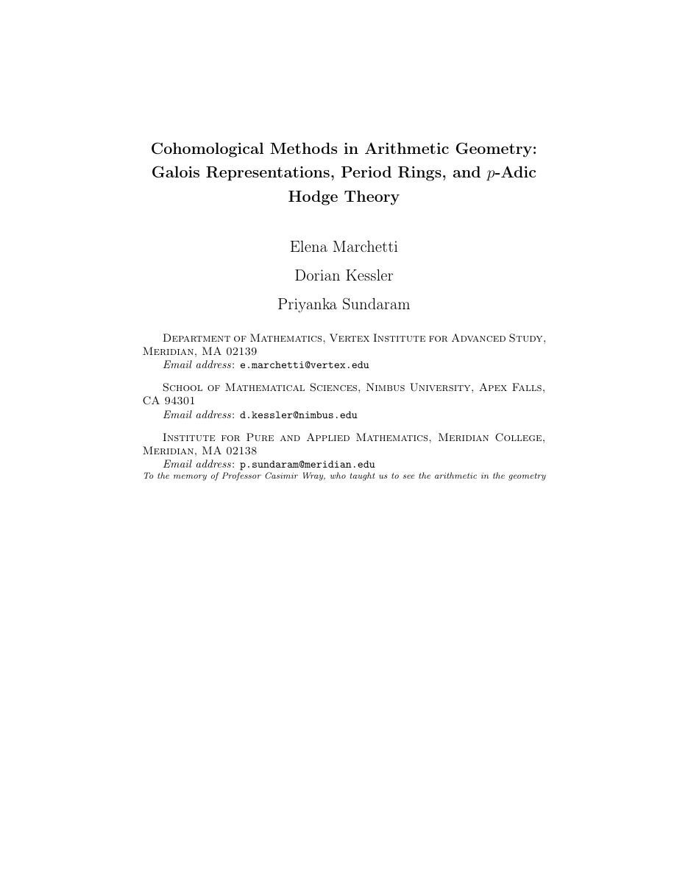</a><br><b>AMS Advanced Mathematical Monograph</b><br><a href="https://letx.app/templates/books/ams-advanced-math-monograph">Open in LetX</a> · <a href="./books/ams-advanced-math-monograph">Source</a></td>
<td width="33%" valign="top" align="center"><a href="https://letx.app/templates/books/classic-typographic-monograph">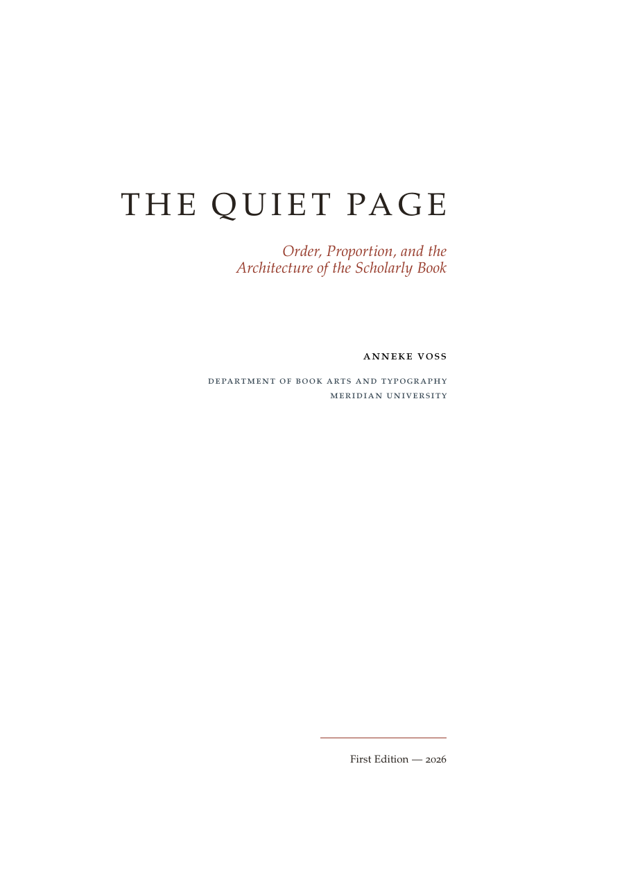</a><br><b>ClassicThesis Typography Masterpiece</b><br><a href="https://letx.app/templates/books/classic-typographic-monograph">Open in LetX</a> · <a href="./books/classic-typographic-monograph">Source</a></td>
<td width="33%" valign="top" align="center"><a href="https://letx.app/templates/books/corporate-annual-report-book">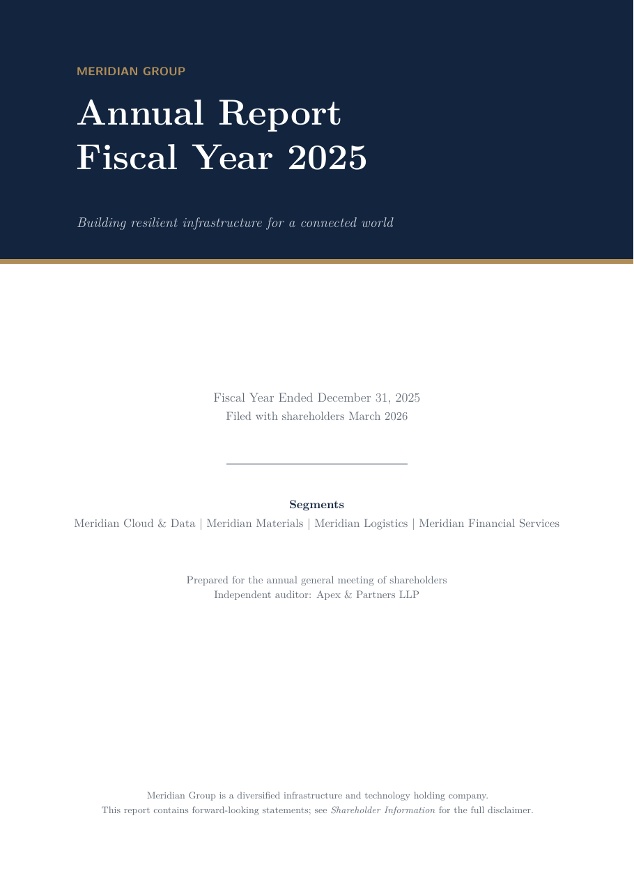</a><br><b>Corporate Annual Report Book</b><br><a href="https://letx.app/templates/books/corporate-annual-report-book">Open in LetX</a> · <a href="./books/corporate-annual-report-book">Source</a></td>
</tr>
<tr>
<td width="33%" valign="top" align="center"><a href="https://letx.app/templates/books/illustrated-heritage-hardcover">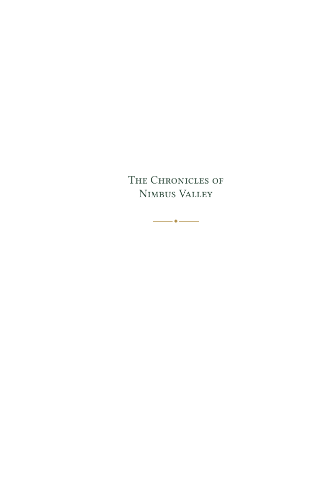</a><br><b>Illustrated Heritage Hardcover Book</b><br><a href="https://letx.app/templates/books/illustrated-heritage-hardcover">Open in LetX</a> · <a href="./books/illustrated-heritage-hardcover">Source</a></td>
<td width="33%" valign="top" align="center"><a href="https://letx.app/templates/books/koma-modern-academic-book">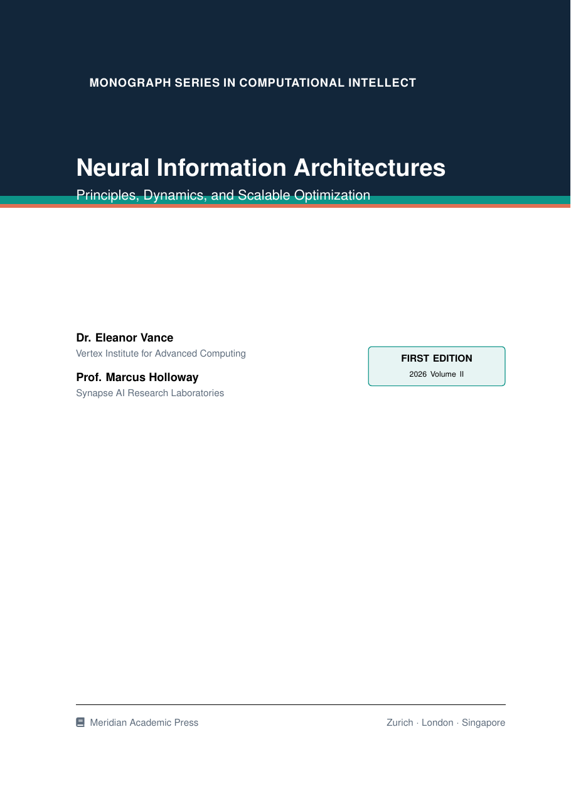</a><br><b>KOMA-Script Modern Academic Book</b><br><a href="https://letx.app/templates/books/koma-modern-academic-book">Open in LetX</a> · <a href="./books/koma-modern-academic-book">Source</a></td>
<td width="33%" valign="top" align="center"><b>Memoir Book Template</b><br><a href="./books/memoir">Source</a></td>
</tr>
<tr>
<td width="33%" valign="top" align="center"><a href="https://letx.app/templates/books/memoir-classic-fiction-novel">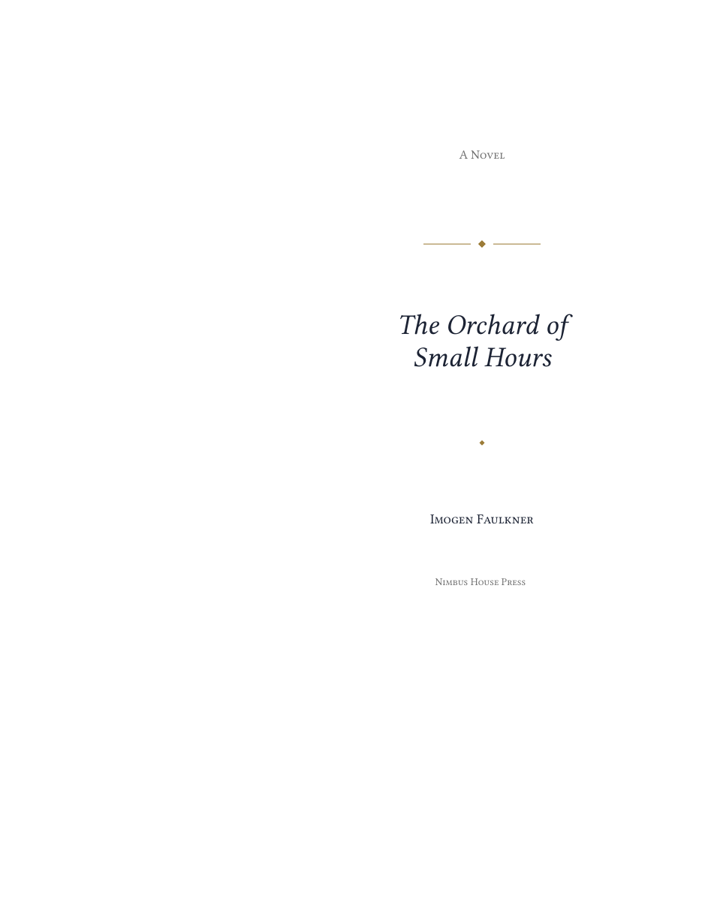</a><br><b>Memoir Classic Fiction Novel</b><br><a href="https://letx.app/templates/books/memoir-classic-fiction-novel">Open in LetX</a> · <a href="./books/memoir-classic-fiction-novel">Source</a></td>
<td width="33%" valign="top" align="center"><a href="https://letx.app/templates/books/modern-technical-manual-book">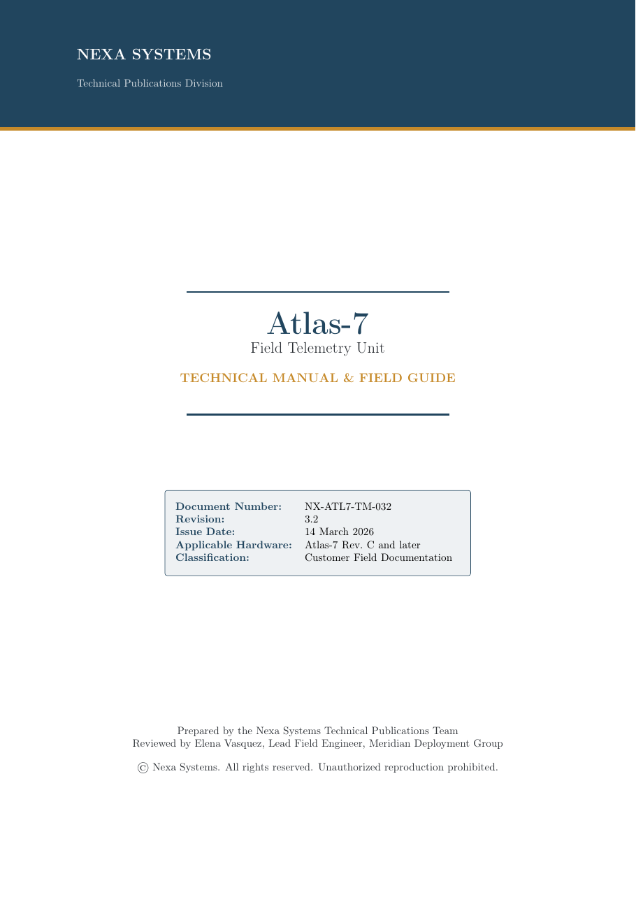</a><br><b>Modern Technical Manual & Field Guide</b><br><a href="https://letx.app/templates/books/modern-technical-manual-book">Open in LetX</a> · <a href="./books/modern-technical-manual-book">Source</a></td>
<td width="33%" valign="top" align="center"><b>Novel & Prose Template</b><br><a href="https://letx.app/templates/books/novel-prose">Open in LetX</a> · <a href="./books/novel-prose">Source</a></td>
</tr>
<tr>
<td width="33%" valign="top" align="center"><a href="https://letx.app/templates/books/novel-formatting-paperback">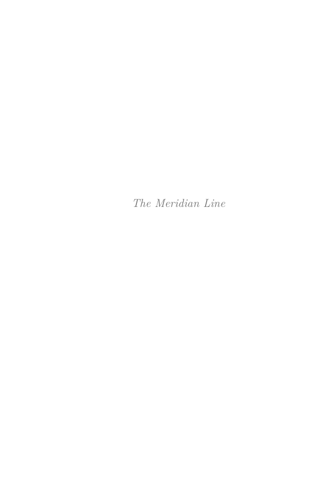</a><br><b>Novel Formatting Package Novel Layout</b><br><a href="https://letx.app/templates/books/novel-formatting-paperback">Open in LetX</a> · <a href="./books/novel-formatting-paperback">Source</a></td>
<td width="33%" valign="top" align="center"><a href="https://letx.app/templates/books/octavo-pocket-antiqua-book"></a><br><b>Octavo Pocket Antiqua Book</b><br><a href="https://letx.app/templates/books/octavo-pocket-antiqua-book">Open in LetX</a> · <a href="./books/octavo-pocket-antiqua-book">Source</a></td>
<td width="33%" valign="top" align="center"><b>Textbook Solutions Manual</b><br><a href="https://letx.app/templates/books/textbook-solutions">Open in LetX</a> · <a href="./books/textbook-solutions">Source</a></td>
</tr>
<tr>
<td width="33%" valign="top" align="center"><b>Tufte Book Template</b><br><a href="https://letx.app/templates/books/tufte-book">Open in LetX</a> · <a href="./books/tufte-book">Source</a></td>
<td width="33%" valign="top" align="center"><a href="https://letx.app/templates/books/tufte-marginal-notes-textbook">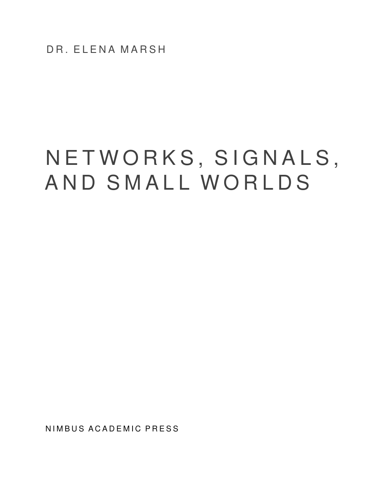</a><br><b>Tufte-Style Marginal Notes Textbook</b><br><a href="https://letx.app/templates/books/tufte-marginal-notes-textbook">Open in LetX</a> · <a href="./books/tufte-marginal-notes-textbook">Source</a></td>
</tr>
</table>

### Formal Letters & Letterheads

19 templates. [Browse this category on LetX](https://letx.app/templates/formal-letters)

<table>
<tr>
<td width="33%" valign="top" align="center"><a href="https://letx.app/templates/formal-letters/akletter-corporate-letterhead">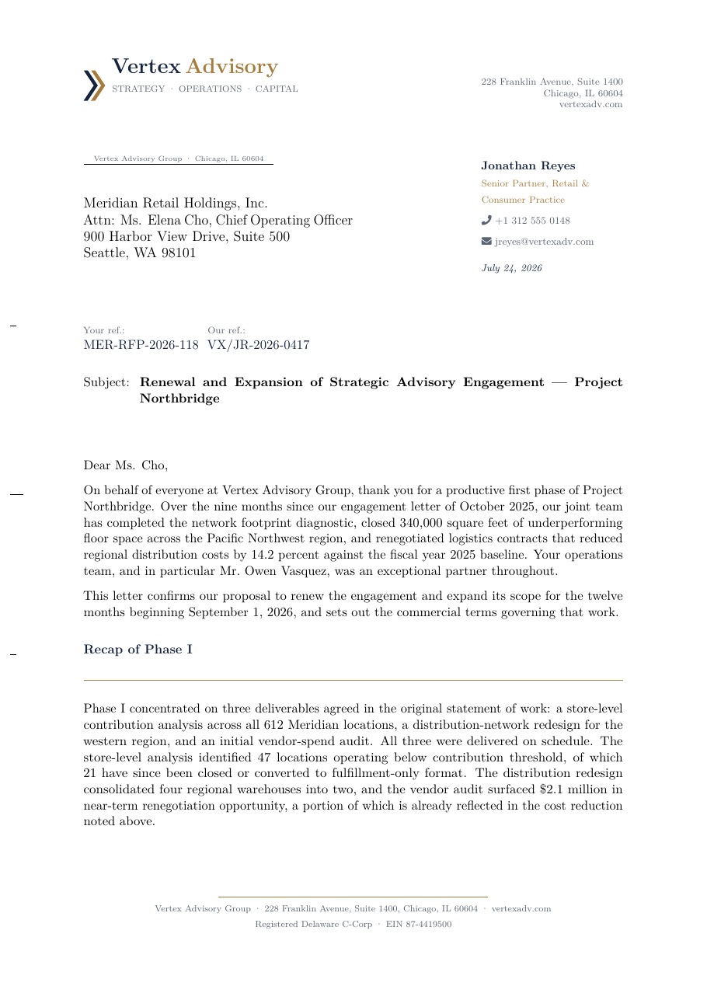</a><br><b>AkLetter Corporate Letterhead</b><br><a href="https://letx.app/templates/formal-letters/akletter-corporate-letterhead">Open in LetX</a> · <a href="./formal-letters/akletter-corporate-letterhead">Source</a></td>
<td width="33%" valign="top" align="center"><a href="https://letx.app/templates/formal-letters/batch-envelope-label-sheet">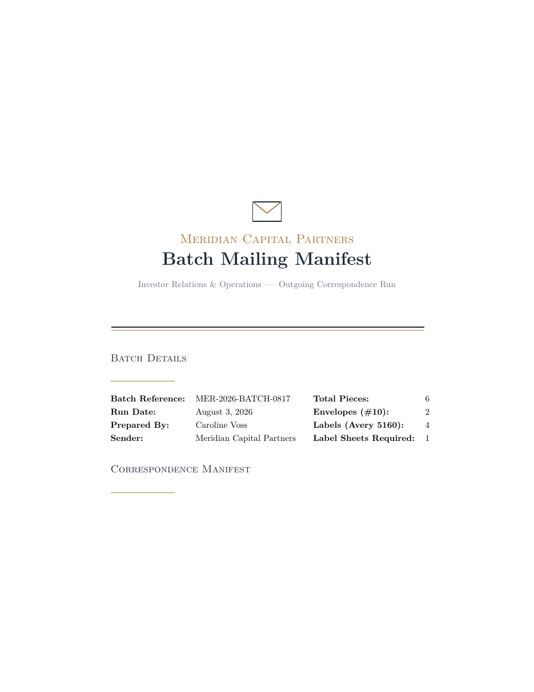</a><br><b>Batch Envelope & Mailing Label Sheet</b><br><a href="https://letx.app/templates/formal-letters/batch-envelope-label-sheet">Open in LetX</a> · <a href="./formal-letters/batch-envelope-label-sheet">Source</a></td>
<td width="33%" valign="top" align="center"><a href="https://letx.app/templates/formal-letters/bilingual-international-letter">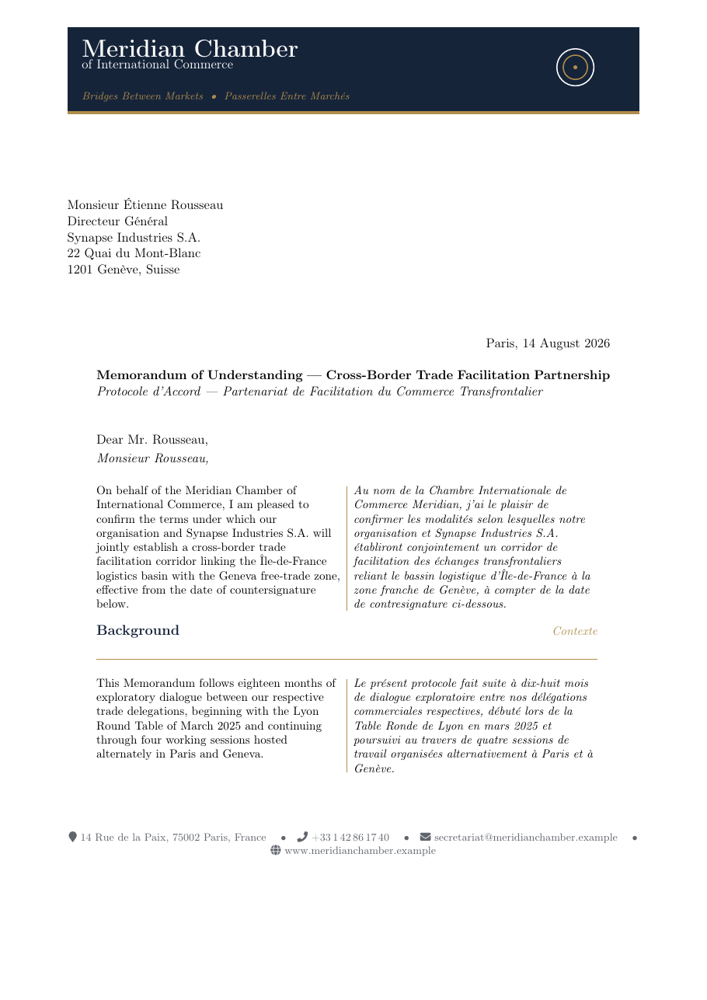</a><br><b>Bilingual International Formal Correspondence</b><br><a href="https://letx.app/templates/formal-letters/bilingual-international-letter">Open in LetX</a> · <a href="./formal-letters/bilingual-international-letter">Source</a></td>
</tr>
<tr>
<td width="33%" valign="top" align="center"><a href="https://letx.app/templates/formal-letters/commercial-invoice-cover-letter">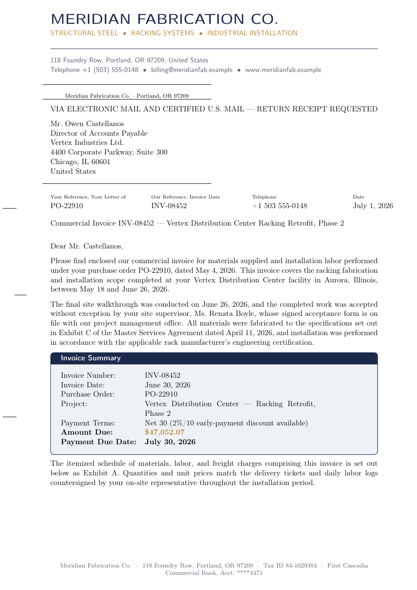</a><br><b>Commercial Invoice Cover Letter</b><br><a href="https://letx.app/templates/formal-letters/commercial-invoice-cover-letter">Open in LetX</a> · <a href="./formal-letters/commercial-invoice-cover-letter">Source</a></td>
<td width="33%" valign="top" align="center"><a href="https://letx.app/templates/formal-letters/corporate-board-resignation-letter">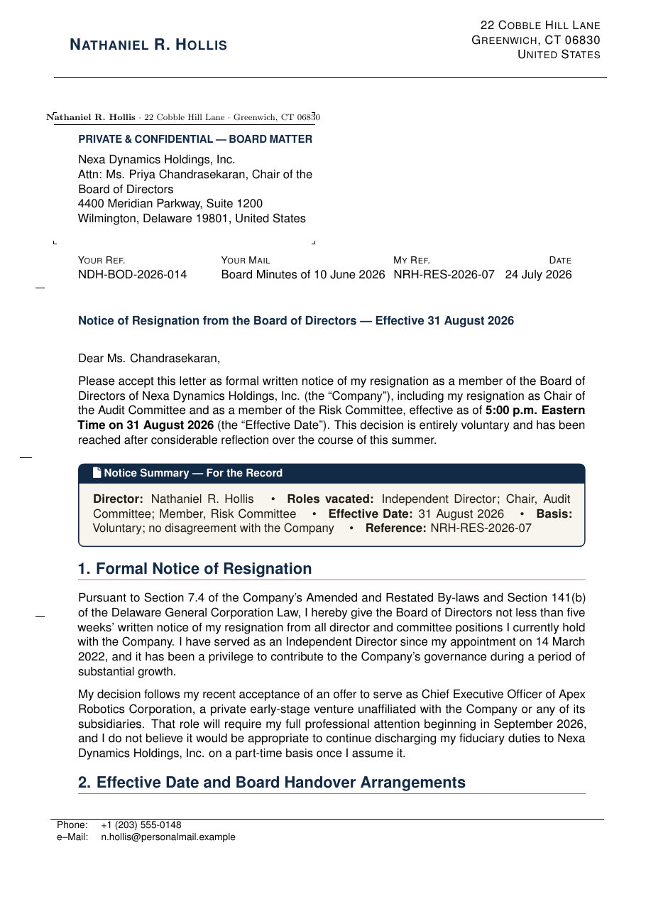</a><br><b>Corporate Board Resignation Letter</b><br><a href="https://letx.app/templates/formal-letters/corporate-board-resignation-letter">Open in LetX</a> · <a href="./formal-letters/corporate-board-resignation-letter">Source</a></td>
<td width="33%" valign="top" align="center"><b>Cover Letter Template</b><br><a href="https://letx.app/templates/formal-letters/cover-letter">Open in LetX</a> · <a href="./formal-letters/cover-letter">Source</a></td>
</tr>
<tr>
<td width="33%" valign="top" align="center"><a href="https://letx.app/templates/formal-letters/din-5008-german-business-letter">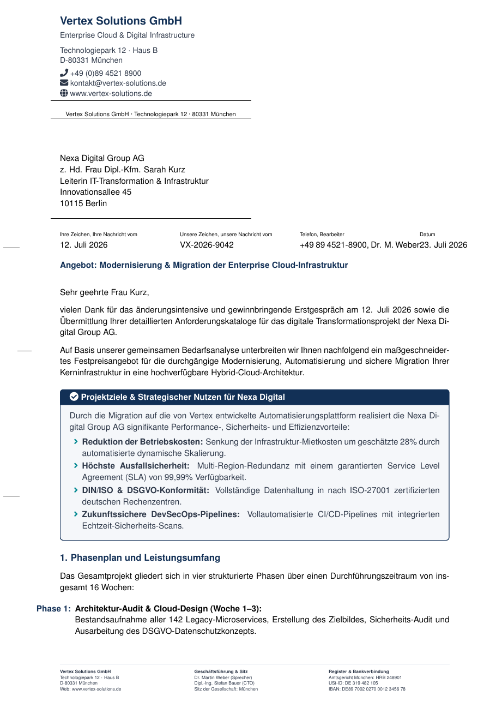</a><br><b>DIN 5008 Standard German Business Letter</b><br><a href="https://letx.app/templates/formal-letters/din-5008-german-business-letter">Open in LetX</a> · <a href="./formal-letters/din-5008-german-business-letter">Source</a></td>
<td width="33%" valign="top" align="center"><a href="https://letx.app/templates/formal-letters/diplomatic-official-note"></a><br><b>Diplomatic & Institutional Official Note</b><br><a href="https://letx.app/templates/formal-letters/diplomatic-official-note">Open in LetX</a> · <a href="./formal-letters/diplomatic-official-note">Source</a></td>
<td width="33%" valign="top" align="center"><b>Formal Business Letter</b><br><a href="./formal-letters/formal-business">Source</a></td>
</tr>
<tr>
<td width="33%" valign="top" align="center"><a href="https://letx.app/templates/formal-letters/g-brief-classic-business-letter">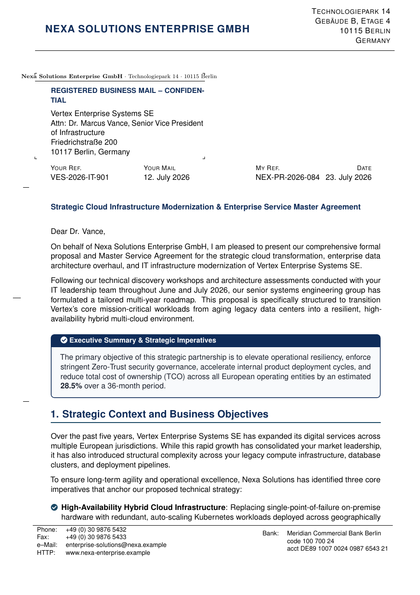</a><br><b>G-Brief Classic Business Letter</b><br><a href="https://letx.app/templates/formal-letters/g-brief-classic-business-letter">Open in LetX</a> · <a href="./formal-letters/g-brief-classic-business-letter">Source</a></td>
<td width="33%" valign="top" align="center"><a href="https://letx.app/templates/formal-letters/koma-executive-formal-letter">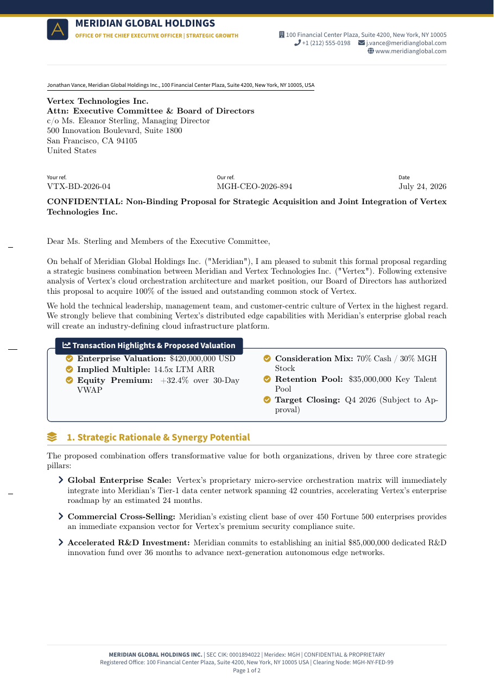</a><br><b>KOMA-Script Executive Formal Letter</b><br><a href="https://letx.app/templates/formal-letters/koma-executive-formal-letter">Open in LetX</a> · <a href="./formal-letters/koma-executive-formal-letter">Source</a></td>
<td width="33%" valign="top" align="center"><b>KOMA-Script Letter</b><br><a href="https://letx.app/templates/formal-letters/koma-letter">Open in LetX</a> · <a href="./formal-letters/koma-letter">Source</a></td>
</tr>
<tr>
<td width="33%" valign="top" align="center"><a href="https://letx.app/templates/formal-letters/legal-notice-demand-letter">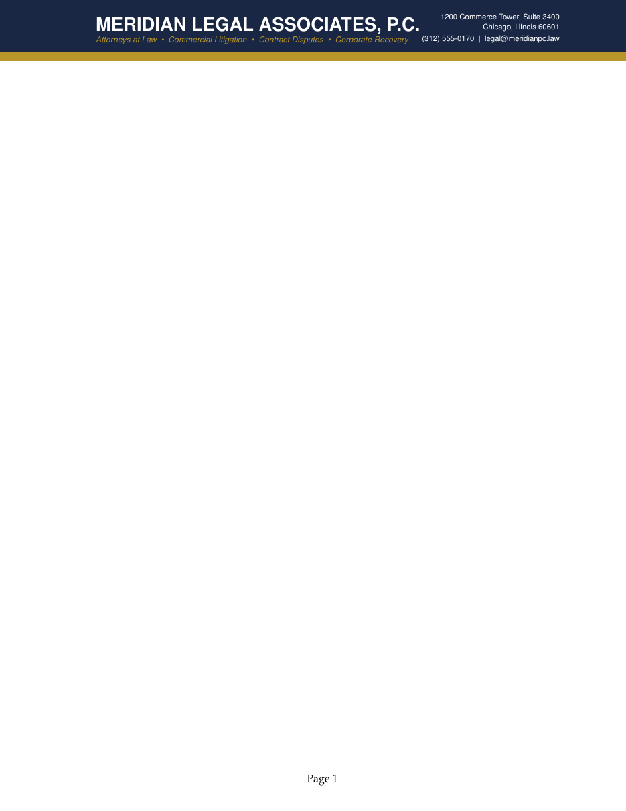</a><br><b>Legal Notice & Formal Demand Letter</b><br><a href="https://letx.app/templates/formal-letters/legal-notice-demand-letter">Open in LetX</a> · <a href="./formal-letters/legal-notice-demand-letter">Source</a></td>
<td width="33%" valign="top" align="center"><a href="https://letx.app/templates/formal-letters/minimalist-personal-formal-letter">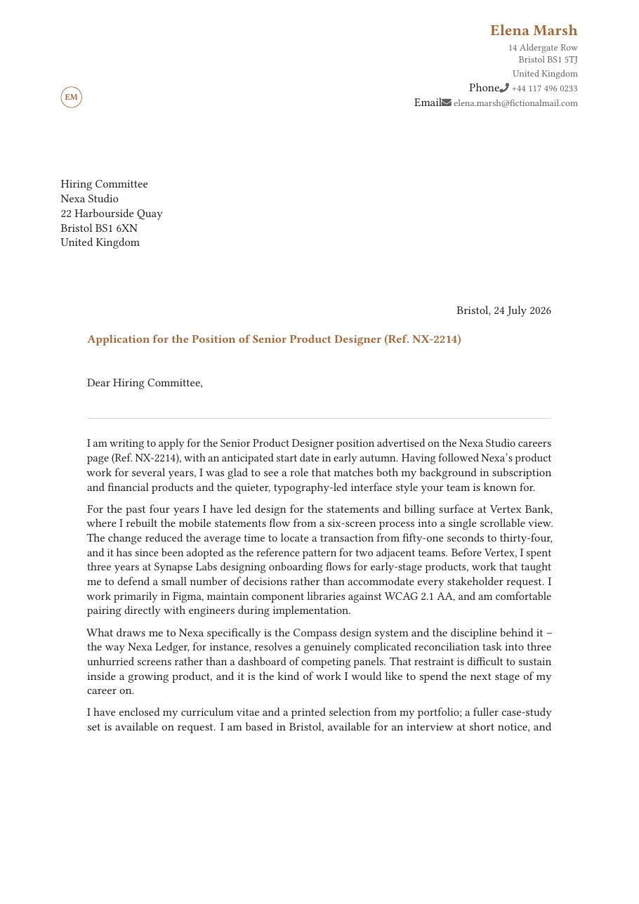</a><br><b>Minimalist Personal Formal Letter</b><br><a href="https://letx.app/templates/formal-letters/minimalist-personal-formal-letter">Open in LetX</a> · <a href="./formal-letters/minimalist-personal-formal-letter">Source</a></td>
<td width="33%" valign="top" align="center"><a href="https://letx.app/templates/formal-letters/koma-left-sidebar-letter">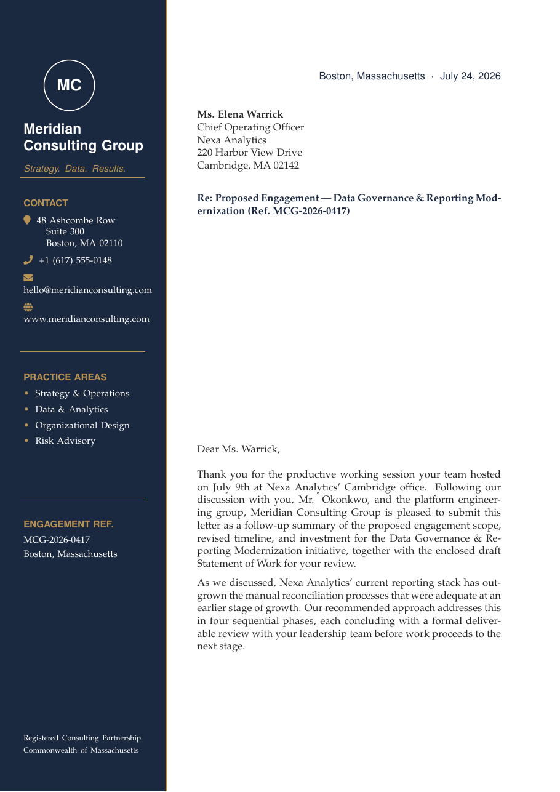</a><br><b>Modern KOMA Letter with Left Sidebar</b><br><a href="https://letx.app/templates/formal-letters/koma-left-sidebar-letter">Open in LetX</a> · <a href="./formal-letters/koma-left-sidebar-letter">Source</a></td>
</tr>
<tr>
<td width="33%" valign="top" align="center"><b>Recommendation Letter</b><br><a href="https://letx.app/templates/formal-letters/recommendation-letter">Open in LetX</a> · <a href="./formal-letters/recommendation-letter">Source</a></td>
<td width="33%" valign="top" align="center"><b>Resignation Letter</b><br><a href="https://letx.app/templates/formal-letters/resignation-letter">Open in LetX</a> · <a href="./formal-letters/resignation-letter">Source</a></td>
<td width="33%" valign="top" align="center"><a href="https://letx.app/templates/formal-letters/standard-us-reference-letter">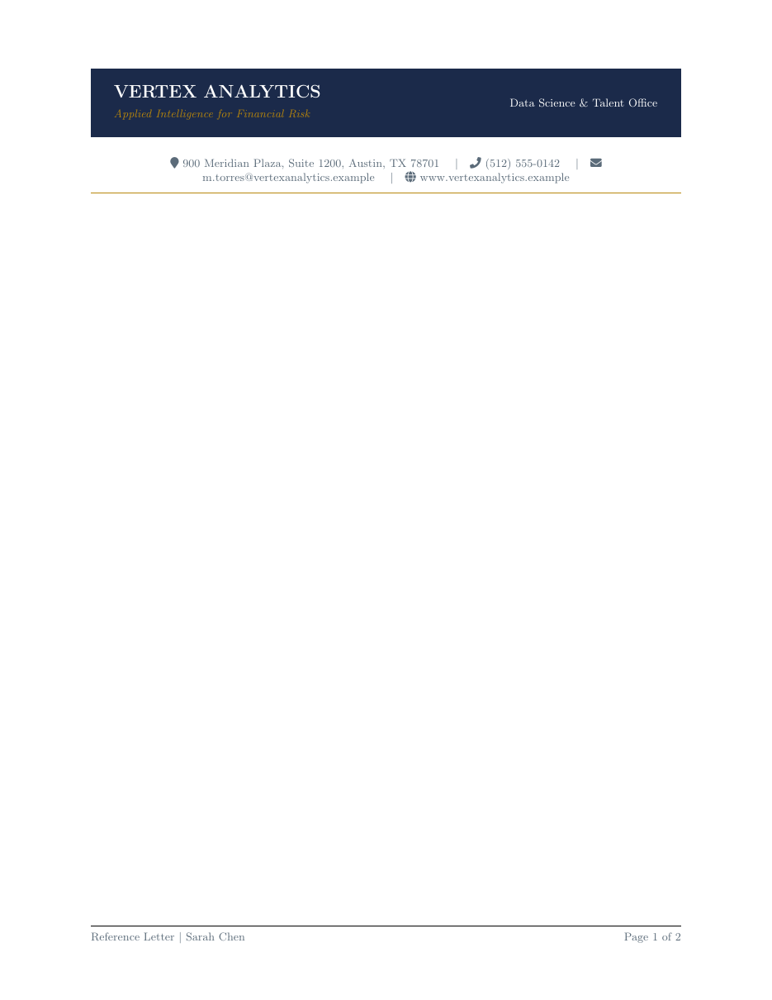</a><br><b>Standard US Formal Reference Letter</b><br><a href="https://letx.app/templates/formal-letters/standard-us-reference-letter">Open in LetX</a> · <a href="./formal-letters/standard-us-reference-letter">Source</a></td>
</tr>
<tr>
<td width="33%" valign="top" align="center"><a href="https://letx.app/templates/formal-letters/academic-chair-official-letter">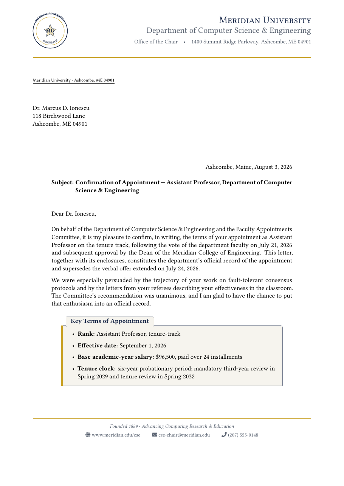</a><br><b>University Department Chair Official Letter</b><br><a href="https://letx.app/templates/formal-letters/academic-chair-official-letter">Open in LetX</a> · <a href="./formal-letters/academic-chair-official-letter">Source</a></td>
</tr>
</table>

### Technical Documentation

12 templates. [Browse this category on LetX](https://letx.app/templates/tech-docs)

<table>
<tr>
<td width="33%" valign="top" align="center"><a href="https://letx.app/templates/tech-docs/api-sdk-integration-guide">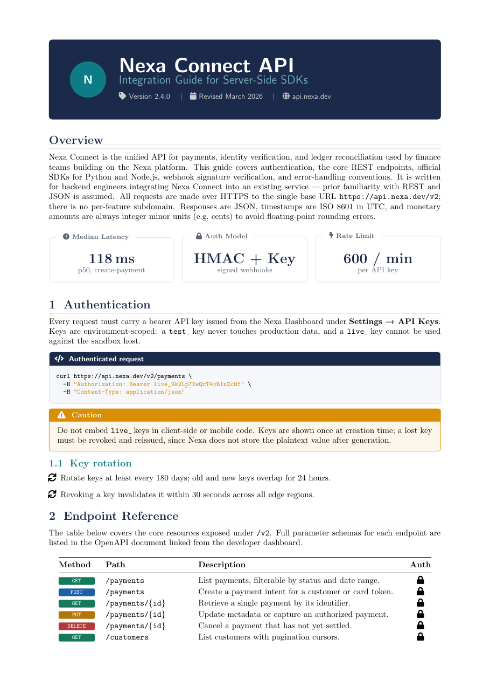</a><br><b>API SDK Integration Guide</b><br><a href="https://letx.app/templates/tech-docs/api-sdk-integration-guide">Open in LetX</a> · <a href="./tech-docs/api-sdk-integration-guide">Source</a></td>
<td width="33%" valign="top" align="center"><a href="https://letx.app/templates/tech-docs/cybersecurity-architecture-spec">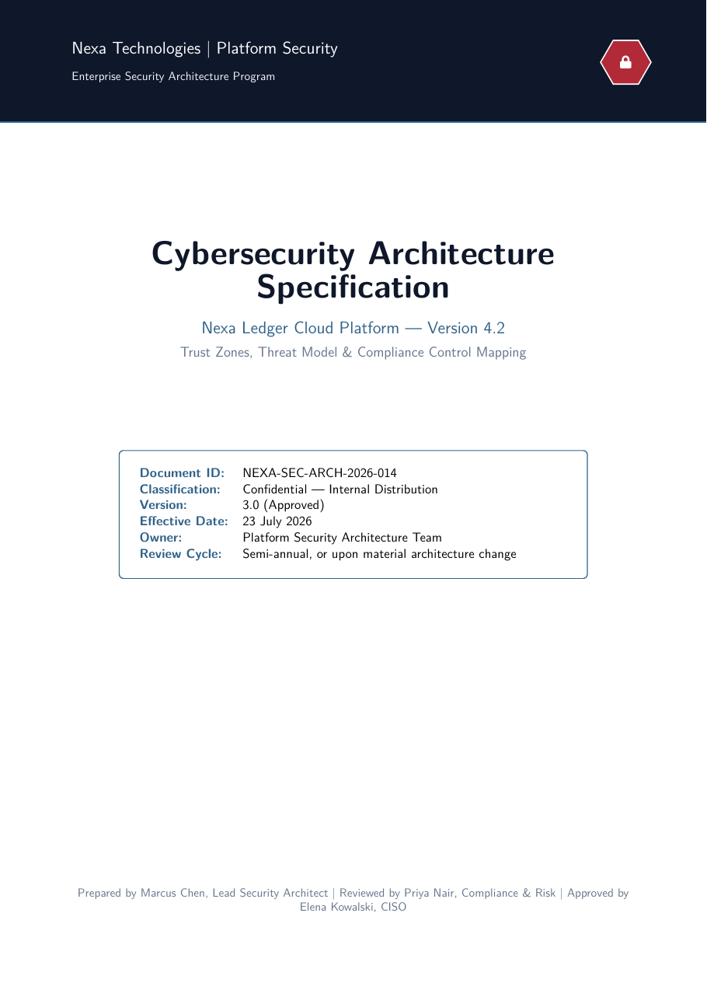</a><br><b>Cybersecurity Architecture Spec</b><br><a href="https://letx.app/templates/tech-docs/cybersecurity-architecture-spec">Open in LetX</a> · <a href="./tech-docs/cybersecurity-architecture-spec">Source</a></td>
<td width="33%" valign="top" align="center"><a href="https://letx.app/templates/tech-docs/data-etl-pipeline-spec">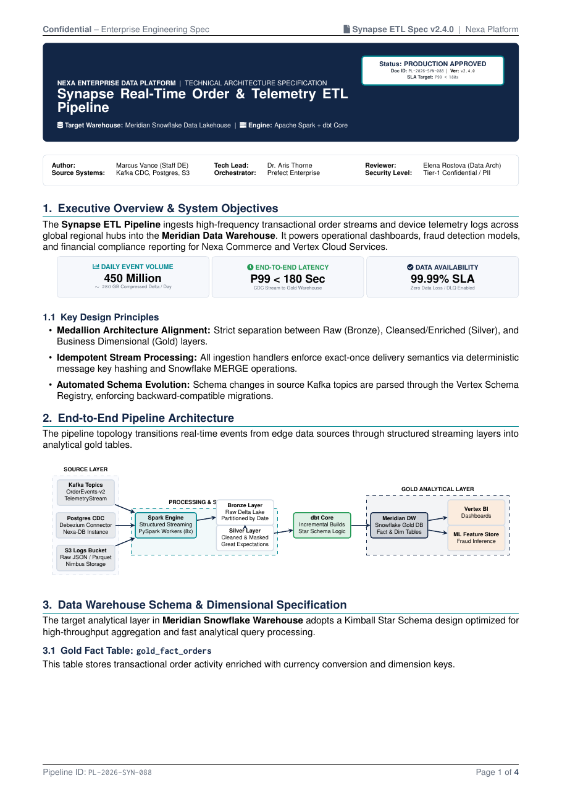</a><br><b>Data Engineering ETL Pipeline Spec</b><br><a href="https://letx.app/templates/tech-docs/data-etl-pipeline-spec">Open in LetX</a> · <a href="./tech-docs/data-etl-pipeline-spec">Source</a></td>
</tr>
<tr>
<td width="33%" valign="top" align="center"><a href="https://letx.app/templates/tech-docs/devops-infrastructure-runbook">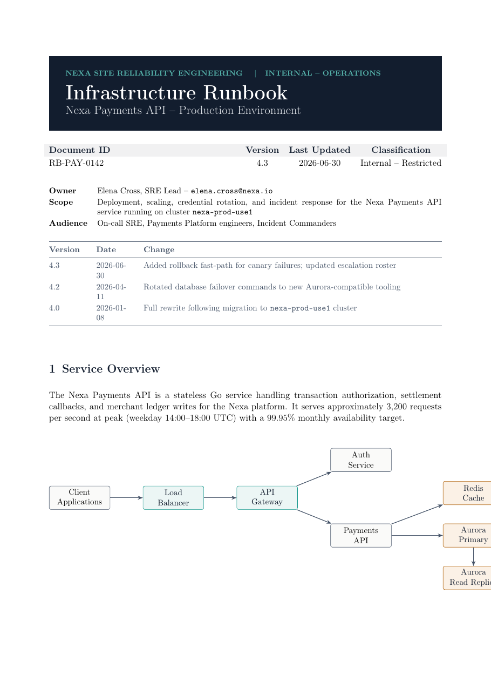</a><br><b>DevOps Infrastructure Runbook</b><br><a href="https://letx.app/templates/tech-docs/devops-infrastructure-runbook">Open in LetX</a> · <a href="./tech-docs/devops-infrastructure-runbook">Source</a></td>
<td width="33%" valign="top" align="center"><a href="https://letx.app/templates/tech-docs/embedded-firmware-technical-reference">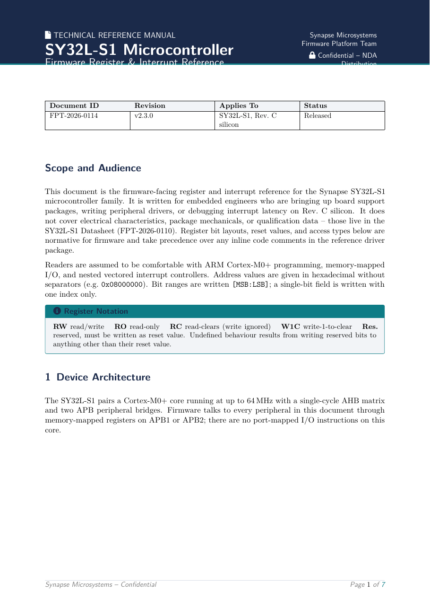</a><br><b>Embedded Firmware Technical Reference</b><br><a href="https://letx.app/templates/tech-docs/embedded-firmware-technical-reference">Open in LetX</a> · <a href="./tech-docs/embedded-firmware-technical-reference">Source</a></td>
<td width="33%" valign="top" align="center"><a href="https://letx.app/templates/tech-docs/hardware-interface-control-document">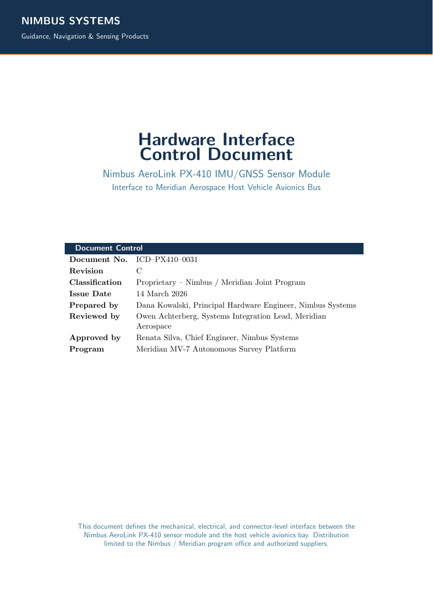</a><br><b>Hardware Interface Control Document (ICD)</b><br><a href="https://letx.app/templates/tech-docs/hardware-interface-control-document">Open in LetX</a> · <a href="./tech-docs/hardware-interface-control-document">Source</a></td>
</tr>
<tr>
<td width="33%" valign="top" align="center"><a href="https://letx.app/templates/tech-docs/network-topography-routing-guide">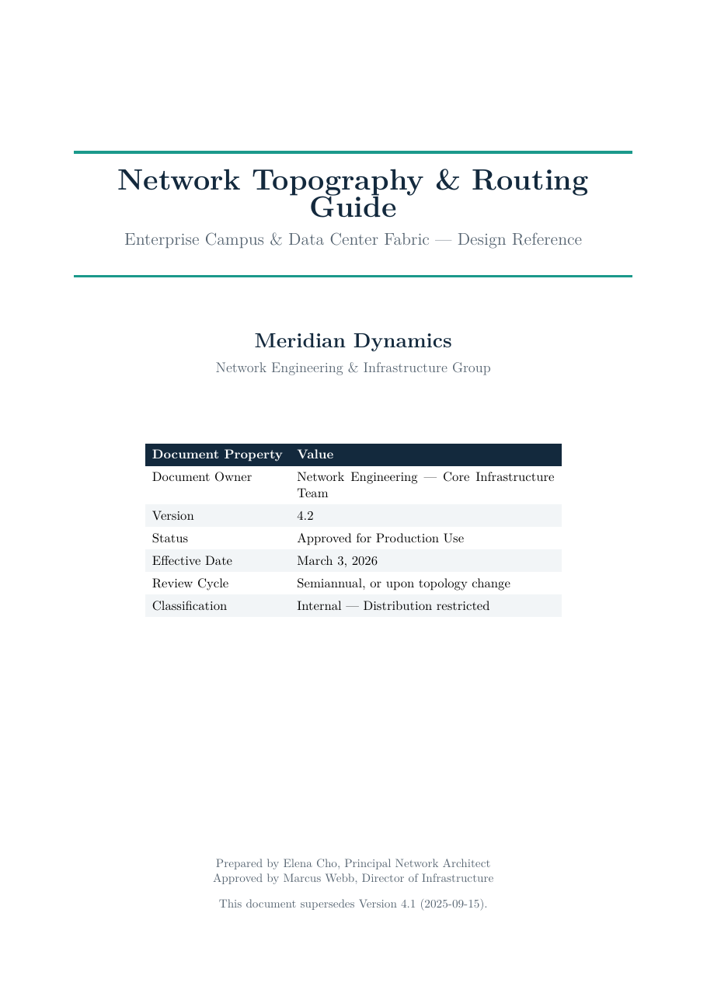</a><br><b>Network Topography & Routing Guide</b><br><a href="https://letx.app/templates/tech-docs/network-topography-routing-guide">Open in LetX</a> · <a href="./tech-docs/network-topography-routing-guide">Source</a></td>
<td width="33%" valign="top" align="center"><a href="https://letx.app/templates/tech-docs/product-datasheet-onepager">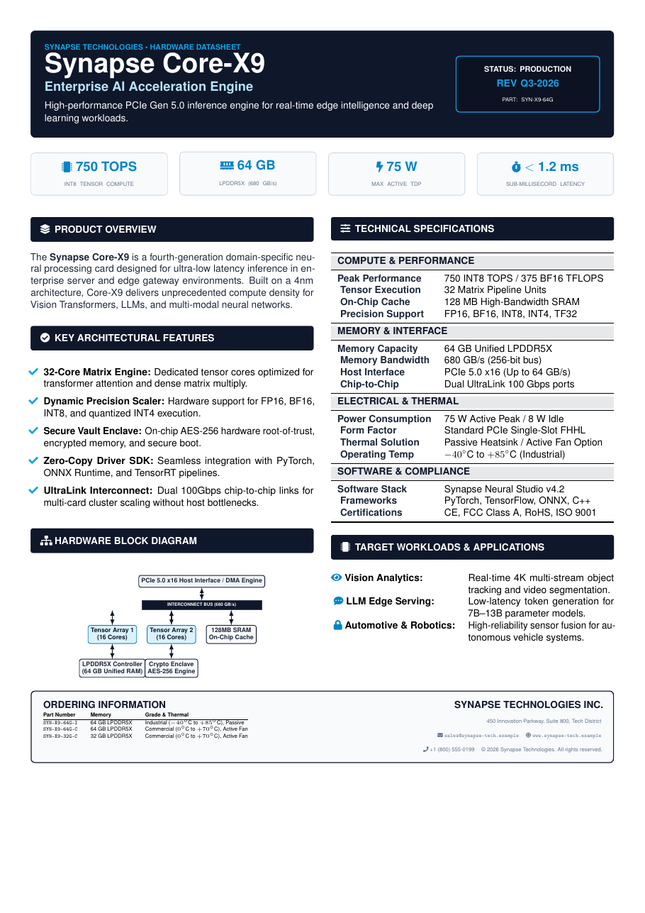</a><br><b>Product Datasheet One-Pager</b><br><a href="https://letx.app/templates/tech-docs/product-datasheet-onepager">Open in LetX</a> · <a href="./tech-docs/product-datasheet-onepager">Source</a></td>
<td width="33%" valign="top" align="center"><a href="https://letx.app/templates/tech-docs/project-gantt-timeline">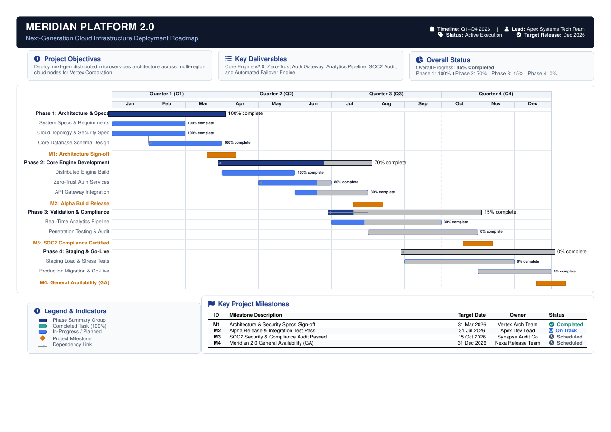</a><br><b>Project Gantt Timeline</b><br><a href="https://letx.app/templates/tech-docs/project-gantt-timeline">Open in LetX</a> · <a href="./tech-docs/project-gantt-timeline">Source</a></td>
</tr>
<tr>
<td width="33%" valign="top" align="center"><a href="https://letx.app/templates/tech-docs/saas-release-notes-changelog">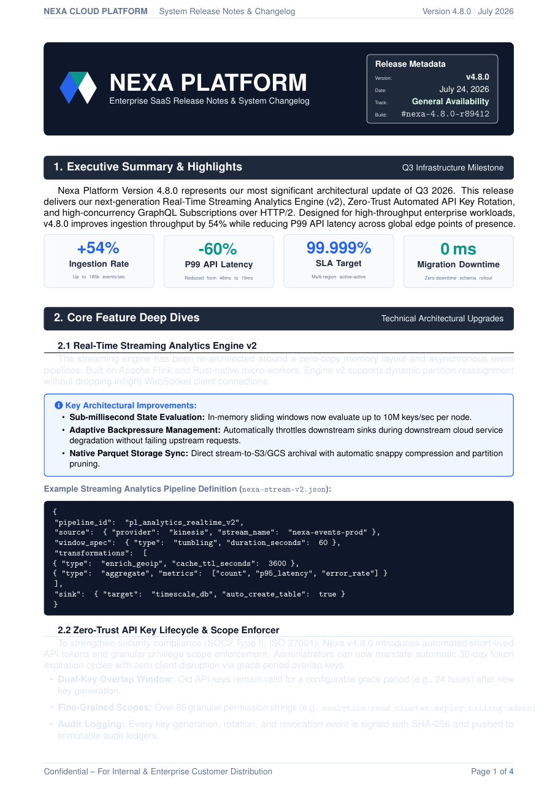</a><br><b>SaaS Product Release Notes & Changelog</b><br><a href="https://letx.app/templates/tech-docs/saas-release-notes-changelog">Open in LetX</a> · <a href="./tech-docs/saas-release-notes-changelog">Source</a></td>
<td width="33%" valign="top" align="center"><a href="https://letx.app/templates/tech-docs/architecture-decision-record">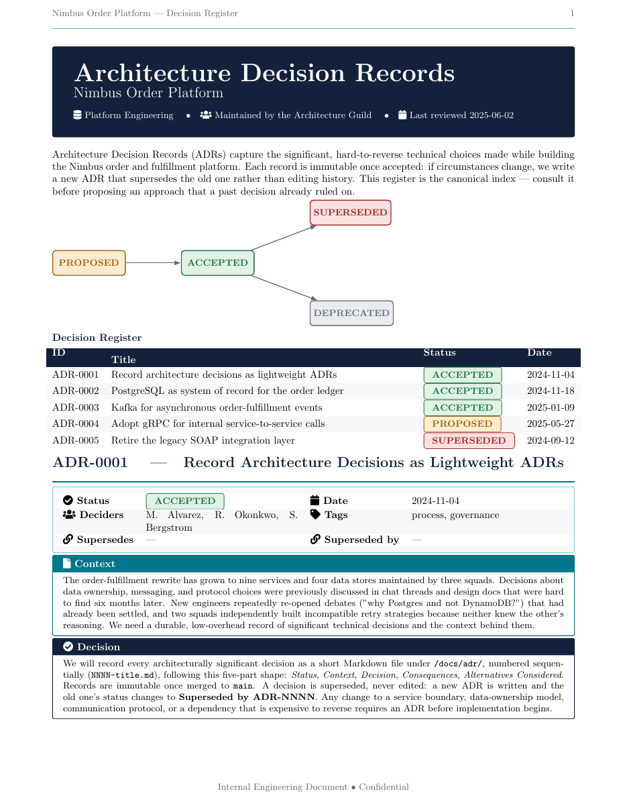</a><br><b>Software Architecture Decision Record (ADR)</b><br><a href="https://letx.app/templates/tech-docs/architecture-decision-record">Open in LetX</a> · <a href="./tech-docs/architecture-decision-record">Source</a></td>
<td width="33%" valign="top" align="center"><a href="https://letx.app/templates/tech-docs/system-reliability-sla-audit">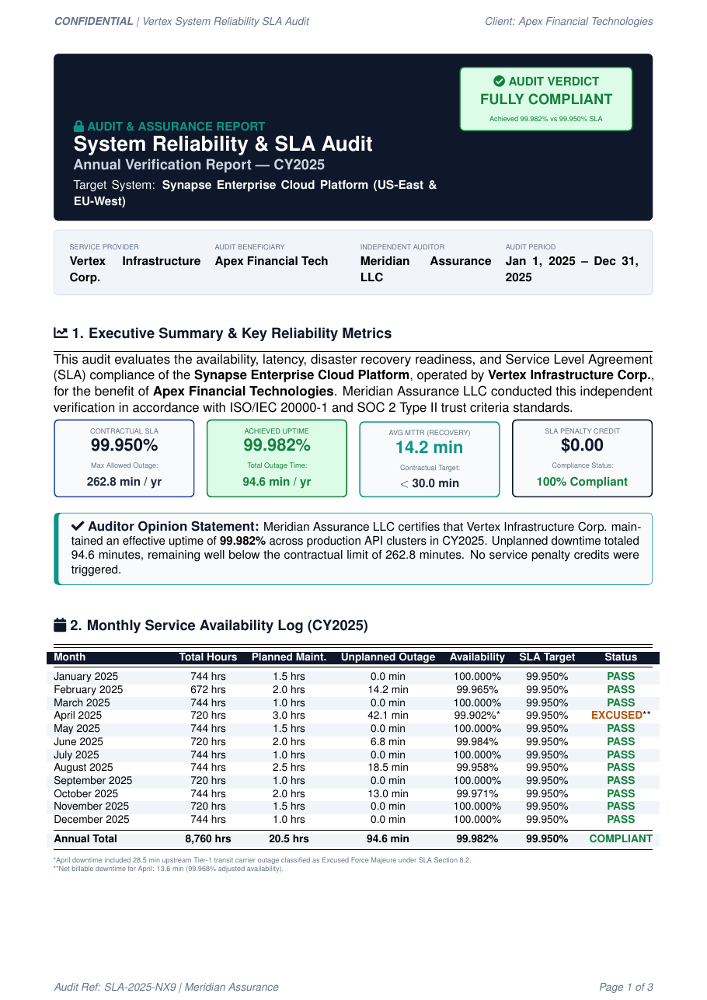</a><br><b>System Reliability SLA Audit Document</b><br><a href="https://letx.app/templates/tech-docs/system-reliability-sla-audit">Open in LetX</a> · <a href="./tech-docs/system-reliability-sla-audit">Source</a></td>
</tr>
</table>

### Medical & Clinical

8 templates. [Browse this category on LetX](https://letx.app/templates/medical)

<table>
<tr>
<td width="33%" valign="top" align="center"><a href="https://letx.app/templates/medical/icu-patient-rounds-summary">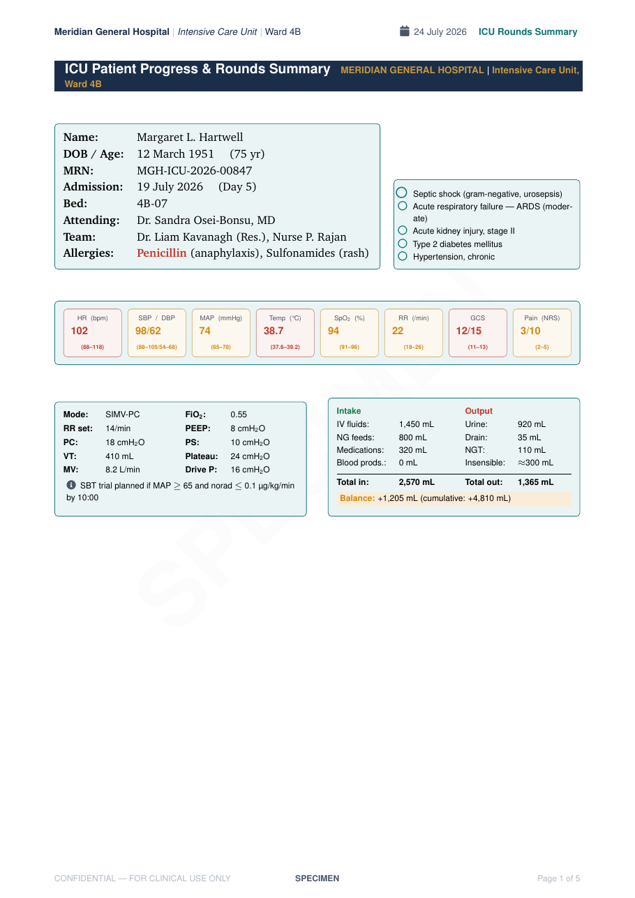</a><br><b>ICU Patient Progress & Rounds Summary</b><br><a href="https://letx.app/templates/medical/icu-patient-rounds-summary">Open in LetX</a> · <a href="./medical/icu-patient-rounds-summary">Source</a></td>
<td width="33%" valign="top" align="center"><a href="https://letx.app/templates/medical/multicenter-clinical-trial-sop">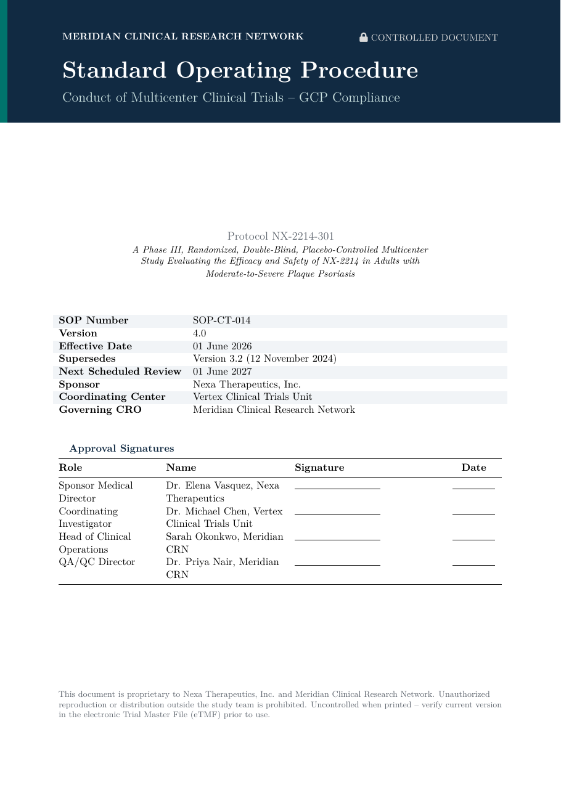</a><br><b>Multicenter Clinical Trial SOP</b><br><a href="https://letx.app/templates/medical/multicenter-clinical-trial-sop">Open in LetX</a> · <a href="./medical/multicenter-clinical-trial-sop">Source</a></td>
<td width="33%" valign="top" align="center"><a href="https://letx.app/templates/medical/oncology-treatment-protocol-plan">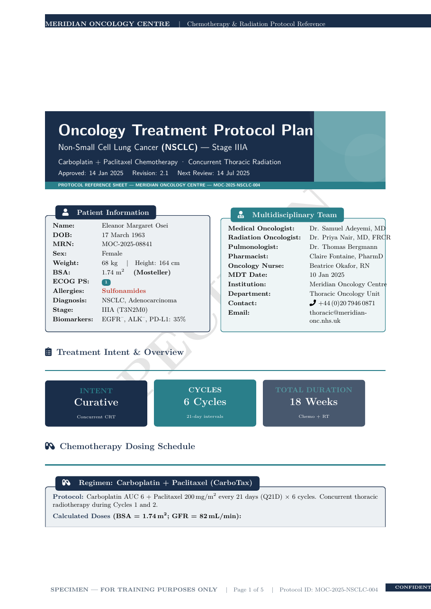</a><br><b>Oncology Treatment Protocol Plan</b><br><a href="https://letx.app/templates/medical/oncology-treatment-protocol-plan">Open in LetX</a> · <a href="./medical/oncology-treatment-protocol-plan">Source</a></td>
</tr>
<tr>
<td width="33%" valign="top" align="center"><a href="https://letx.app/templates/medical/pathology-histology-analysis-sheet">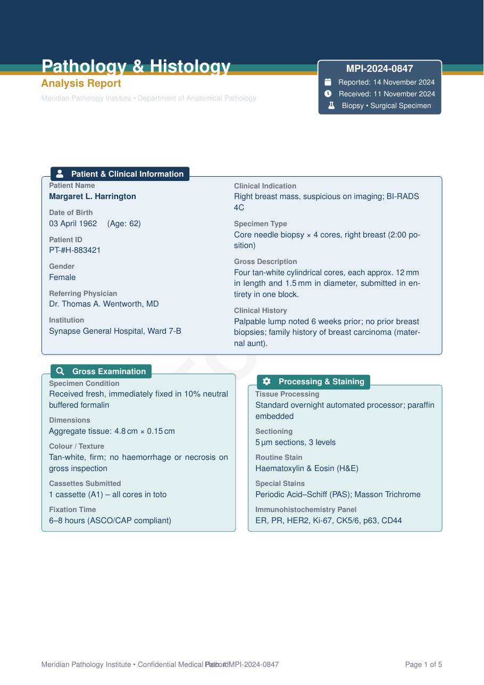</a><br><b>Pathology & Histology Analysis Sheet</b><br><a href="https://letx.app/templates/medical/pathology-histology-analysis-sheet">Open in LetX</a> · <a href="./medical/pathology-histology-analysis-sheet">Source</a></td>
<td width="33%" valign="top" align="center"><a href="https://letx.app/templates/medical/pediatric-clinical-consultation-note">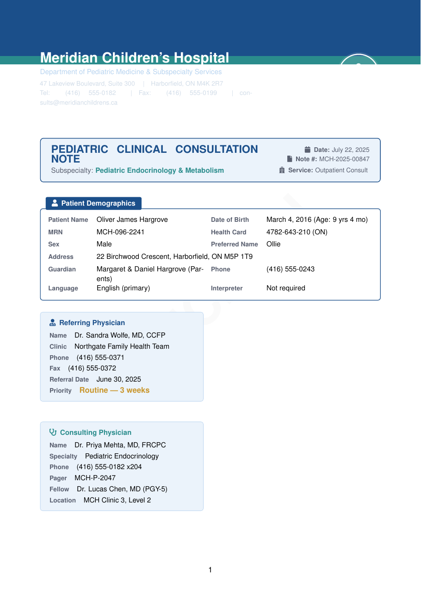</a><br><b>Pediatric Clinical Consultation Note</b><br><a href="https://letx.app/templates/medical/pediatric-clinical-consultation-note">Open in LetX</a> · <a href="./medical/pediatric-clinical-consultation-note">Source</a></td>
<td width="33%" valign="top" align="center"><a href="https://letx.app/templates/medical/pharmacovigilance-adverse-event-report">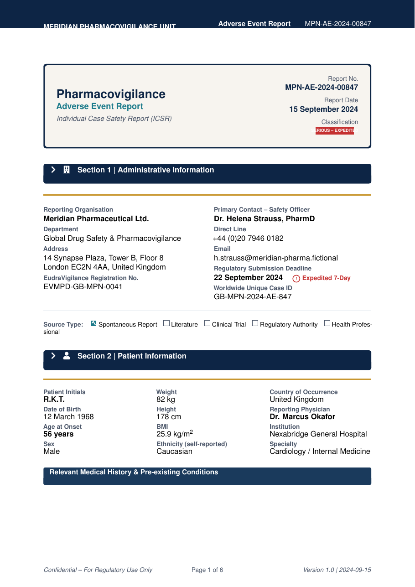</a><br><b>Pharmacovigilance Adverse Event Report</b><br><a href="https://letx.app/templates/medical/pharmacovigilance-adverse-event-report">Open in LetX</a> · <a href="./medical/pharmacovigilance-adverse-event-report">Source</a></td>
</tr>
<tr>
<td width="33%" valign="top" align="center"><a href="https://letx.app/templates/medical/radiology-diagnostic-imaging-report">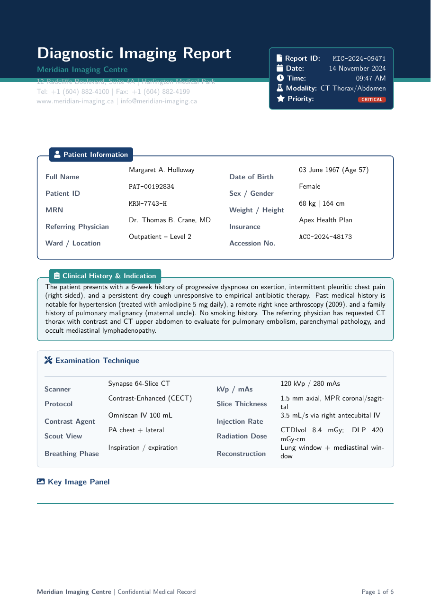</a><br><b>Radiology Diagnostic Imaging Report</b><br><a href="https://letx.app/templates/medical/radiology-diagnostic-imaging-report">Open in LetX</a> · <a href="./medical/radiology-diagnostic-imaging-report">Source</a></td>
<td width="33%" valign="top" align="center"><a href="https://letx.app/templates/medical/surgical-case-series-report">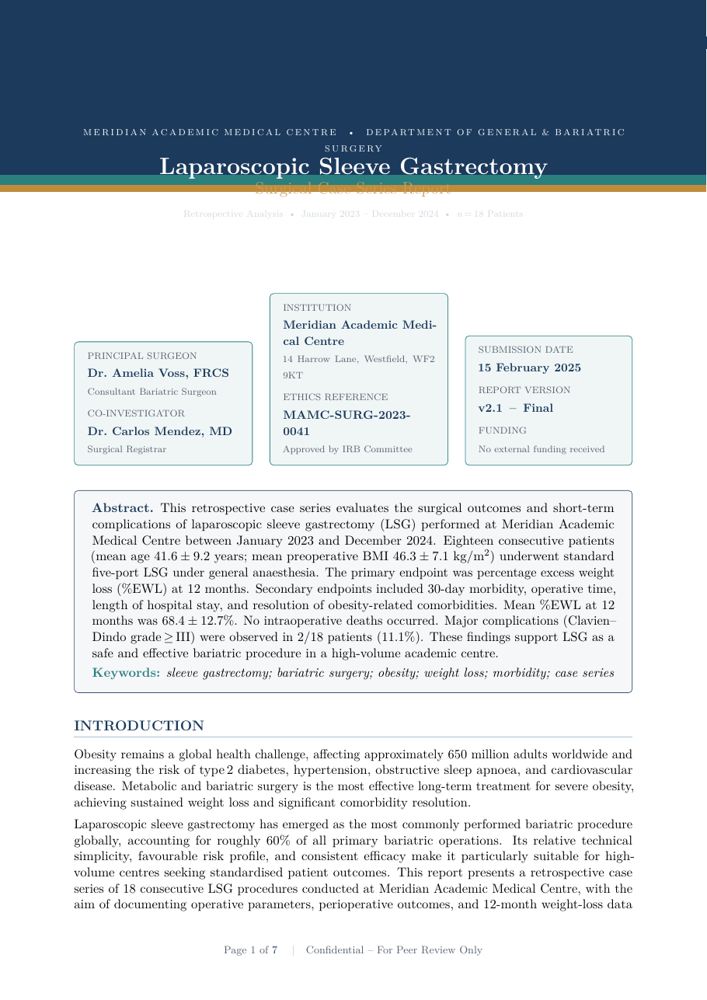</a><br><b>Surgical Case Series Report</b><br><a href="https://letx.app/templates/medical/surgical-case-series-report">Open in LetX</a> · <a href="./medical/surgical-case-series-report">Source</a></td>
</tr>
</table>

### Legal Documents

8 templates. [Browse this category on LetX](https://letx.app/templates/legal)

<table>
<tr>
<td width="33%" valign="top" align="center"><a href="https://letx.app/templates/legal/appellate-brief-table-authorities">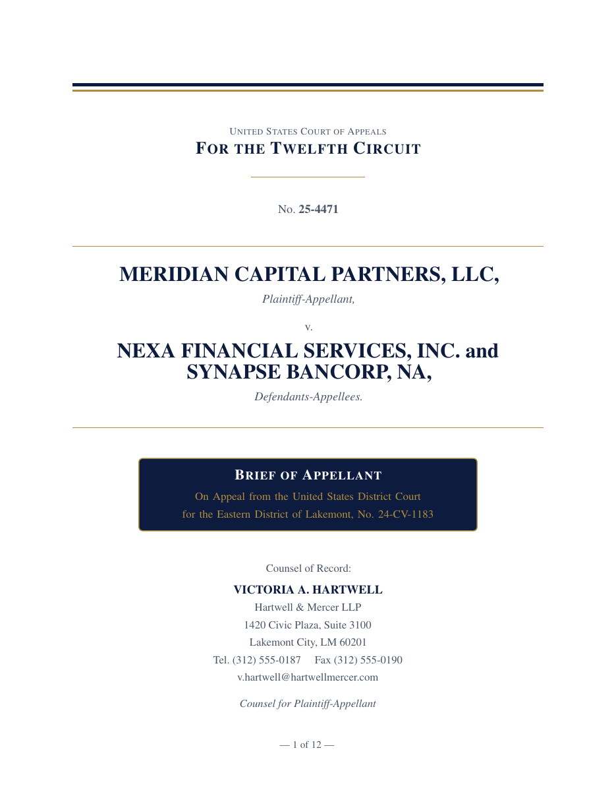</a><br><b>Appellate Brief & Table of Authorities</b><br><a href="https://letx.app/templates/legal/appellate-brief-table-authorities">Open in LetX</a> · <a href="./legal/appellate-brief-table-authorities">Source</a></td>
<td width="33%" valign="top" align="center"><a href="https://letx.app/templates/legal/arbitration-dispute-resolution">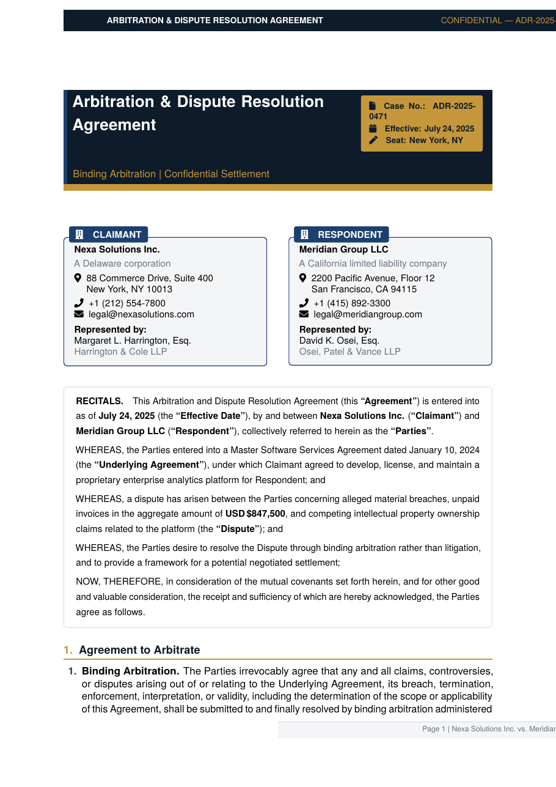</a><br><b>Arbitration & Dispute Resolution Agreement</b><br><a href="https://letx.app/templates/legal/arbitration-dispute-resolution">Open in LetX</a> · <a href="./legal/arbitration-dispute-resolution">Source</a></td>
<td width="33%" valign="top" align="center"><a href="https://letx.app/templates/legal/commercial-real-estate-lease">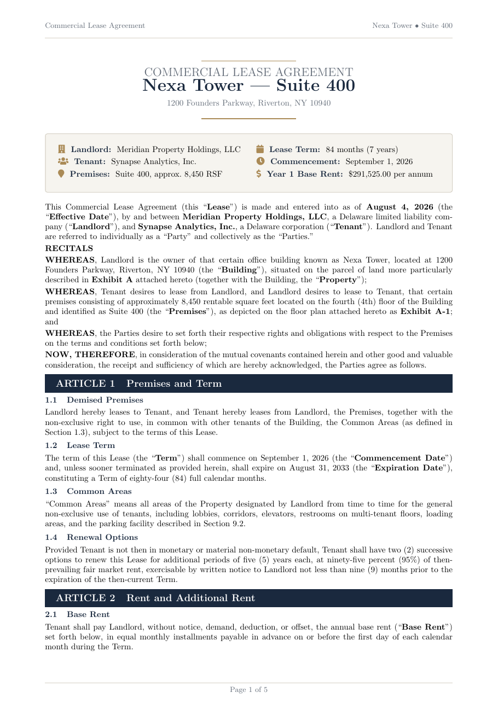</a><br><b>Commercial Real Estate Lease Contract</b><br><a href="https://letx.app/templates/legal/commercial-real-estate-lease">Open in LetX</a> · <a href="./legal/commercial-real-estate-lease">Source</a></td>
</tr>
<tr>
<td width="33%" valign="top" align="center"><a href="https://letx.app/templates/legal/corporate-articles-incorporation">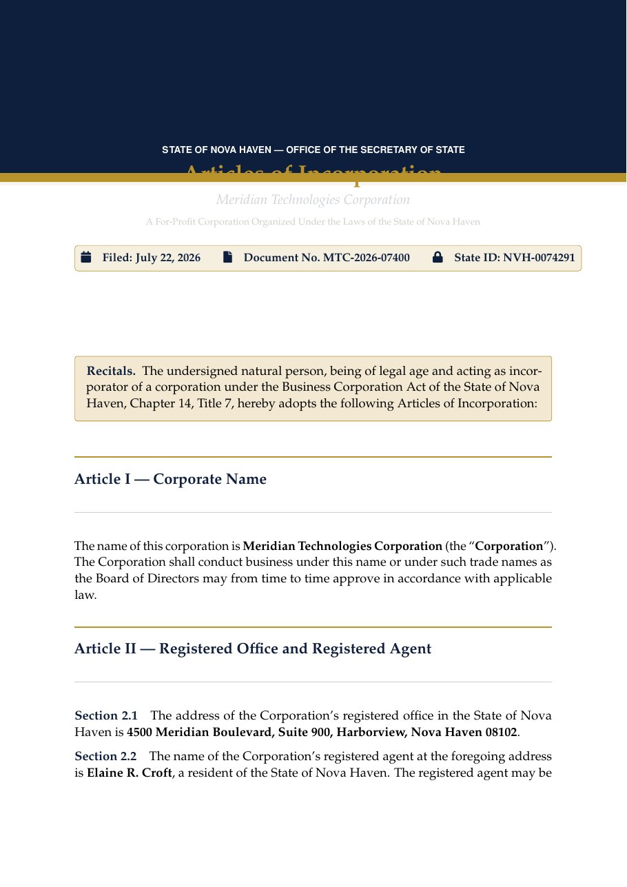</a><br><b>Corporate Articles of Incorporation</b><br><a href="https://letx.app/templates/legal/corporate-articles-incorporation">Open in LetX</a> · <a href="./legal/corporate-articles-incorporation">Source</a></td>
<td width="33%" valign="top" align="center"><a href="https://letx.app/templates/legal/data-privacy-policy-gdpr">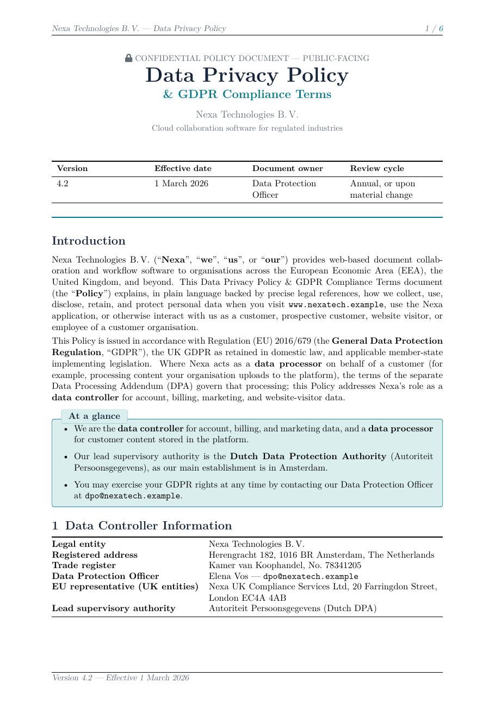</a><br><b>Data Privacy Policy & GDPR Terms</b><br><a href="https://letx.app/templates/legal/data-privacy-policy-gdpr">Open in LetX</a> · <a href="./legal/data-privacy-policy-gdpr">Source</a></td>
<td width="33%" valign="top" align="center"><a href="https://letx.app/templates/legal/employment-nda-nonsolicit">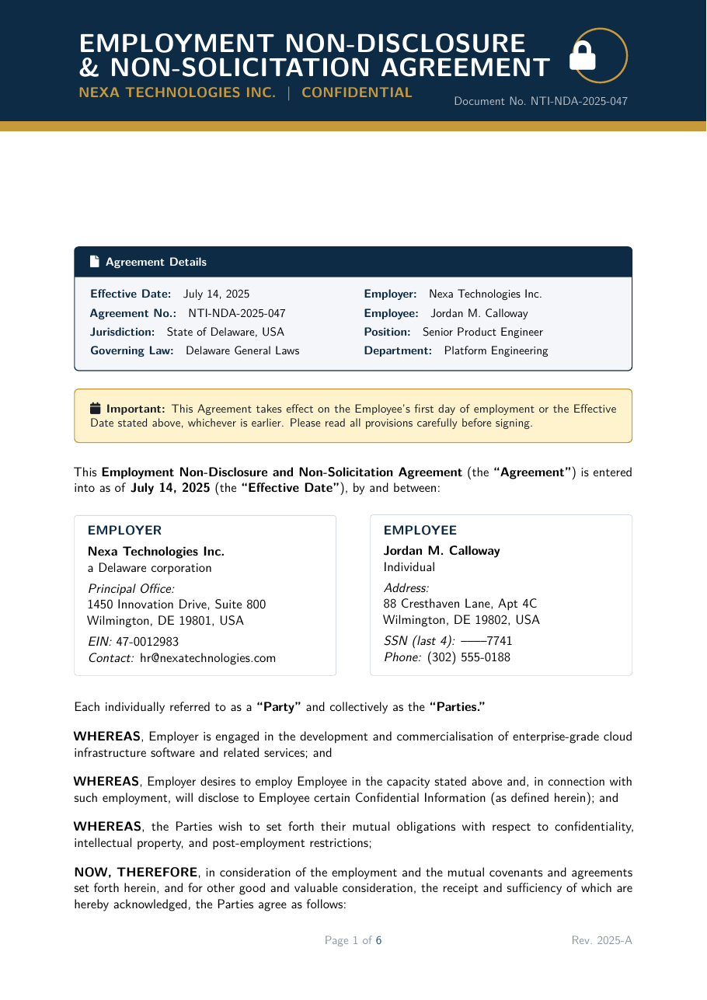</a><br><b>Employment Non-Disclosure & Non-Solicit</b><br><a href="https://letx.app/templates/legal/employment-nda-nonsolicit">Open in LetX</a> · <a href="./legal/employment-nda-nonsolicit">Source</a></td>
</tr>
<tr>
<td width="33%" valign="top" align="center"><a href="https://letx.app/templates/legal/ip-licensing-agreement">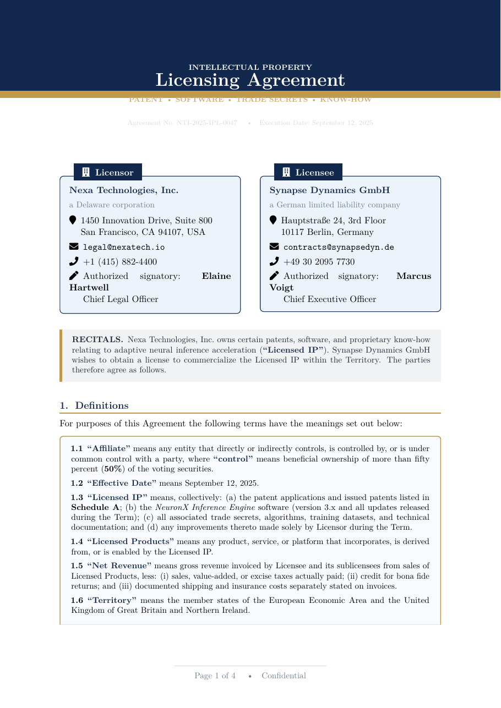</a><br><b>Intellectual Property Licensing Agreement</b><br><a href="https://letx.app/templates/legal/ip-licensing-agreement">Open in LetX</a> · <a href="./legal/ip-licensing-agreement">Source</a></td>
<td width="33%" valign="top" align="center"><a href="https://letx.app/templates/legal/legal-opinion-letter-client">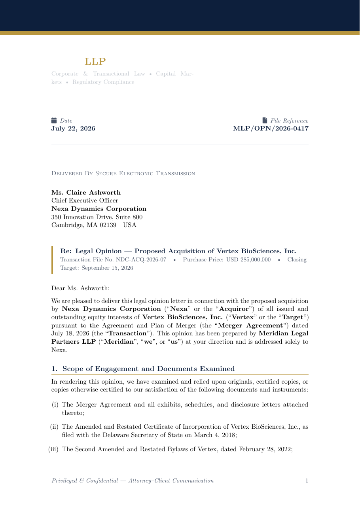</a><br><b>Legal Opinion Letter to Corporate Client</b><br><a href="https://letx.app/templates/legal/legal-opinion-letter-client">Open in LetX</a> · <a href="./legal/legal-opinion-letter-client">Source</a></td>
</tr>
</table>

### Finance & Business

11 templates. [Browse this category on LetX](https://letx.app/templates/finance)

<table>
<tr>
<td width="33%" valign="top" align="center"><a href="https://letx.app/templates/finance/business-restructuring-strategy">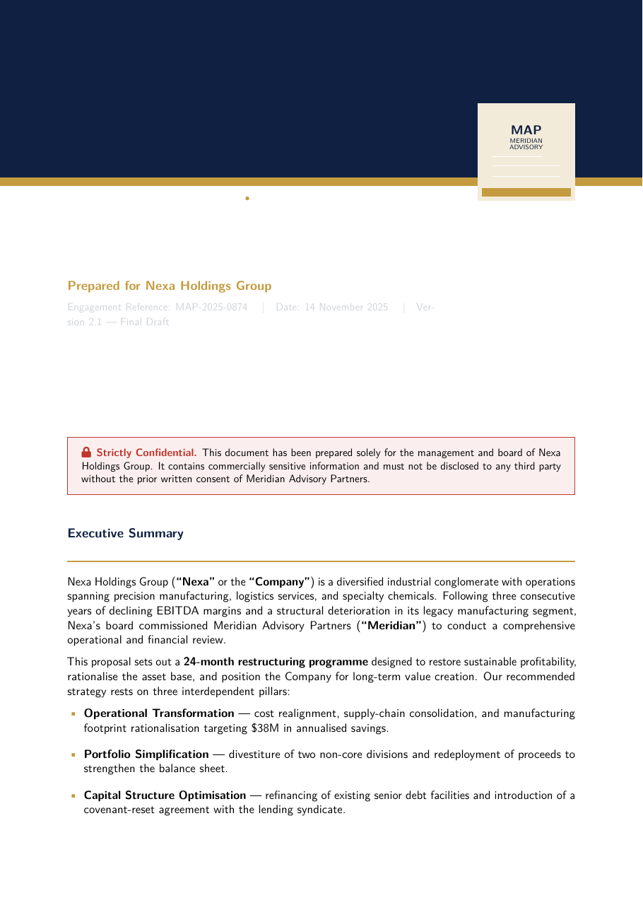</a><br><b>Business Restructuring Strategy Proposal</b><br><a href="https://letx.app/templates/finance/business-restructuring-strategy">Open in LetX</a> · <a href="./finance/business-restructuring-strategy">Source</a></td>
<td width="33%" valign="top" align="center"><a href="https://letx.app/templates/finance/commercial-credit-loan-report">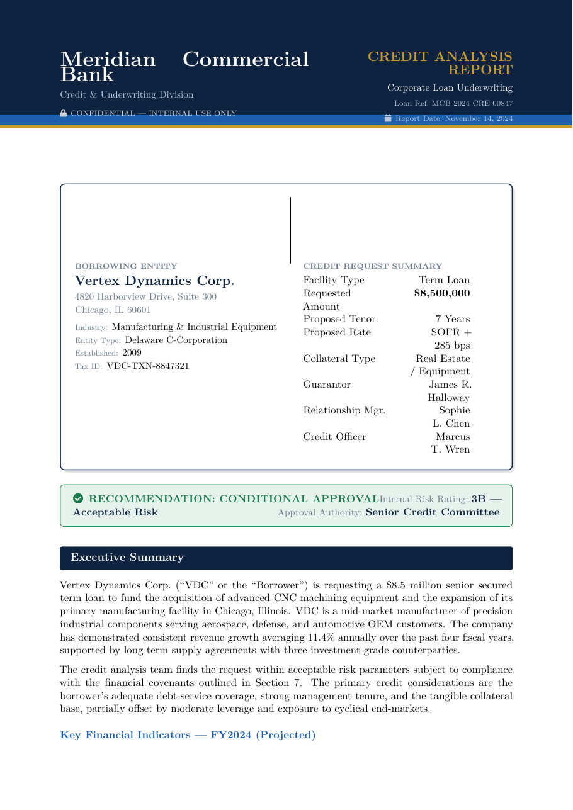</a><br><b>Commercial Credit & Loan Application Report</b><br><a href="https://letx.app/templates/finance/commercial-credit-loan-report">Open in LetX</a> · <a href="./finance/commercial-credit-loan-report">Source</a></td>
<td width="33%" valign="top" align="center"><a href="https://letx.app/templates/finance/real-estate-valuation-memo">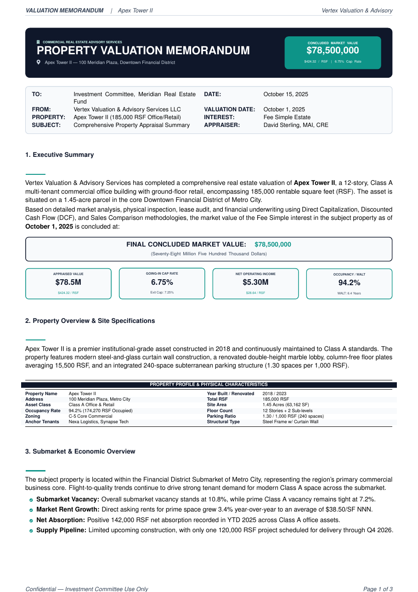</a><br><b>Commercial Real Estate Valuation Memo</b><br><a href="https://letx.app/templates/finance/real-estate-valuation-memo">Open in LetX</a> · <a href="./finance/real-estate-valuation-memo">Source</a></td>
</tr>
<tr>
<td width="33%" valign="top" align="center"><a href="https://letx.app/templates/finance/corporate-quarterly-financial-statement">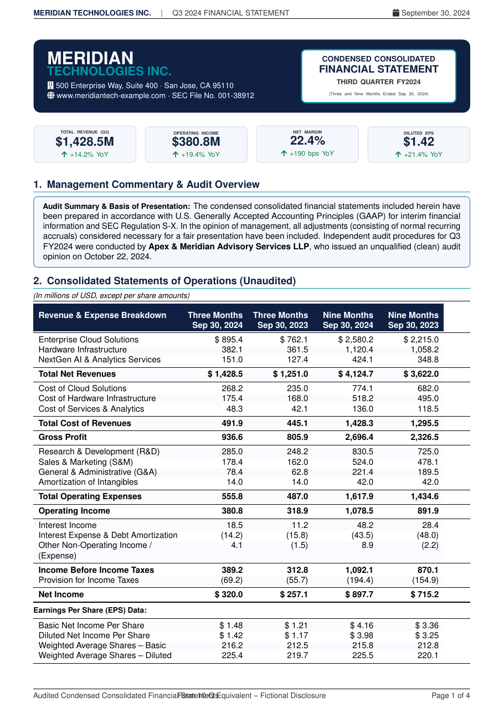</a><br><b>Corporate Quarterly Financial Statement</b><br><a href="https://letx.app/templates/finance/corporate-quarterly-financial-statement">Open in LetX</a> · <a href="./finance/corporate-quarterly-financial-statement">Source</a></td>
<td width="33%" valign="top" align="center"><a href="https://letx.app/templates/finance/corporate-treasury-cash-plan">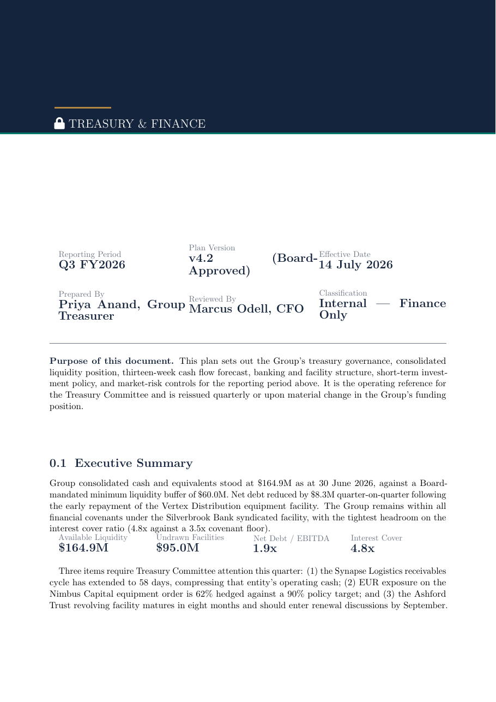</a><br><b>Corporate Treasury & Cash Management Plan</b><br><a href="https://letx.app/templates/finance/corporate-treasury-cash-plan">Open in LetX</a> · <a href="./finance/corporate-treasury-cash-plan">Source</a></td>
<td width="33%" valign="top" align="center"><a href="https://letx.app/templates/finance/saas-financial-model-summary">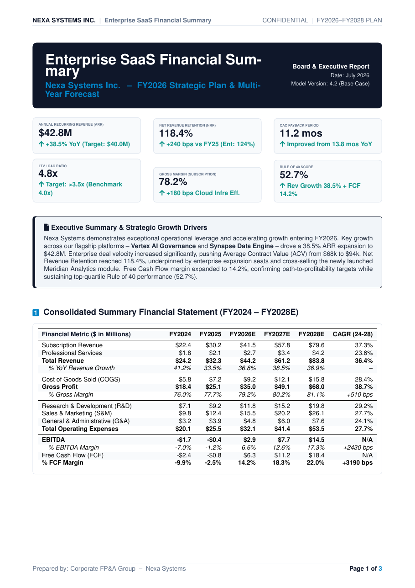</a><br><b>Enterprise SaaS Financial Model Summary</b><br><a href="https://letx.app/templates/finance/saas-financial-model-summary">Open in LetX</a> · <a href="./finance/saas-financial-model-summary">Source</a></td>
</tr>
<tr>
<td width="33%" valign="top" align="center"><a href="https://letx.app/templates/finance/equity-research-analyst-report">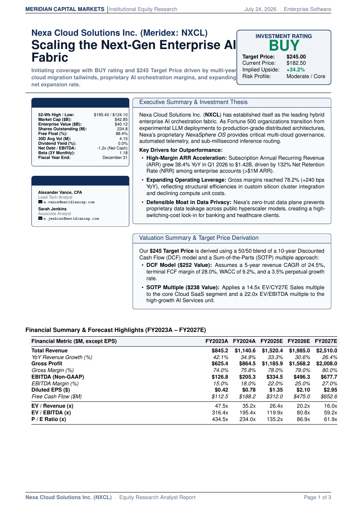</a><br><b>Equity Research Analyst Report</b><br><a href="https://letx.app/templates/finance/equity-research-analyst-report">Open in LetX</a> · <a href="./finance/equity-research-analyst-report">Source</a></td>
<td width="33%" valign="top" align="center"><a href="https://letx.app/templates/finance/financial-due-diligence-report">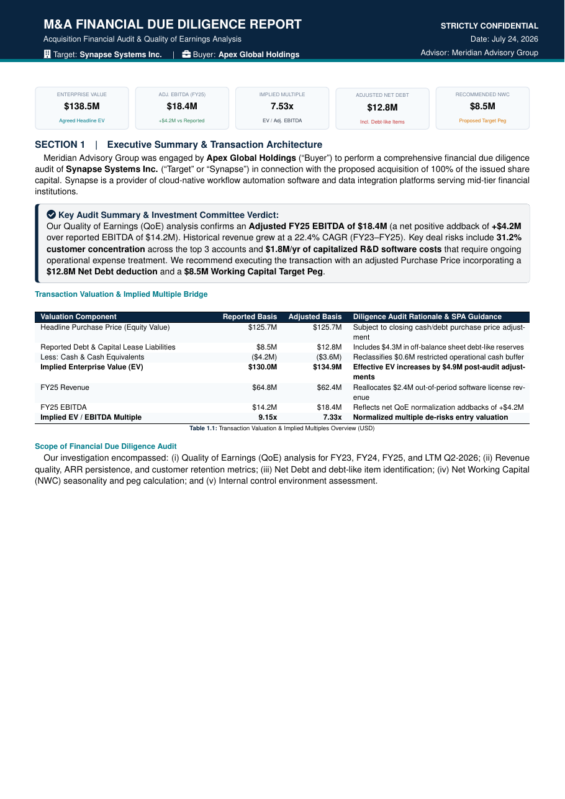</a><br><b>M&A Financial Due Diligence Report</b><br><a href="https://letx.app/templates/finance/financial-due-diligence-report">Open in LetX</a> · <a href="./finance/financial-due-diligence-report">Source</a></td>
<td width="33%" valign="top" align="center"><a href="https://letx.app/templates/finance/modern-freelance-invoice">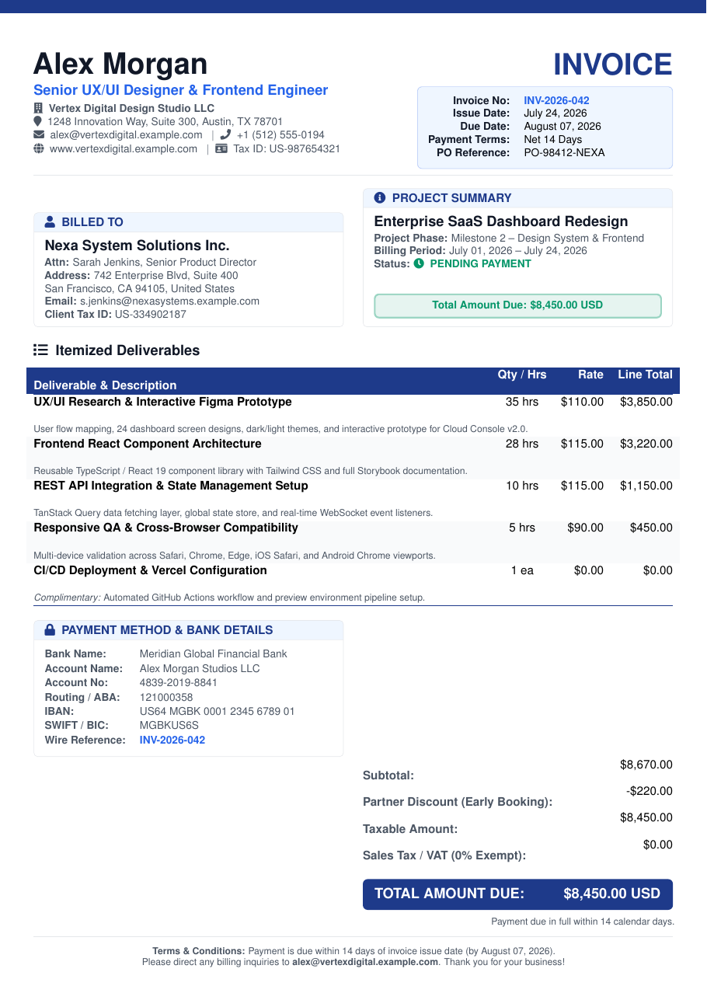</a><br><b>Modern Freelance Invoice</b><br><a href="https://letx.app/templates/finance/modern-freelance-invoice">Open in LetX</a> · <a href="./finance/modern-freelance-invoice">Source</a></td>
</tr>
<tr>
<td width="33%" valign="top" align="center"><a href="https://letx.app/templates/finance/risk-management-compliance-audit">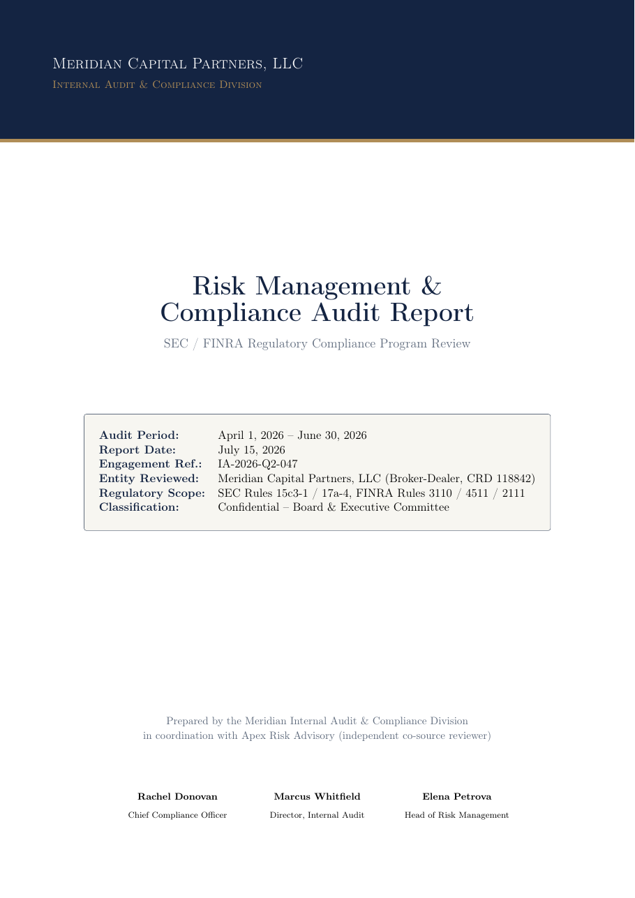</a><br><b>Risk Management & Compliance Audit</b><br><a href="https://letx.app/templates/finance/risk-management-compliance-audit">Open in LetX</a> · <a href="./finance/risk-management-compliance-audit">Source</a></td>
<td width="33%" valign="top" align="center"><a href="https://letx.app/templates/finance/venture-capital-investment-memo">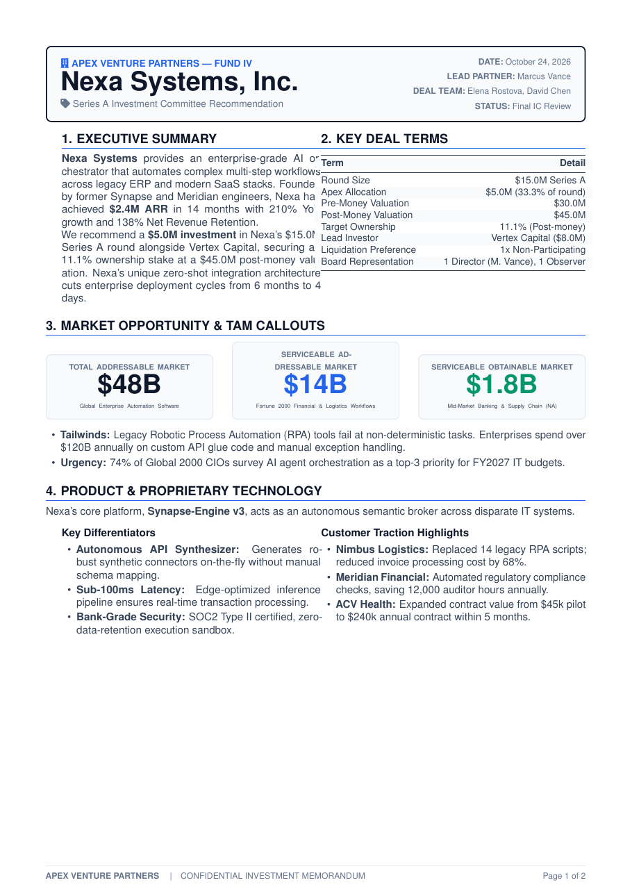</a><br><b>Venture Capital Investment Memo</b><br><a href="https://letx.app/templates/finance/venture-capital-investment-memo">Open in LetX</a> · <a href="./finance/venture-capital-investment-memo">Source</a></td>
</tr>
</table>

### Teaching & Education

8 templates. [Browse this category on LetX](https://letx.app/templates/education)

<table>
<tr>
<td width="33%" valign="top" align="center"><a href="https://letx.app/templates/education/academic-course-exam-solution-key">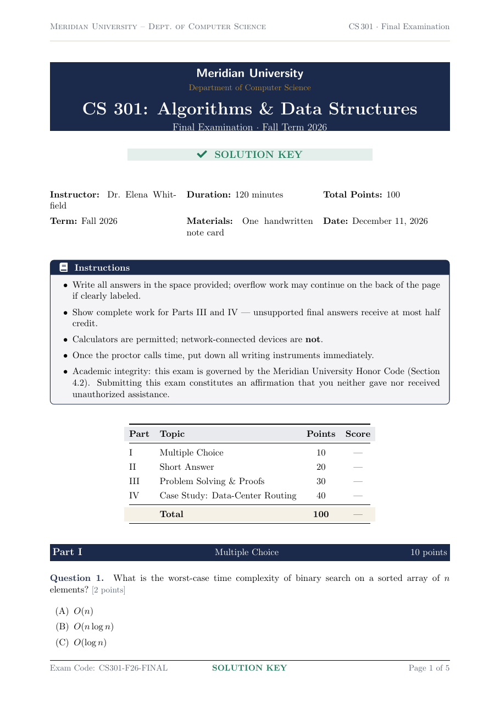</a><br><b>Academic Course Exam & Solution Key</b><br><a href="https://letx.app/templates/education/academic-course-exam-solution-key">Open in LetX</a> · <a href="./education/academic-course-exam-solution-key">Source</a></td>
<td width="33%" valign="top" align="center"><a href="https://letx.app/templates/education/distance-learning-study-guide">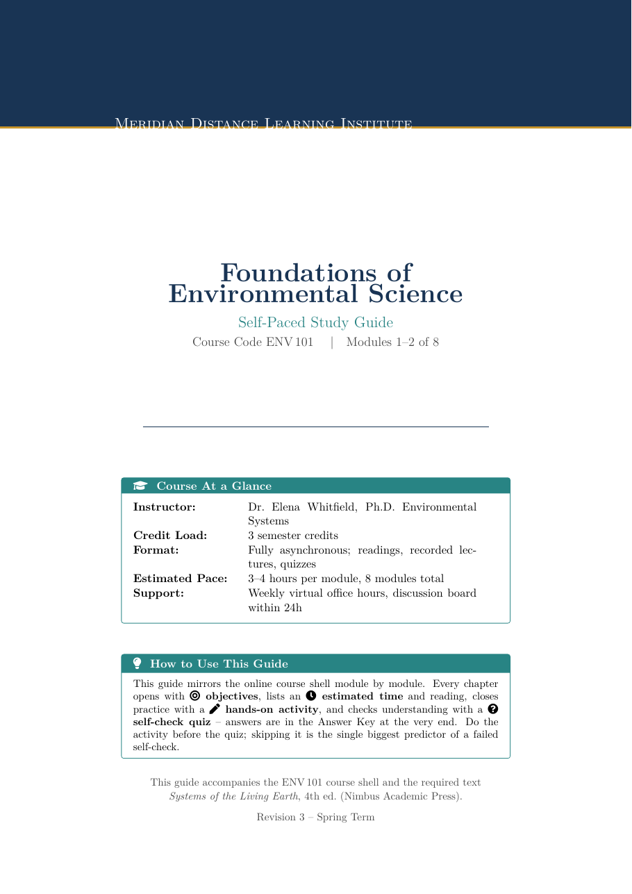</a><br><b>Distance Learning Study Guide</b><br><a href="https://letx.app/templates/education/distance-learning-study-guide">Open in LetX</a> · <a href="./education/distance-learning-study-guide">Source</a></td>
<td width="33%" valign="top" align="center"><a href="https://letx.app/templates/education/workshop-handout-exercises">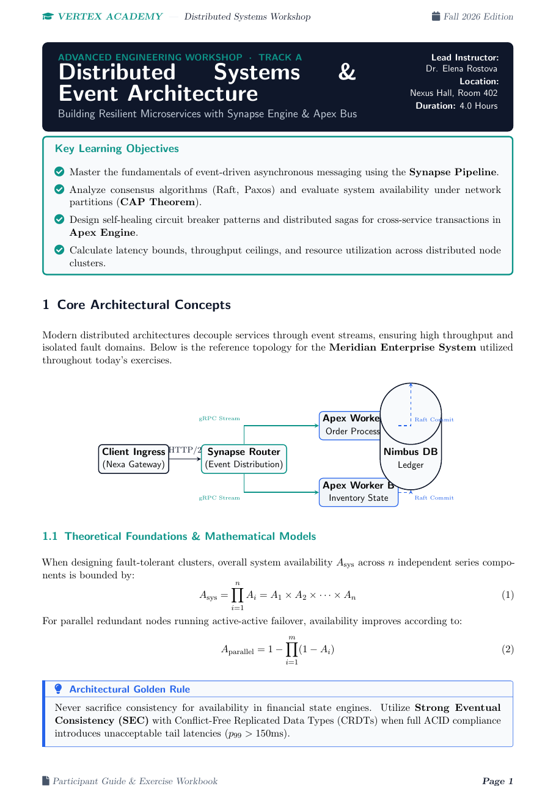</a><br><b>Educational Workshop Handout & Exercises</b><br><a href="https://letx.app/templates/education/workshop-handout-exercises">Open in LetX</a> · <a href="./education/workshop-handout-exercises">Source</a></td>
</tr>
<tr>
<td width="33%" valign="top" align="center"><a href="https://letx.app/templates/education/k12-stem-weekly-lesson-plan">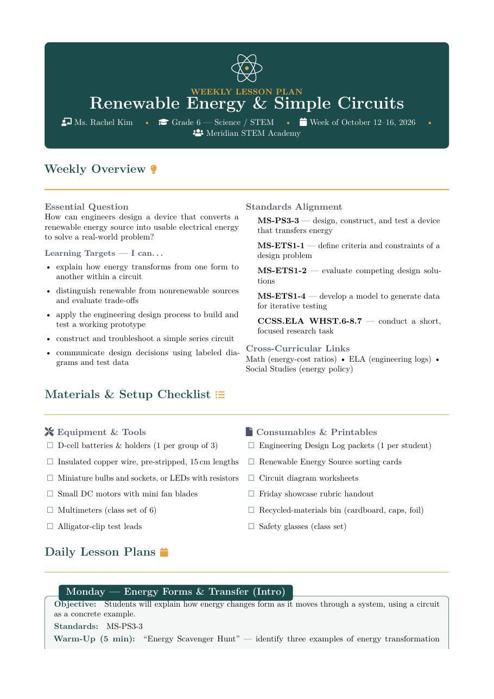</a><br><b>K-12 STEM Weekly Lesson Plan</b><br><a href="https://letx.app/templates/education/k12-stem-weekly-lesson-plan">Open in LetX</a> · <a href="./education/k12-stem-weekly-lesson-plan">Source</a></td>
<td width="33%" valign="top" align="center"><a href="https://letx.app/templates/education/rubric-assignment-grading-matrix">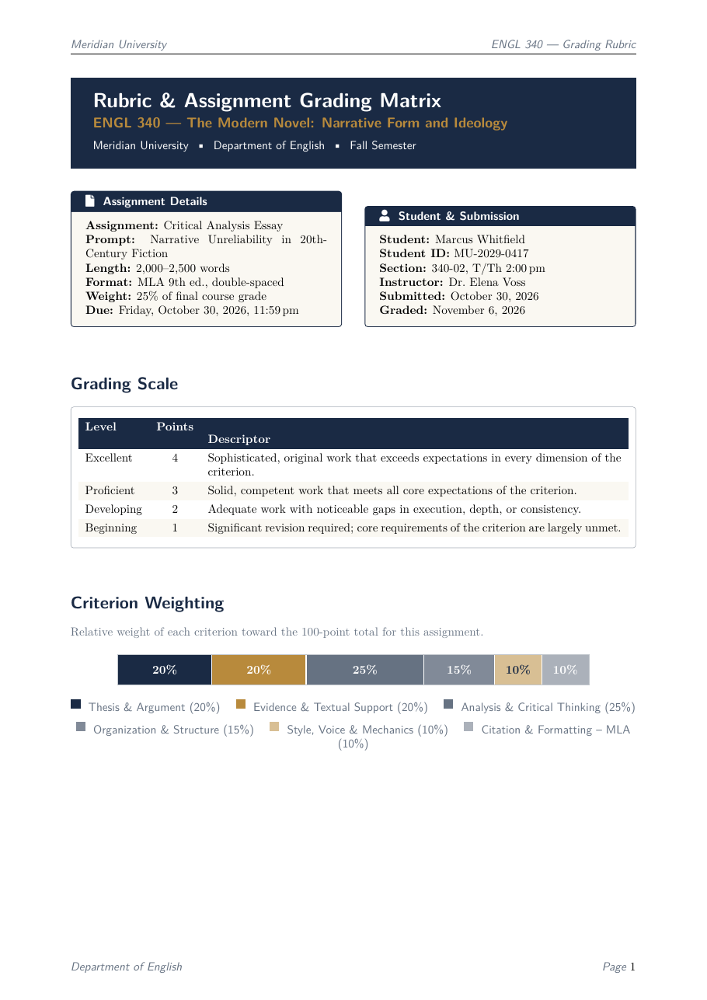</a><br><b>Rubric & Assignment Grading Matrix</b><br><a href="https://letx.app/templates/education/rubric-assignment-grading-matrix">Open in LetX</a> · <a href="./education/rubric-assignment-grading-matrix">Source</a></td>
<td width="33%" valign="top" align="center"><a href="https://letx.app/templates/education/student-advising-record">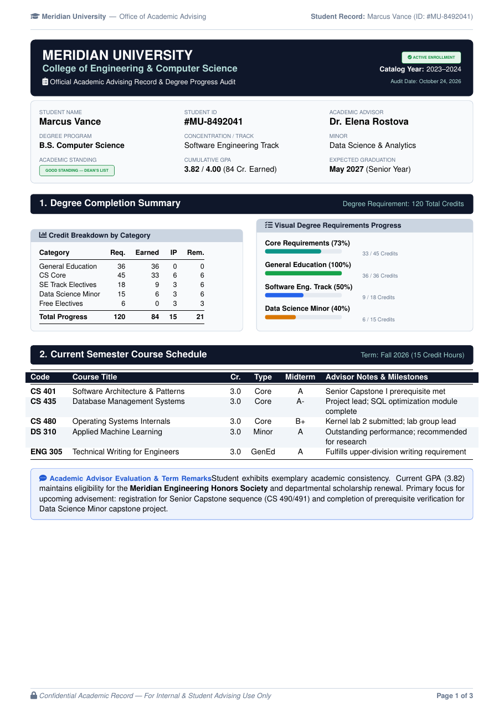</a><br><b>Student Academic Advising Record</b><br><a href="https://letx.app/templates/education/student-advising-record">Open in LetX</a> · <a href="./education/student-advising-record">Source</a></td>
</tr>
<tr>
<td width="33%" valign="top" align="center"><a href="https://letx.app/templates/education/teacher-peer-classroom-evaluation">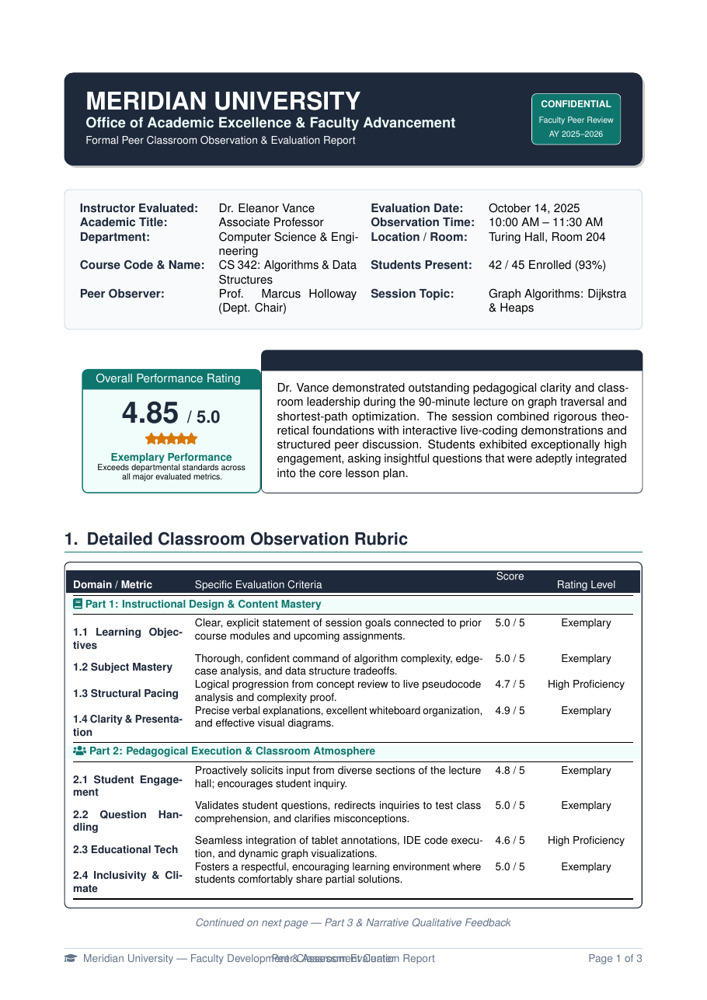</a><br><b>Teacher Peer Classroom Evaluation</b><br><a href="https://letx.app/templates/education/teacher-peer-classroom-evaluation">Open in LetX</a> · <a href="./education/teacher-peer-classroom-evaluation">Source</a></td>
<td width="33%" valign="top" align="center"><a href="https://letx.app/templates/education/academic-course-syllabus-calendar">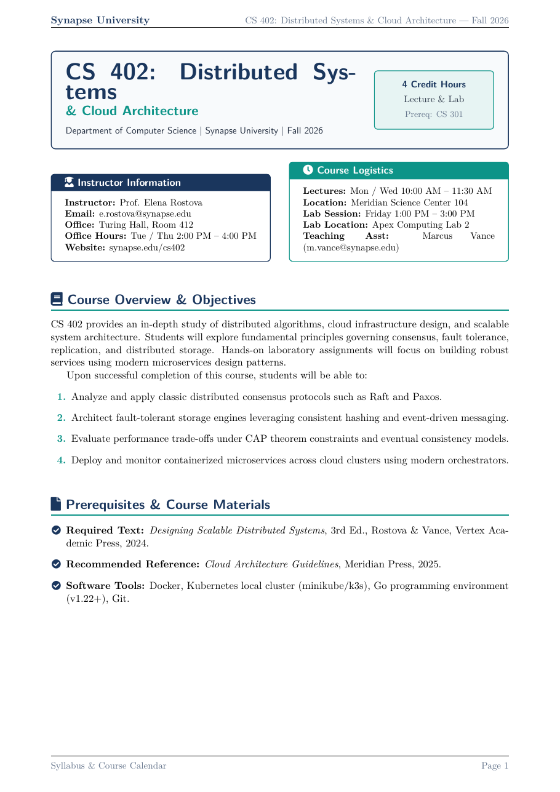</a><br><b>University Course Syllabus & Calendar</b><br><a href="https://letx.app/templates/education/academic-course-syllabus-calendar">Open in LetX</a> · <a href="./education/academic-course-syllabus-calendar">Source</a></td>
</tr>
</table>

### Calendars & Planners

4 templates. [Browse this category on LetX](https://letx.app/templates/calendars)

<table>
<tr>
<td width="33%" valign="top" align="center"><a href="https://letx.app/templates/calendars/academic-year-semester-calendar">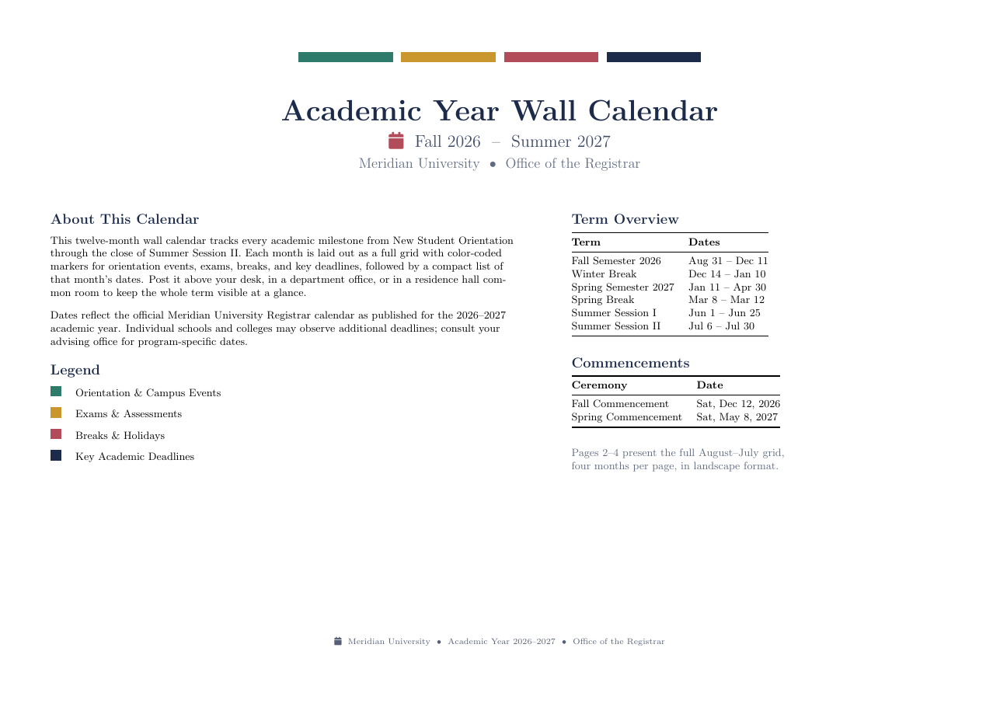</a><br><b>Academic Year Semester Wall Calendar</b><br><a href="https://letx.app/templates/calendars/academic-year-semester-calendar">Open in LetX</a> · <a href="./calendars/academic-year-semester-calendar">Source</a></td>
<td width="33%" valign="top" align="center"><a href="https://letx.app/templates/calendars/conference-event-schedule-grid">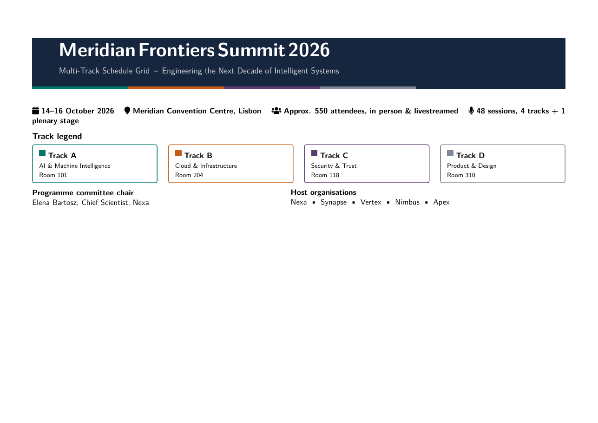</a><br><b>Conference & Event Schedule Grid</b><br><a href="https://letx.app/templates/calendars/conference-event-schedule-grid">Open in LetX</a> · <a href="./calendars/conference-event-schedule-grid">Source</a></td>
<td width="33%" valign="top" align="center"><a href="https://letx.app/templates/calendars/monthly-project-milestone-planner">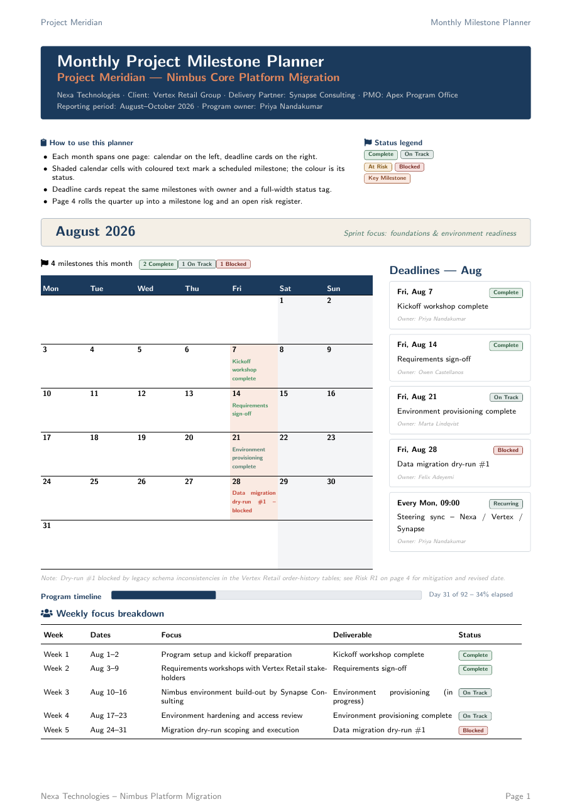</a><br><b>Monthly Project Milestone Planner</b><br><a href="https://letx.app/templates/calendars/monthly-project-milestone-planner">Open in LetX</a> · <a href="./calendars/monthly-project-milestone-planner">Source</a></td>
</tr>
<tr>
<td width="33%" valign="top" align="center"><a href="https://letx.app/templates/calendars/weekly-time-blocking-calendar">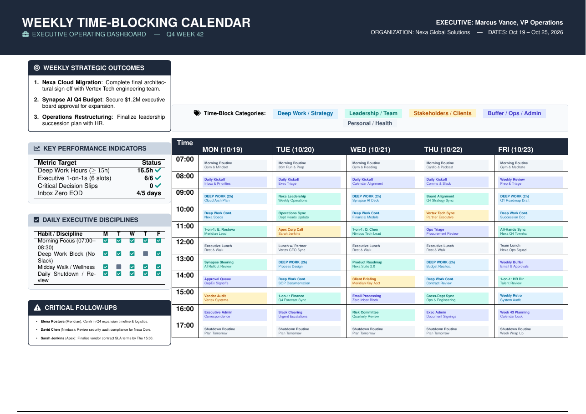</a><br><b>Weekly Time-Blocking Executive Calendar</b><br><a href="https://letx.app/templates/calendars/weekly-time-blocking-calendar">Open in LetX</a> · <a href="./calendars/weekly-time-blocking-calendar">Source</a></td>
</tr>
</table>

### Everything Else

9 templates. [Browse this category on LetX](https://letx.app/templates/miscellaneous)

<table>
<tr>
<td width="33%" valign="top" align="center"><b>Concert Program</b><br><a href="https://letx.app/templates/miscellaneous/concert-program">Open in LetX</a> · <a href="./miscellaneous/concert-program">Source</a></td>
<td width="33%" valign="top" align="center"><a href="https://letx.app/templates/miscellaneous/corporate-meeting-minutes">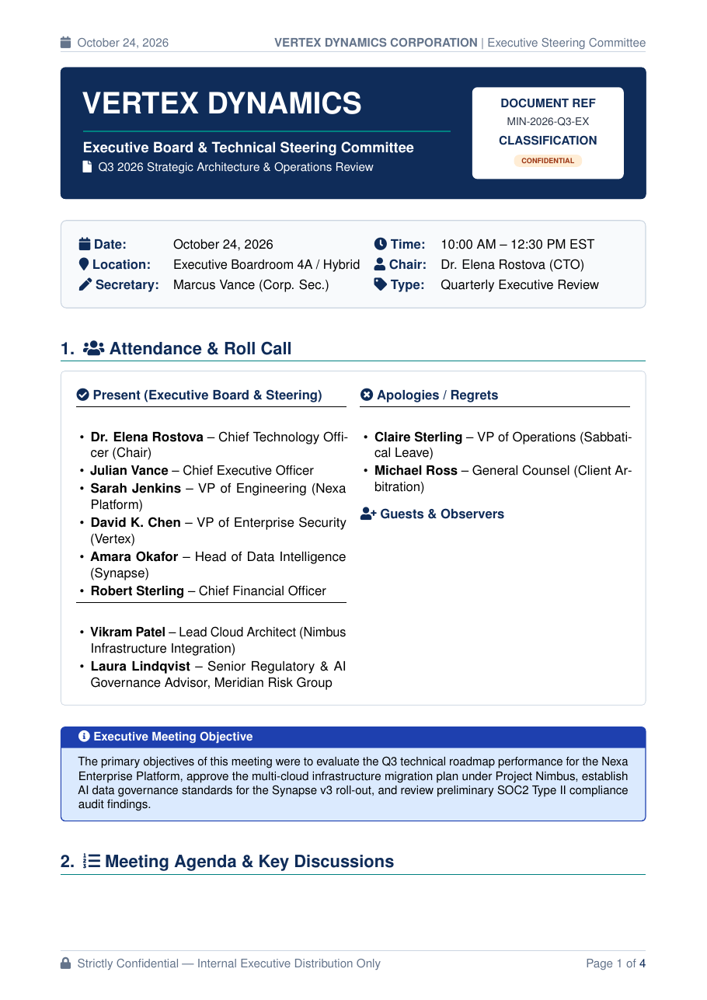</a><br><b>Corporate Meeting Minutes</b><br><a href="https://letx.app/templates/miscellaneous/corporate-meeting-minutes">Open in LetX</a> · <a href="./miscellaneous/corporate-meeting-minutes">Source</a></td>
<td width="33%" valign="top" align="center"><b>Elegant Marriage Biodata</b><br><a href="https://letx.app/templates/miscellaneous/elegant-marriage-biodata">Open in LetX</a> · <a href="./miscellaneous/elegant-marriage-biodata">Source</a></td>
</tr>
<tr>
<td width="33%" valign="top" align="center"><a href="https://letx.app/templates/miscellaneous/restaurant-menu-elegant">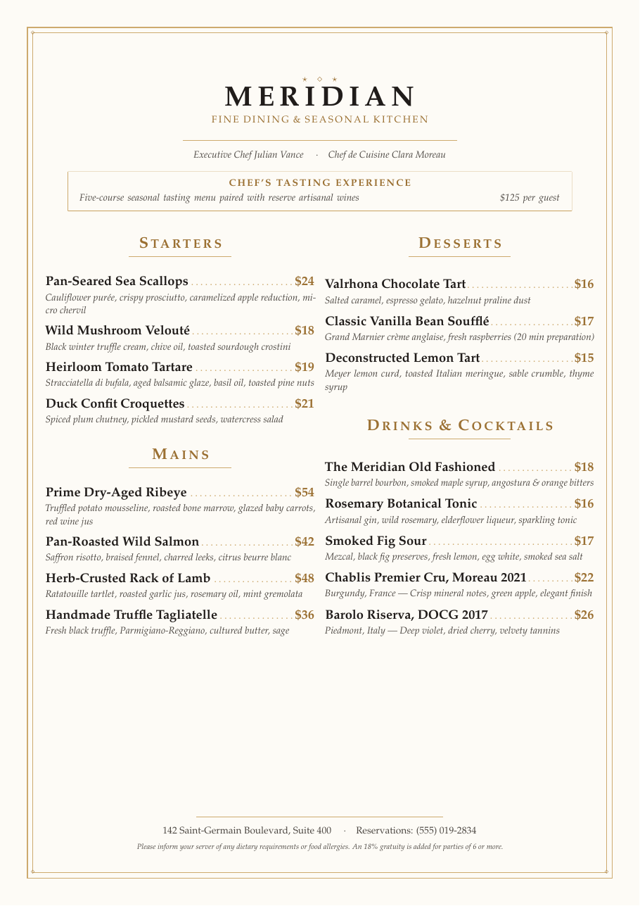</a><br><b>Elegant Restaurant Menu</b><br><a href="https://letx.app/templates/miscellaneous/restaurant-menu-elegant">Open in LetX</a> · <a href="./miscellaneous/restaurant-menu-elegant">Source</a></td>
<td width="33%" valign="top" align="center"><b>Invoice Template</b><br><a href="https://letx.app/templates/miscellaneous/invoice">Open in LetX</a> · <a href="./miscellaneous/invoice">Source</a></td>
<td width="33%" valign="top" align="center"><b>Marriage Biodata</b><br><a href="https://letx.app/templates/miscellaneous/marriage-biodata">Open in LetX</a> · <a href="./miscellaneous/marriage-biodata">Source</a></td>
</tr>
<tr>
<td width="33%" valign="top" align="center"><b>Meeting Minutes</b><br><a href="https://letx.app/templates/miscellaneous/meeting-minutes">Open in LetX</a> · <a href="./miscellaneous/meeting-minutes">Source</a></td>
<td width="33%" valign="top" align="center"><b>Multi-Column Cheatsheet</b><br><a href="https://letx.app/templates/miscellaneous/cheatsheet-multicol">Open in LetX</a> · <a href="./miscellaneous/cheatsheet-multicol">Source</a></td>
<td width="33%" valign="top" align="center"><b>Recipe Book Template</b><br><a href="https://letx.app/templates/miscellaneous/recipe-book">Open in LetX</a> · <a href="./miscellaneous/recipe-book">Source</a></td>
</tr>
</table>

## Frequently asked questions

### What is in this repository?

232 free, MIT-licensed LaTeX templates organised into 19 categories — university theses, journal articles, CVs, posters, presentations, lab reports and more. Every one compiles as-is.

### Can I use these without installing LaTeX?

Yes. Each template links to an online version at letx.app that opens in the browser, compiles to PDF, and supports real-time collaboration — no local TeX installation needed.

### Which university thesis templates are included?

Thesis and university formats are grouped under [`universities/`](#university--thesis-templates), covering formats from institutions in several countries. The wider library at [letx.app/templates/universities](https://letx.app/templates/universities) carries considerably more.

### How do I contribute a template?

Add a directory under the matching category containing `main.tex`, `metadata.json` and a compiled `main.pdf`, then open a pull request. University thesis formats are the most useful contributions.

## Related

- **[Shahriar-Labs/latex-templates](https://github.com/Shahriar-Labs/latex-templates)** — the main LetX template library — a larger, separate set covering the same categories.
- **[letx.app/templates](https://letx.app/templates)** — the full searchable library of 601+ templates, with live preview and one-click editing.
- **[letx.app](https://letx.app)** — the collaborative LaTeX editor these templates are built for: real-time co-authoring, compile to PDF in seconds, no install.

## Contributing

Templates are organised as `<category>/<template-slug>/`. To add one, create a directory under the right category containing `main.tex`, `metadata.json`, and a compiled `main.pdf`. Open a pull request — contributions of university thesis formats are especially welcome, since those are the hardest for students to find.

## License

MIT — free for academic and commercial use. Individual templates that adapt an official publisher or university class file retain the licence of that upstream file; see each template's `metadata.json`.

<sub>This README is generated from the repository contents by `gen_readme.py` in the letX template factory — the counts above are read from disk, not maintained by hand.</sub>
